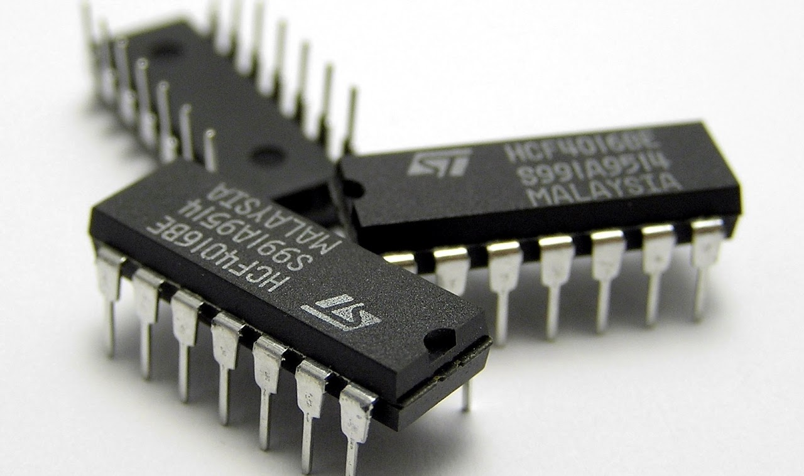

# Electrònica digital

Hemos visto algunos componentes utilizados en los circuitos de electrónica analógica (resistencias, condensadores, diodos, etc.), esta tecnología se caracteriza porque las señales físicas (temperatura, sonido, imagen, etc.) se convierten en una señal eléctrica para poder realizar un circuito que controle una calefacción, un ventilador, una bombilla, etc.

En electrónica digital sólo existen dos niveles de tensión:

- 0 voltios (que se representa mediante el número 0)
- 5 voltios (que se representa con el número 1)

PoUna señal digital sólo puede tener dos valores, 0 y 1.

## Operacions lògiques

En el álgebra de Boole existen tres operaciones lógicas básicas:

- AND
- OR
- NOT

Como en el álgebra de Boole hay pocos dígitos y pocas operaciones, es fácil probar las operaciones y funciones mediante las llamadas "tablas de verdad", que son tablas en las que se representan todos los valores posibles.

Se puede construir una tabla de verdad para cada operación lógica básica: (a y b son los operandos o Entradas y S es el resultado o Salida)

## 4. Puertas lògicas

La puerta lógica es el bloque de construcción básico de los sistemas digitales. Constan de
dos o más entradas (A, B, C) y una salida S. Las puertas lógicas operan con números binarios. En los
circuitos digitales una tensión alta significa un 1 binario y una tensión baja significa un cero binario
(lógica positiva).

En un montaje real, una puerta lógica será un circuito electrónico que proporciona señales
digitales en su salida cuando a sus entradas se le aplican también señales digitales. Las señales de
salida dependen de las señales de entrada.

Todos los sistemas digitales se pueden construir utilizando tres puertas lógicas básicas.
Estas son las puertas AND, la puerta OR y la puerta NOT.
Existen otro tipo de puertas que se obtienen combinando las anteriores. De este tipo son las
puertas NAND, NOR, XOR y XNOR.

El funcionamiento de un circuito digital se refleja en su TABLA DE VERDAD, donde
representamos las entradas del circuito (A, B, C) y las salidas (normalmente una llamada S).
Se representan todas las posibles combinaciones de entrada en orden. Recordar que con 2
entradas hay 4 combinaciones posibles, con 3 entradas existen 8 combinaciones posibles, con n
entradas existen 2n combinaciones.

## Puertas elementales: OR, AND y NOT.

El funcionamiento de cada una de estas puertas se puede comprender fácilmente observando la
equivalencia con el circuito de interruptores. El interruptor abierto simboliza la entrada a nivel 0,
mientras que el nivel 1 corresponde con el interruptor cerrado, es decir, a 5 voltios.
Según la tabla de la verdad, para la puerta OR existe salida cuando el interruptor A o B está
cerrado. La bombilla permanecerá apagada cuando ambas entradas estén abiertas o lo que es lo
mismo a nivel cero.

## 5. Circuito lògico

Una vez obtenida y simplificada (si se puede) la función lógica, el siguiente paso es obtener el
circuito lógico con puertas lógicas correspondiente, para por último efectuar el montaje. Para ello
tendremos en cuenta lo siguiente:

- Un producto de la función lógica equivale a una puerta AND.
- Una suma equivale a una puerta OR.
- Cuando una entrada aparece negada, equivale a la misma entrada sin negar pero conectada a
una puerta inversora NOT.

Sigamos con el ejemplo de la silla de atracción de feria para ver su circuito lógico equivalente,
recordando que su función lógica es la siguiente:

S = A·B + A·B

El circuito lógico equivalente será:

## 6. Circuitos integrados

En tiendas de electrónica podemos comprar **circuitos integrados** con varias puertas lógicas en su interior, cuyas entradas y salidas se pueden conectar a través de las patillas para formar cualquier circuito.

Por ejemplo, este circuito integrado tiene en su interior cuatro puertas del tipo AND.

