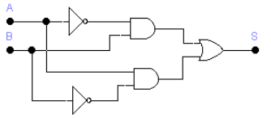

# Puertas lógicas

La **puerta lógica** es el bloque de construcción básico de los sistemas digitales. Cada puerta lógica tiene un símbolo que lo identifica. Constan de dos o más **entradas** (A, B, C) y una **salida** S.

A la izquierda tenemos las entradas, y a la derecha las salidas.

Juntando varias puertas lógicas y conectándolas entre ellas, podemos diseñar el sistema digital que nosotros necesitemos.

