# GAS NATURAL

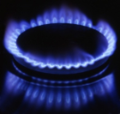

## Usos del gas natural

El gas natural se utiliza como fuente de energía para varios usos, entre los que destacan:

- Calefacción, aire acondicionado, agua caliente sanitaria
- Cocción para usos comerciales y domésticos (Consejos de seguridad asociados).
- Generación de electricidad a través de las **centrales de ciclo combinado**.
- Combustible para buques y transporte marítimo (GNL/LNG).
- Combustible para vehículos terrestres (GNC/CNG y GNL/LNG)
- Procesos industriales y fabricación de abonos.

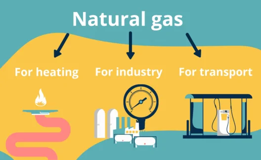

## Composición

Está formado por una **mezcla de gases** en proporciones variables (H2, metano, etano, propano y butano) resultado de la fermentación anaerobia de restos orgánicos.

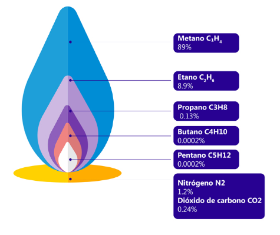

Pueden aparecer en yacimientos aislados o junto al petróleo. Se forma de manera similar al petróleo, pero a mayor presión y temperatura.

Es el combustible de mayor poder calorífico y el menos contaminante (su combustión produce menos CO2 y no forma NOx, ni SOX responsables del smog y la lluvia ácida).

 El gas natural se extrae del subsuelo mediante la perforación de pozos y se transporta a plantas de tratamiento donde se separa del petróleo y otros fluidos.

 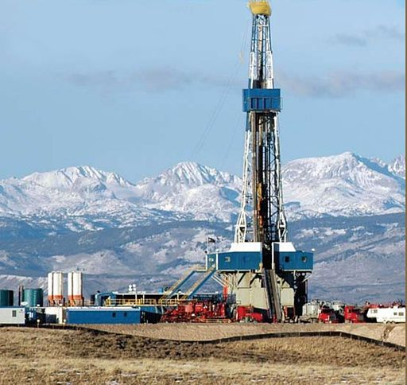

 ## Transporte

 Luego, el gas natural se transporta a través de una red de tuberías a plantas de regasificación, donde se convierte en gas licuado de petróleo (GLP) o gas natural licuado (GNL), que es más fácil de transportar.

 También nos puede llegar directamente a través de **gasoductos**.

 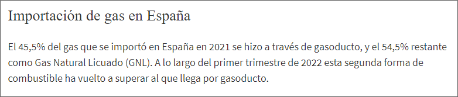

 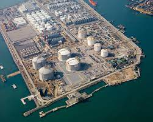

 El GNL se transporta en buques "tankers" a puertos de importación, donde se regasifica y se distribuye a los consumidores a través de una red de tuberías.

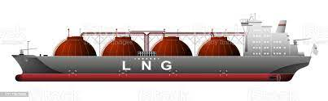

# Transporte dentro de España

El gas natural llega a Mallorca a través de un gasoducto submarino que conecta la isla con la península ibérica.

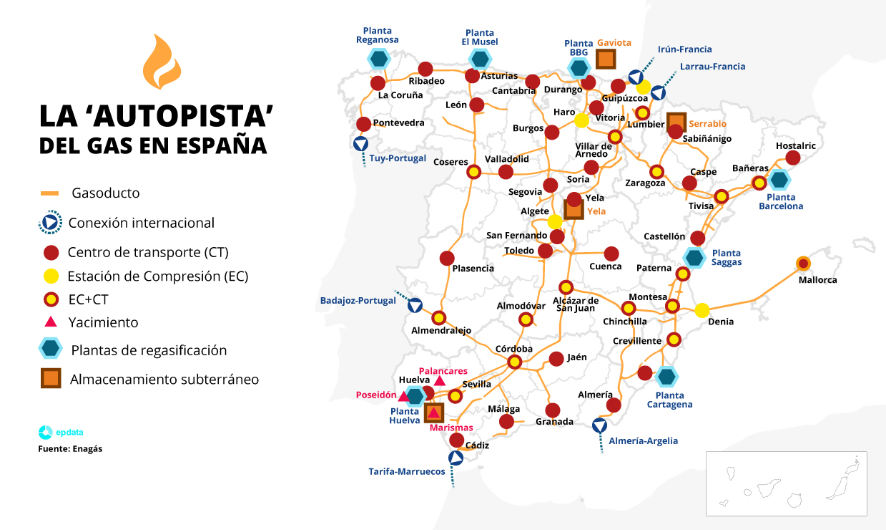

# Uso doméstico

El cuarto de contadores es una habitación en la que se encuentran los contadores de luz, agua y gas. Esta habitación suele estar ubicada en un lugar de la casa en el que se pueda acceder fácilmente, ya que es necesario que los contadores estén accesibles para que se puedan realizar las lecturas. El **cuarto de contadores** suele estar ubicado en la planta baja del edificio.

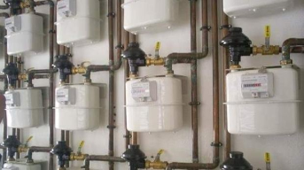

Cada piso tiene su propio contador individual, que mide los metros cúbicos de gas que consumimos. Se apuntan las mediciones de dos días diferentes, normalmente cada uno o dos meses y se calcula la diferencia.

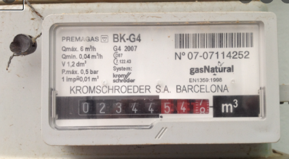

Una vez en el hogar, las calderas generalmente queman el gas para generar calor, o las cocinas para mantener el fuego de las cocinas.

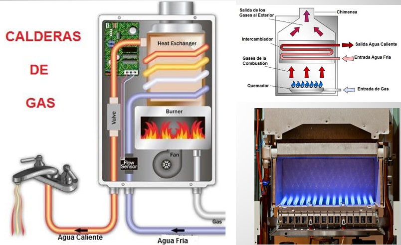

# Curiosidades. Acetileno

El acetileno se obtiene por medio de la reacción de hidrólisis de carburo de calcio, este es el alcalino más sencillo.

Los usos del acetileno son el calentamiento de llama, alzado de llama, soldadura, endurecimiento de llama, texturado, mercado de pallets de madera, inmunización y cubrimiento de carbono.

