[🔙 Enrere](../) | [🏠 Pàgina principal](http://danimrprofe.github.io/apuntes/) \n\n---
title: Barra de tareas
footer: Daniel Moreno 🌐 <github.com/danimrprofe>
_footer: ""
paginate: true
_paginate: false
_class: invert
marp: true
---

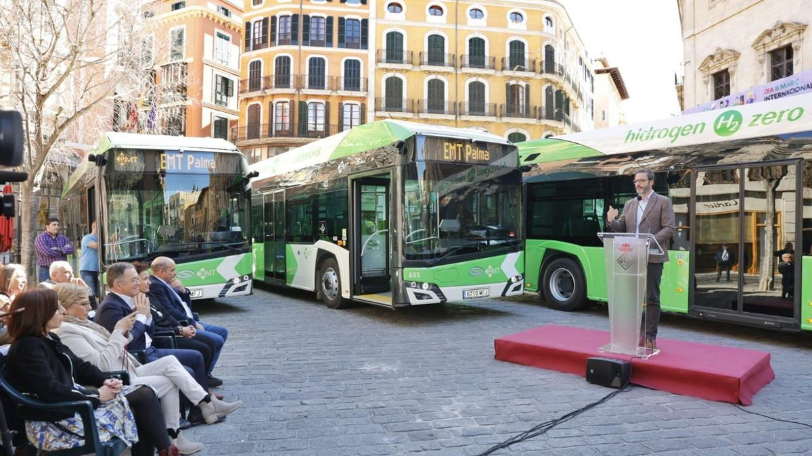

# Hidrogen verd

## Tecnologia i enginyeria I

---

Hidrògen verd = Hidrogen produït a partir de fonts renovables d'energia (solar, eòlica, etc.)

---

Durant aquest any, s'han posat en marxa 3 autobusos de l'EMT que funcionen a base d'hidrogen verd. Veurem d'on s'obté, com s'obté i quines són les aplicacions.

---

# Introducció

- Els “vehicles de combustió interna” utilitzen un motor de combustió interna que crema combustible per generar energia mecànica. Utilitzen combustibles fòssils com la gasolina, el dièsel o el gas natural.

- Els "vehicles elèctrics" utilitzen "bateries" elèctriques per emmagatzemar energia i "motors elèctrics" per generar energia mecànica.

- Els "vehicles híbrids" combinen un motor de combustió interna amb un motor elèctric i una bateria. Aquests vehicles poden funcionar amb combustibles fòssils i electricitat.

---

L'hidrogen verd es pot produir a partir de plaques fotovoltaiques mitjançant un procés anomenat ``electròlisi`` de l'aigua.

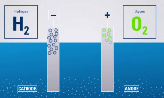

Aquest procés implica la descomposició de l'aigua en els seus components bàsics, ``hidrogen`` i ``oxigen``, utilitzant electricitat generada a partir de panells solars.

---

# Producció d'hidrogen verd a partir de plaques fotovoltaiques

1. Les ``plaques fotovoltaiques`` capturen la llum solar i la converteixen en electricitat.

2. L'``electrolitzador`` utilitza l'electricitat per dividir l'aigua en els seus components bàsics, hidrogen i oxigen. L'hidrogen es recull en un tanc separat per al seu ús posterior.

3. L'hidrogen es pot emmagatzemar de forma ``comprimida`` o ``líquida`` per al seu ús posterior. Es comprimeix entre 350 i 700 bars de pressió.

---

Aquest procés de producció d'hidrogen verd ``no emet gasos amb efecte d'hivernacle``. A més, l'hidrogen produït es pot utilitzar com a font d'energia neta i renovable en vehicles i sistemes d'energia estacionaris.

---

Palma és la segona ciutat del país, després de Barcelona, a generar hidrogen a partir de les plaques fotovoltaiques que generen hidrogen verd.

---

El projecte de producció d'hidrogen verd a la planta de Lloseta forma part de la iniciativa europea "Green Hysland" i neix a l'antiga "fàbrica de ciment de Cemex". Ha estat el primer projecte mediterrani que ha rebut finançament europeu per executar-lo.

---

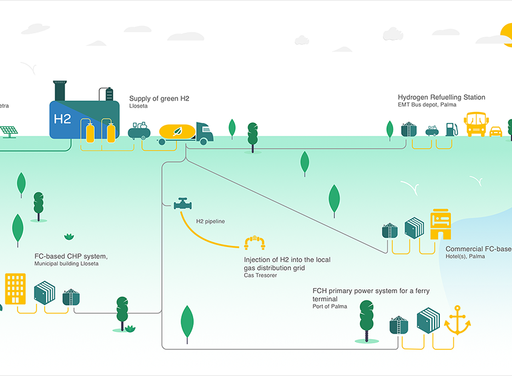

---

# Power to Green Hydrogen Mallorca

Objectiu: descarbonitzar l'illa... el 2050
El projecte 'Power to Green Hydrogen Mallorca' inclou la construcció d'una ``planta d'electròlisi``, el desenvolupament de ``2 plantes fotovoltaiques`` que l'alimenten i una estació de servei d'hidrogen verd a l'illa.

La UE ha compromès "10 milions d'euros" per a la posada en marxa.

---

# Electricitat necessària

L'electricitat renovable necessària per alimentar l'electrolitzador estarà garantida per les plantes fotovoltaiques de Lloseta (8,5MW) i Petra (5,85MW).

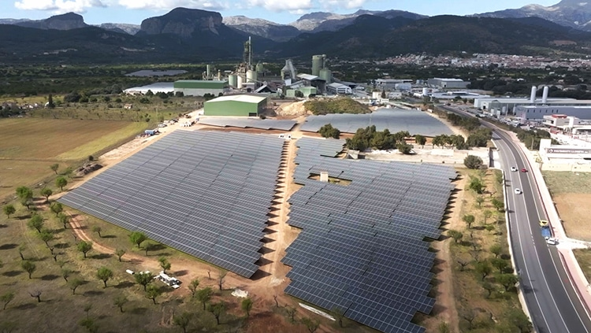

La plataforma ``GreenH2Chain`` acreditarà mitjançant tecnologia ``blockchain`` que l‟hidrogen obtingut a la planta és 100% renovable.

---

Totes dues plantes produiran l'energia renovable necessària per a la "planta d'hidrogen verd", que generarà i distribuirà més de "300 tones a l'any" d'aquest combustible.

---

# Electrolitzadora

És la encarregada de, utilitzant la electricitat produida pels panells solars, fer l'``electròlisi`` que dona lloc a l'``hidrogen``, a partir d'``aigua``.

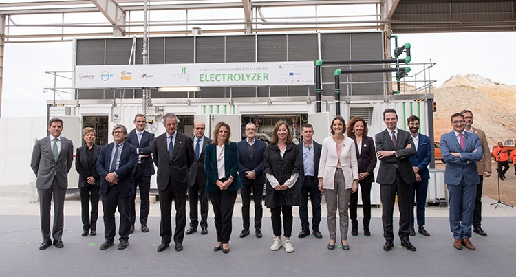

---

# Usos de l'hidrògen produït

- Subministrament de combustible a "flotes d'autobusos públics i vehicles de lloguer"
- Generació de calor i energia per a edificis públics i comercials
- Subministrament d'energia auxiliar a ferris i operacions portuàries.

---

Així mateix, part d'aquest hidrogen renovable s'injectarà a la xarxa gasista de l'illa, "barrejat amb gas natural" a través d'un ``hidroducte`` que Redexis construirà a l'illa.

---

# Autobusos

- Tene una autonomia de més de ``200 km`` (aproximadament)
- Procés de càrrega dura uns 10 minuts per part d'un tècnic a una ``hidrogenera``
- El conductor va a una zona més segura mentre es carrega
- Els autobusos tene uns dipòsits d'entre 30 i 40 kg de capacitat.

---

# Hidrogenera

Només n'hi ha una, però encara no està operativa. De moment es duen ``cartuxos d'hidrògen`` des de la península.

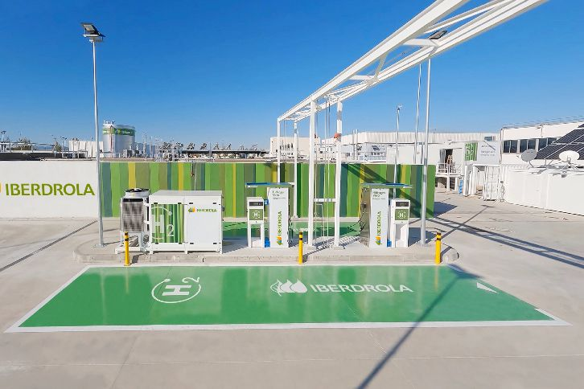

---

L'hidrogen se subministra al motor de l'autobús a través d'una "canonada d'alta pressió".
Aquesta electricitat alimenta un ``motor elèctric`` que impulsa el vehicle, que es diu ``cel·la de combustible``.

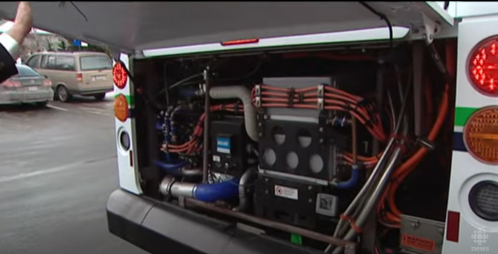

---

L'únic subproducte és ``vapor d'aigua``, cosa que fa que els autobusos d'hidrogen siguin una opció molt neta i eficient des del punt de vista energètic.

---

# Emmagatzematge de l'hidrogen

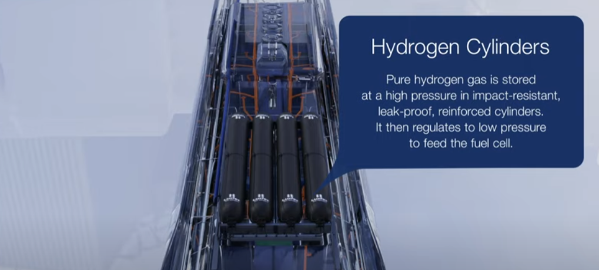

---

<!-- _class: invert -->

## <!--fit --> Cel·la de combustible

Converteix l'energia química emmagatzemada en un combustible, com l'hidrogen, directament en electricitat i calor.

---

Quan l'hidrogen  entra a la cel·la de combustible, es troba amb un ``catalitzador`` que el descompon les mol·lècules de hidrògen en protons (H+) i electrons (e-).

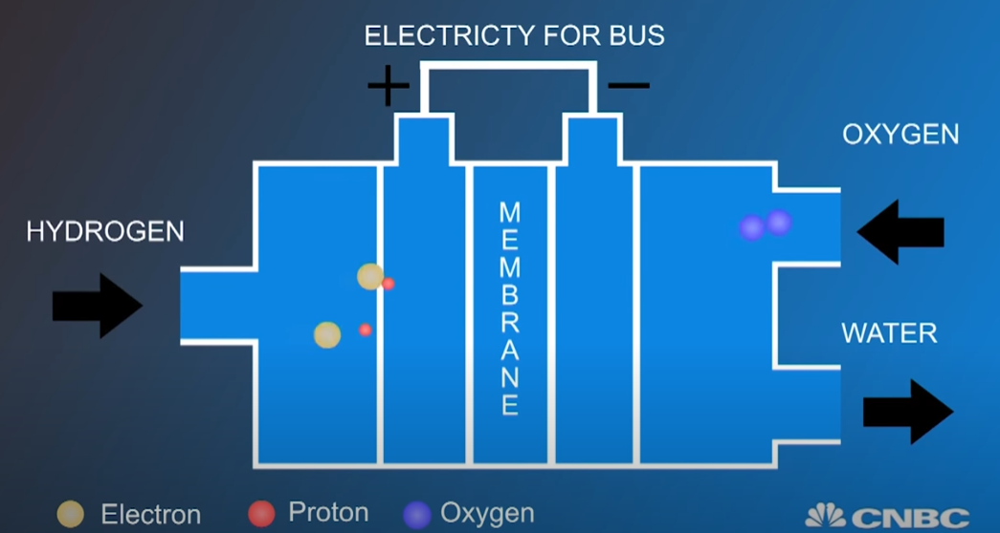

---

Els ``protons`` es mouen travessant una ``membrana`` d'intercanvi de protons cap a la secció de càtode de la cel·la, mentre que els ``electrons`` es mouen mitjançant un ``circuit`` extern per generar ``electricitat``.

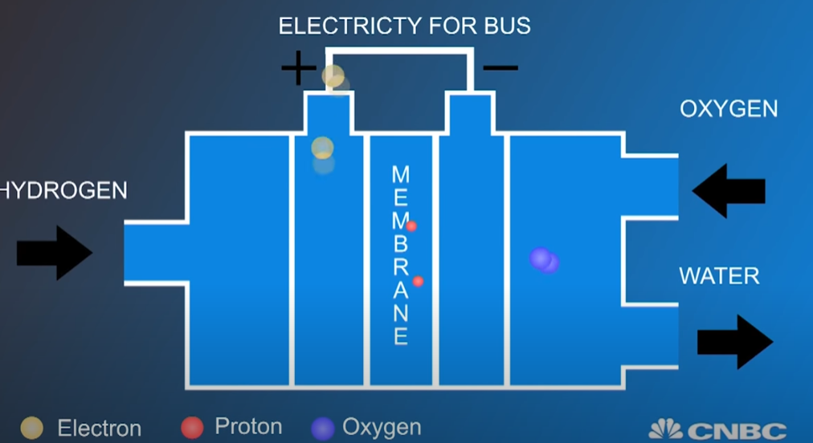

---
Al càtode, els protons i els electrons es combinen amb ``oxigen`` de l'aire exterior per produir aigua en forma de ``vapor d'aigua``.

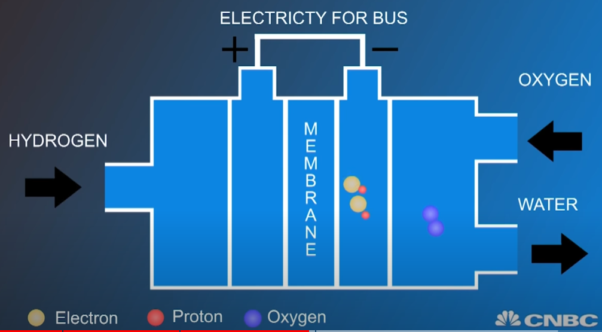

---

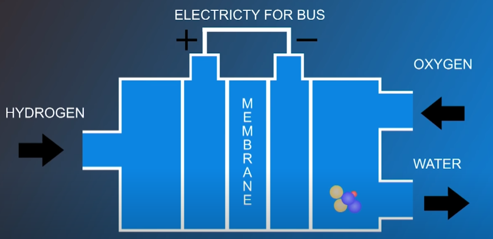

---

# Cotxe elèctric vs hidrogen verd

- L'hidrogen es ven ara a 10 €/kg. Amb aquest preu i un consum homologat de 0,8 kg/100 km (Toyota Mirai), que equival a ``8€ / 100 km``, el cost és una mica més baix que per a un cotxe de gasolina.
- Un cotxe 100% elèctric, té un cost de recàrrega del qual oscil·la entre ``1-2 € / 100 km`` si es fa a casa. El seu avantatge principal respecte a aquest darrer és que la recàrrega pot trigar al voltant dels cinc minuts.

---

# Cotxes d'hidrògen

Actualment a espanya només es venen 3 models comercials. Toyota ven a Espanya el ``Mirai``, una berlina amb una longitud de 4,97 metres. Parteix d'un preu de ``68.900 euros``. Hi ha ajudes estatals per a l'adquisició d'aquests cotxes.

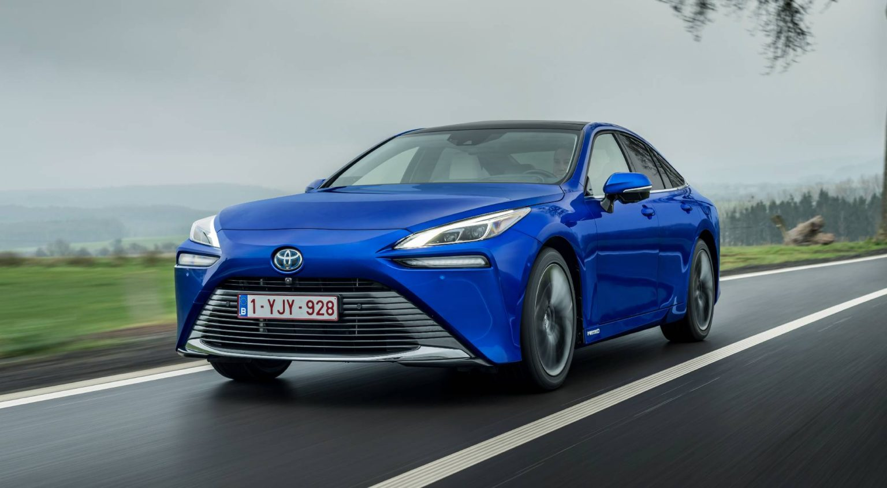