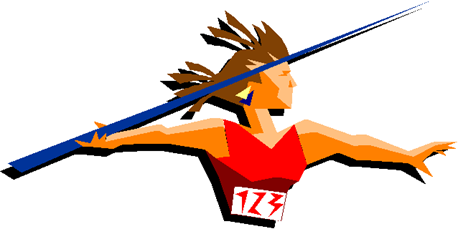
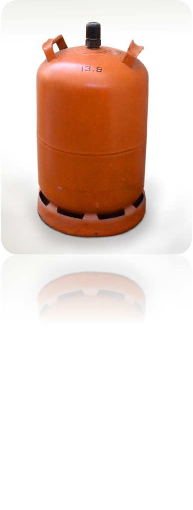

# 1. Forces

Les forces són elements que poden:

- Deformar un cos (efecte estàtic)
- Canviar el seu estat de moviment (efecte dinàmic)

## 1.1 Exemples de forces

- Gravetat
- Vent
- Forces mecàniques
- Pressions de gasos
- Músculs
- Calor

¿Quines forces actuen sobre aquests objectes?

