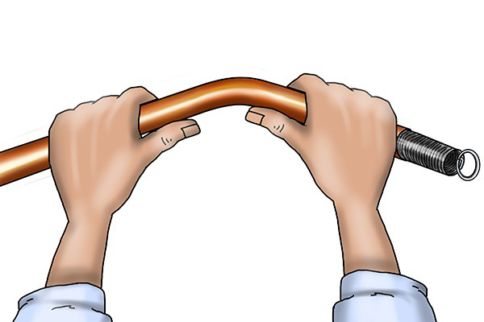
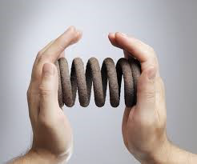
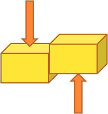

# 4. Esforços

Es tracta de tensions internes que sofreixen els objectes que estan sotmessos a l'acció de una o més forces.

## Tipus d'esforços

### Tracció

Forces intenten estirar l'objecte.

- Flexió

- Compressió

- Torsió

- Cizalla

Dues forces actuen com les fulles d'una tissora. Una es mou cap a dalt i l'altra cap abaix, com si tractessin de tallar un objecte.

Quins esforços diries que sofreixen els següents objectes:

- Tirants d'un vestit
- Potes d'una cadira
- Candau d'una porta
- Tissores per tallar paper