# 1. Forces

Les forces són elements que poden:

- Deformar un cos (efecte estàtic)
- Canviar el seu estat de moviment (efecte dinàmic)

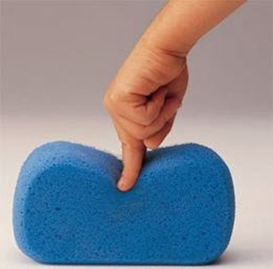

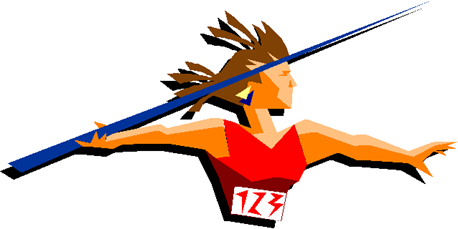

## 1.1 Exemples de forces

- Gravetat
- Vent
- Forces mecàniques
- Pressions de gasos
- Músculs
- Calor

¿Quines forces actuen sobre aquests objectes?

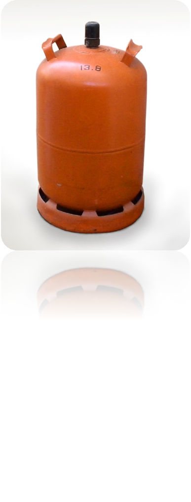

# 2. Estructures

Una estructura és un conjunt resistent i estable d’elements capaços de suportar forces i transmetre-les als punts de suport.

Tots els objectes necessiten una estructura que els permeti resistir els efectes de les forces que hi actuen.

# 2.1. Tipus d'estructures

## Naturals

- Conxes
- Nius

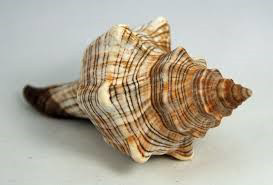

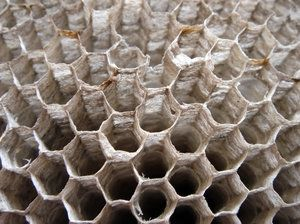

## Artificials

- Gratacels
- Torres elèctriques

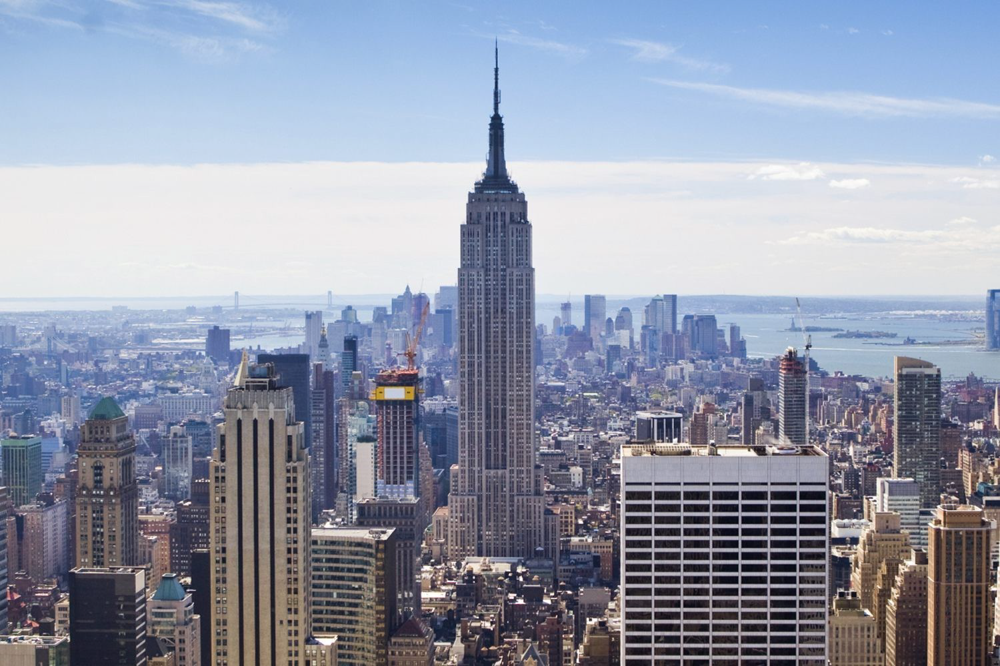

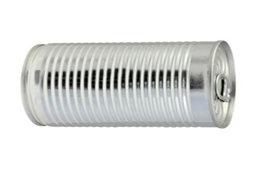

# Càrregues

Son forces que actuen sobre una estructura

## Tipus de càrregues

### Càrregues permanents

No varien amb el temps

Exemples:

- El propi pes d'un objecte

### Càrregues variables

Son ocasionals i varibles

Exemples:

- Neu sobre un terrat
- Pressió de l'aigua sobre una presa

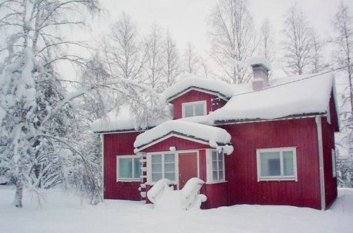

# Esforços

Es tracta de tensions internes que sofreixen els objectes que estan sotmessos a l'acció de una o més forces.

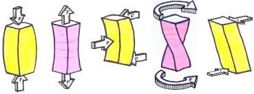

## Tipus d'esforços

### Tracció

Forces intenten estirar l'objecte.

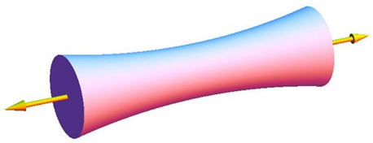

- Flexió

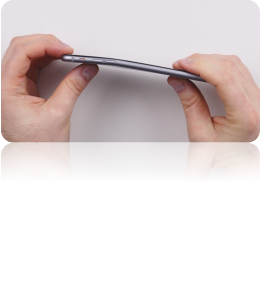

- Compressió

- Torsió

- Cizalla

Dues forces actuen com les fulles d'una tissora. Una es mou cap a dalt i l'altra cap abaix, com si tractessin de tallar un objecte.

Quins esforços diries que sofreixen els següents objectes:

- Tirants d'un vestit
- Potes d'una cadira
- Candau d'una porta
- Tissores per tallar paper

# Condicions estructurals

- **Estabilitat**: La capacitat que té l'objecte per mantenir-se estable.
- **Resistència**: Capacitat de resistir un esforç sense trencar-se.
- **Rigiditat**: Capacitat de mantenir la seva forma.

# Tipus d'estructures artificials

## Massives

Materials: roca, pedres
Exemples: piràmides

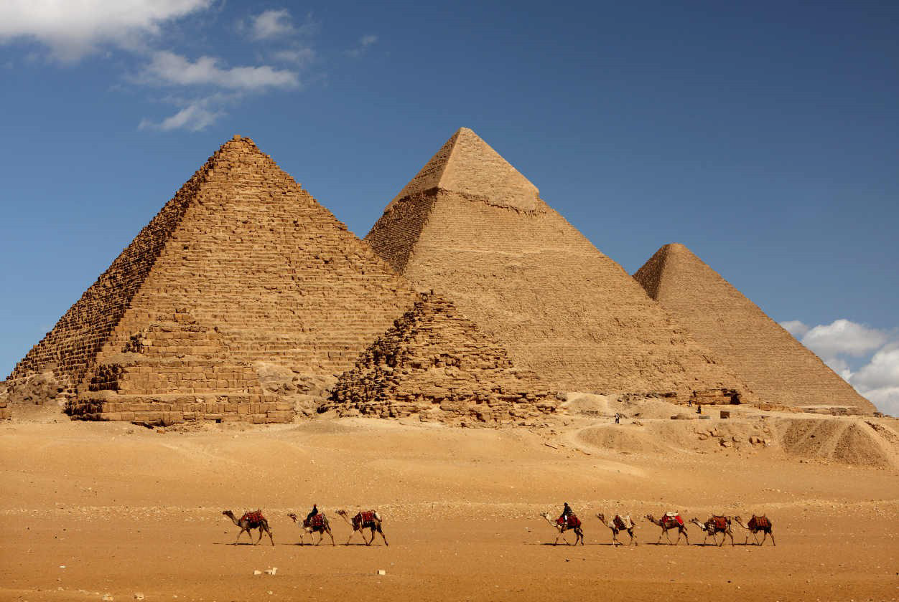

## Vaulted

Materials: pedra, roca o ciment
Exemples: basíliques, panteons i catedrals

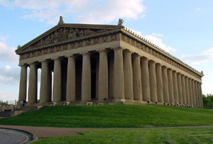

## Entramades

Materials: ciment i metall
Exemples: blocs i pisos

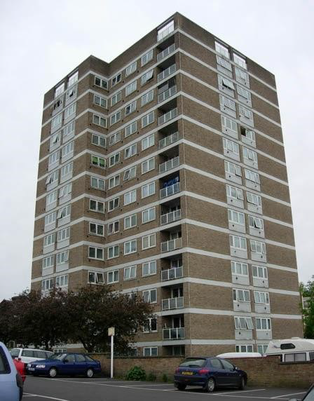

## Triangulades

Materials: metall o fusta
Exemples: sostres, ponts

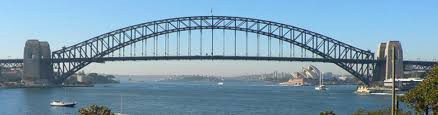

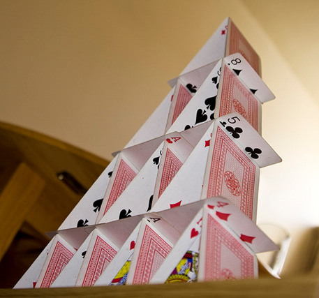

## Penjants

Materials: metall i ciment
Exemples: ponts,  antennes i torres

## Pneumàtiques

Materials: plàstic
Exemples: castell inflable

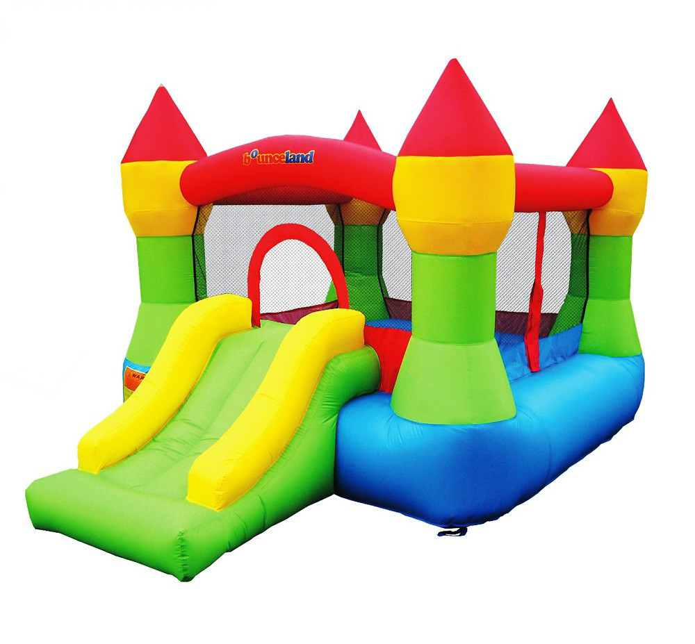

## Rolled and plate

Materials: metall, plàstic i altres materials sintètics
Exemples: cotxe

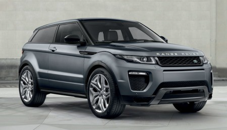

## Geodèsiques

Materials: metall i alumini
Exemples: tetrahedre

# Elements d'una estructura

fonaments
Columnes o pilars
bigues
arcs
tirants

# Perfils

Recurs molt utilitzat per construir estructures
Són barres de diferents seccions
Bigues i columnes massisses,
pesarien molt
Serien molt cares
No podríem fabricar grans estructures.