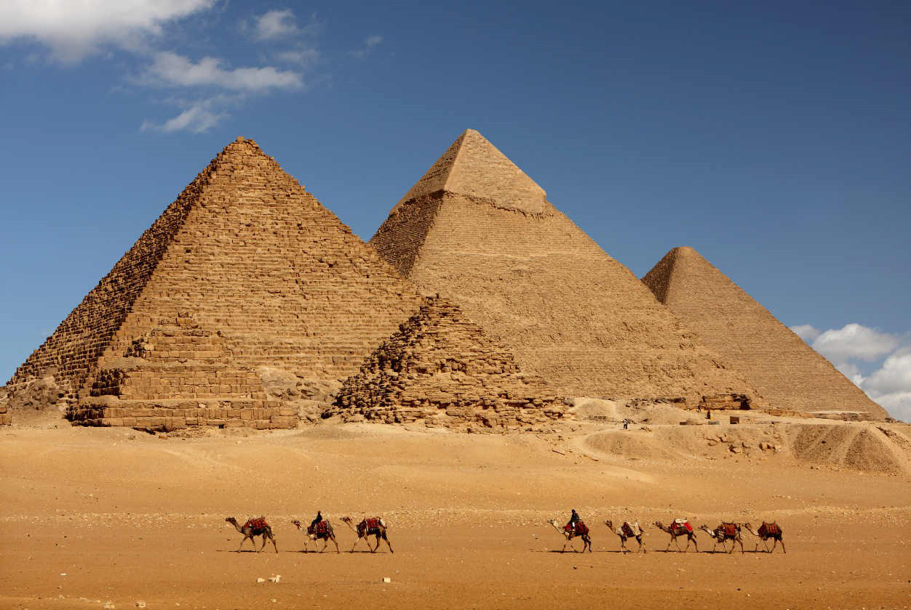
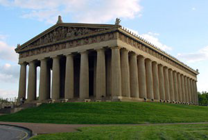
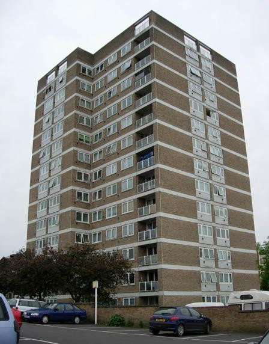
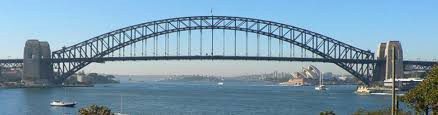
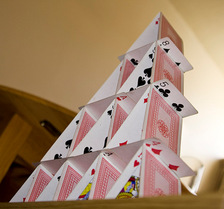
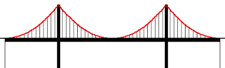
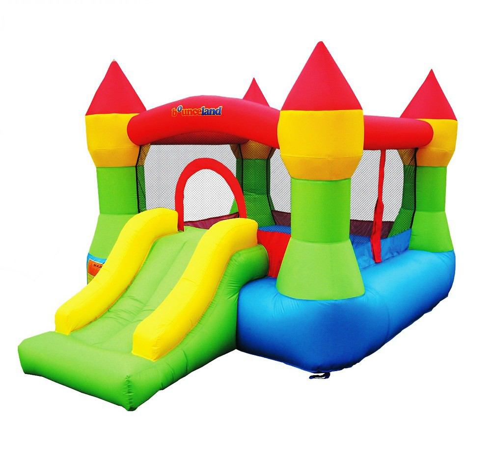
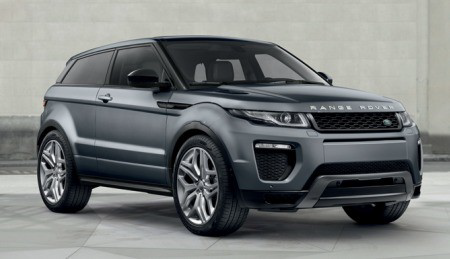
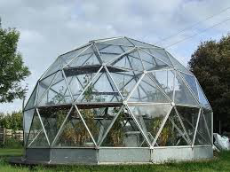

# Tipus d'estructures artificials

## Massives

Materials: roca, pedres
Exemples: piràmides

## Vaulted

Materials: pedra, roca o ciment
Exemples: basíliques, panteons i catedrals

## Entramades

Materials: ciment i metall
Exemples: blocs i pisos

## Triangulades

Materials: metall o fusta
Exemples: sostres, ponts

## Penjants

Materials: metall i ciment
Exemples: ponts,  antennes i torres

## Pneumàtiques

Materials: plàstic
Exemples: castell inflable

## Rolled and plate

Materials: metall, plàstic i altres materials sintètics
Exemples: cotxe

## Geodèsiques

Materials: metall i alumini
Exemples: tetrahedre

