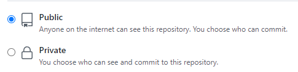

# 17. Github pages

 ``GitHub Pages`` es un servicio de ``GitHub`` que nos permite alojar nuestros proyectos y mostrarlos en vivo en una página web estática sin necesidad de pagar por ello.

## Crear el repositorio

Para ello debemos crear un repositorio que se llame de una forma especial. El formato será:

```
nombreusuario.github.io
```

Esta será también la dirección URL de nuestra web en Internet.

A modo de ejemplo:


Debe de ser público:



## Subir archivos

Una vez creado el repositorio, deberemos subir a él los archivos de nuestro proyecto. Es importante recordar que si tenemos imágenes u otros archivos, también los deberemos subir a este repositorio. De otro modo, estas imágenes no se verán.


## Comprobación

Tenemos que darle unos minutos para que se actualice la página y podremos visitarla introduciendo el nombre que le hemos dado al repositorio en la barra de direcciones:


Si todo ha ido bien, desde cualquier dispositivo conectado a Internet podremos visualizar la página que hemos creado.
