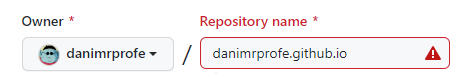
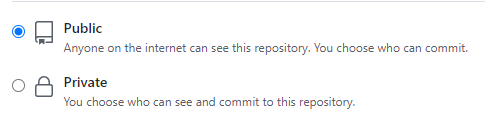

# 6. Github pages

## Crear un repositorio de página web y subir la web allí

Para ello debemos crear un repositorio que se llame de una forma especial. El formato será:

```
nombreusuario.github.io
```

Esta será también la dirección URL de nuestra web en Internet.

A modo de ejemplo:



Debe de ser público:



Una vez creado el repositorio, deberemos subir a él los archivos de nuestro proyecto.


Tenemos que darle unos minutos para que se actualice la página y podremos visitarla introduciendo el nombre que le hemos dado al repositorio en la barra de direcciones:


Si todo ha ido bien, desde cualquier dispositivo conectado a Internet podremos visualizar la página que hemos creado.

## Crear un QR que apunte a la página web y acceder a ella


Seleccionamos URL:


Introducimos la dirección como texto:


Elegimos forma y color:


Y ya podremos descargar y utilizar nuestro código QR


Para abrirlo necesitaremos alguna app como google lens, por ejemplo.

## Crear un readme para un repositorio con markdown
