# Componentes de tu ordenador

Una forma de detectar qué componentes tiene nuestro ordenador consiste en utilizar las herramientas del sistema operativo. Para ello, teniendo Windows 10 y buscando en el explorador de windows MI PC o Este equipo o equipo, con botón derecho encima y propiedades, podemos ver información.

## Cómo saber qué sistema operativo estamos utilizando

En este caso, podemos saber qué tipo de sistema operativo tenemos y su versión, cual es el modelo de procesador (o CPU), así como la memoria RAM (16 GB)

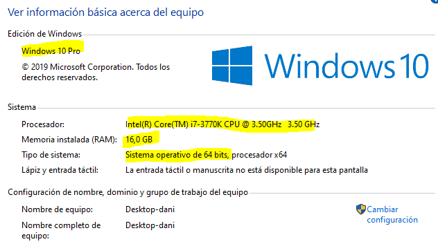

## Cómo saber qué unidades de almacenamiento tenemos

Para comprobar el disco duro o discos duros que tenemos en nuestro ordenador, podemos buscar también en mi equipo (ver animación abajo):

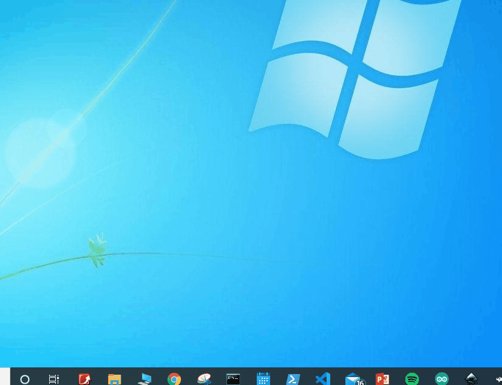

Utilizando el programa CPU-Z, indica todos los componentes que puedas encontrar de tu ordenador, así como el sistema operativo que utiliza. Realiza una tabla.

Para descargar el programa:

 https://www.cpuid.com/downloads/cpu-z/cpu-z_1.90-en.zip

Buscáis en descargas, y descomprimís el archivo

1. Adjunta una captura del programa y señala sobre la imagen:

Placa base

Procesador

Memoria

Componentes de una placa base

 A partir de la placa base que el profesor te asignará, deberás buscar:

Marca, modelo, precio y foto de la placa

Buscar el manual de la placa y poner el enlace al manual

Explica qué socket de procesador tiene y qué procesadores podemos ponerle

Explica qué ranuras de memoria tiene, de qué tipo y el máximo de memoria que se le puede poner.

Explica qué ranuras de expansión tiene y de qué tipo son

Explica qué conectores traseros tiene y para qué se utilizan

En una imagen de la placa, señalar todos los componentes que reconozcas en la placa

## Procesador

En la primera pestaña, llamada CPU, veréis información del procesador. La información más importante es el nombre (Name) y también Specification.

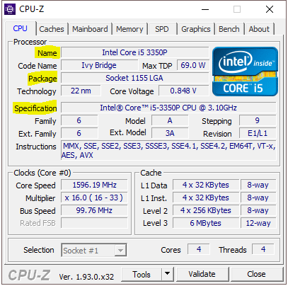

La siguiente es la pestaña de la caché, y de momento la podéis saltar.

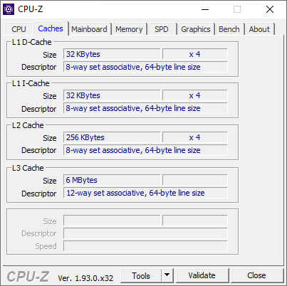

## Placa base

En esta pestaña podemos ver que placa base tiene vuestro ordenador. Manufacturer es el fabricante,y model el modelo concreto de la placa.

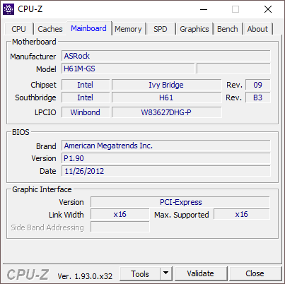

## Memoria

Aquí podréis ver la información de la memoria RAM que tiene instalada vuestro ordenador en la placa base. Type es el tipo de memoria, y size la cantidad de memoria.

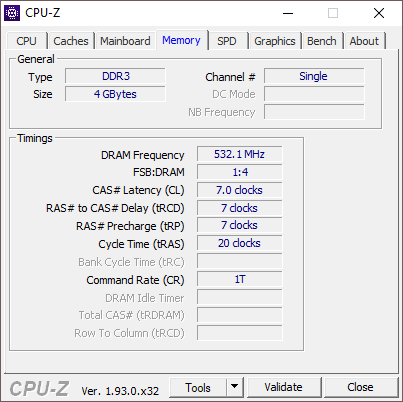

Aquí muestra que el ordenador tiene solamente 4 GB de RAM.

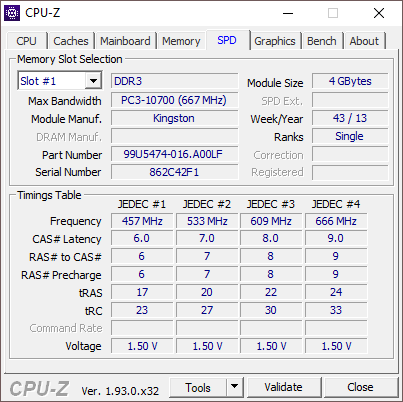

## Tarjeta gráfica

En graphics podremos encontrar información sobre la tarjeta gráfica.

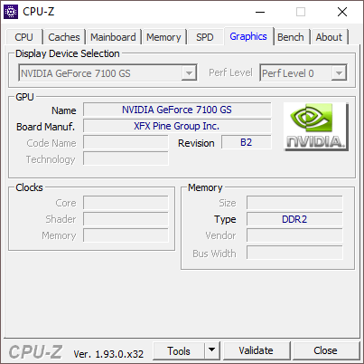

Aquí muestra la información de la tarjeta gráfica.

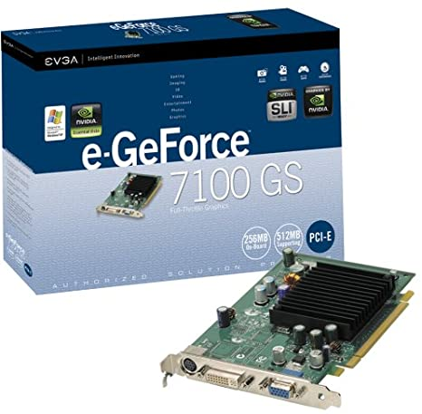

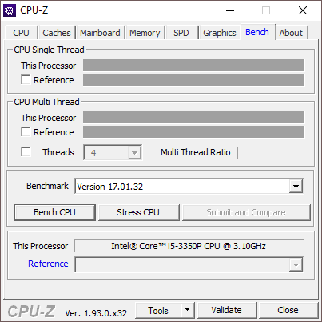

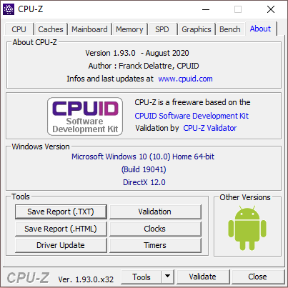

Aquí habla sobre el programa CPU-Z.