# Fuente de alimentación

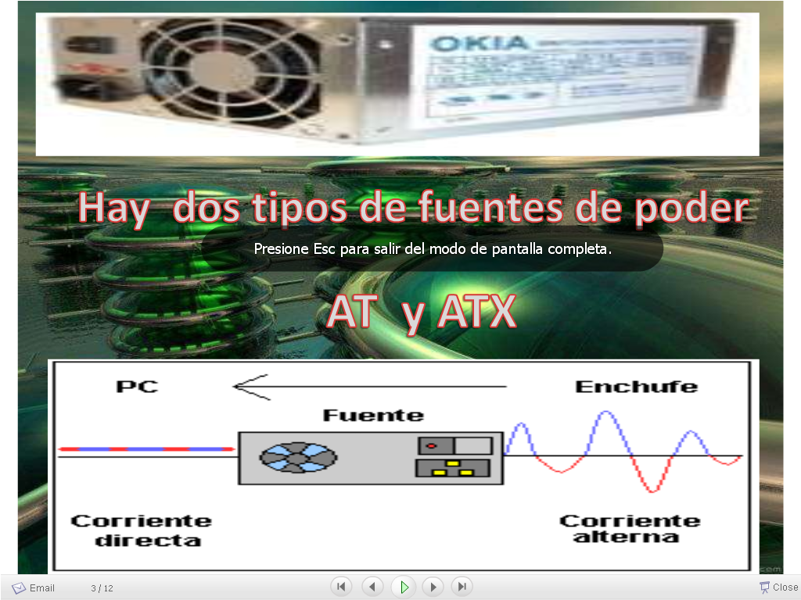

* 1\) Transforma
  * __Corriente eléctrica \(AC\) __ alterna procedente del sistema eléctrico
  * En  __corriente continua \(DC\) __ en un voltaje apropiado para los distintos componentes del ordenador\.
* 2\) Permite alimentar diferentes circuitos y dispositivos del ordenador
  * Voltajes que proporciona la fuente:  __ __   __\-12 V, \-5 V, 0 V, \+3,3 V, \+5 V,\+12 V__ 

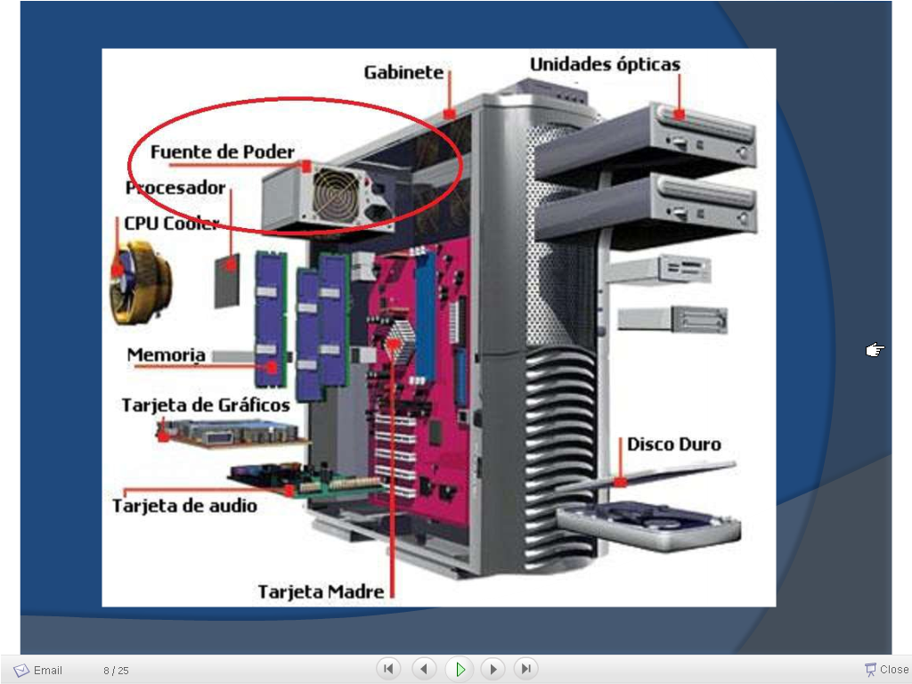

* _Posibilidades de expansión_
* Potencia \(W\) determina la cantidad de componentes
* Cantidad de conectores de alimentación proporcionan energía
  * __A la placa base__
    * Conector de 20 o 24 pines
  * __A los dispositivos __
    * Conector de 4 pines molex
    * Conector Berg de 4 pines minimolex
    * Conector de 15 pines Serial ATA

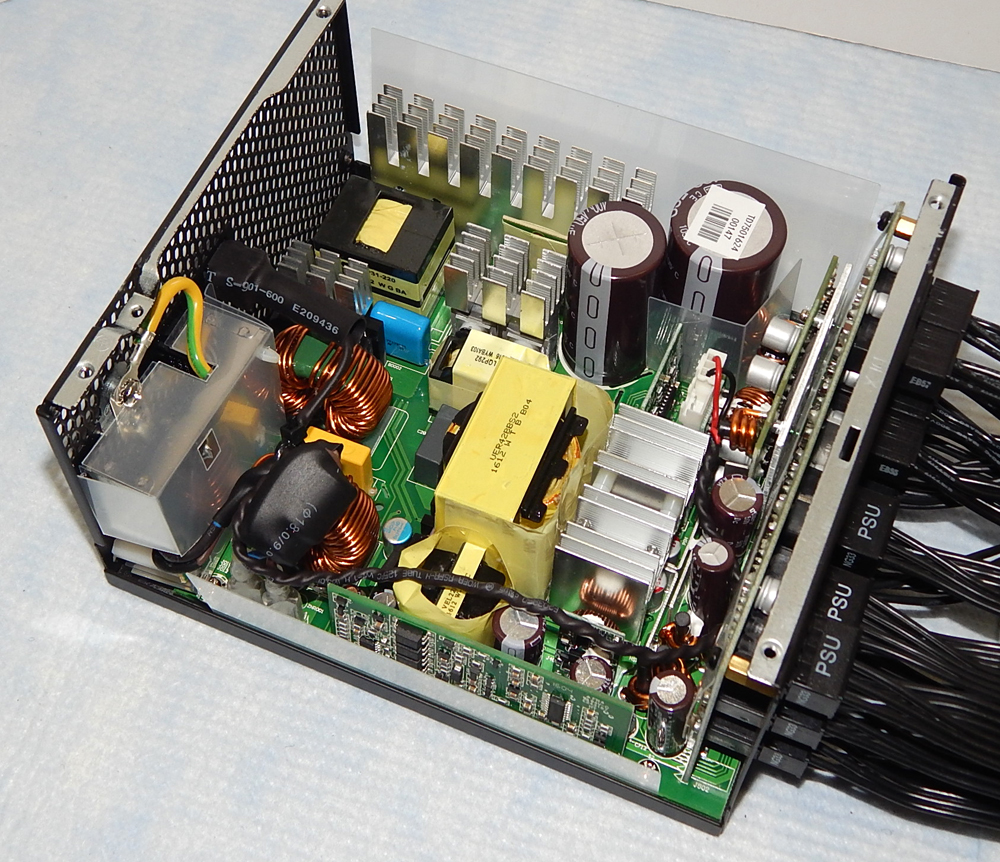

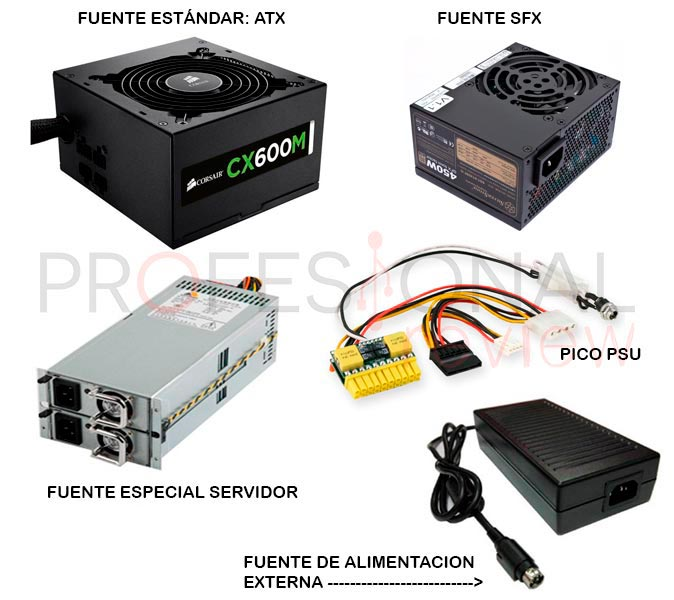

Tipos de fuentes

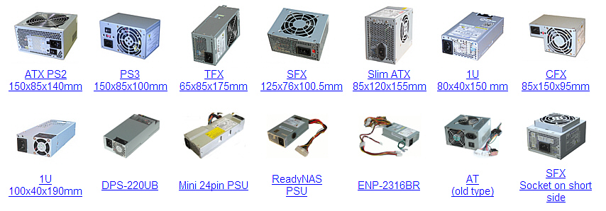

## Tipos de fuente de alimentación

### Fuentes AT

Las Fuentes AT fueron creadas en 1984 por IBM como un estándar para el IBM AT. Esta fuente de alimentación brindaba salida eléctrica para el monitor, sin embargo presentaba dos inconvenientes: un interruptor externo problemático por el que circulaba gran cantidad de voltaje y conectores a la placa base poco diferenciables.

Esto último fue solucionado mediante 4 pines centrales negros. Finalmente esta fuente fue reemplazada con la salida de ATX.

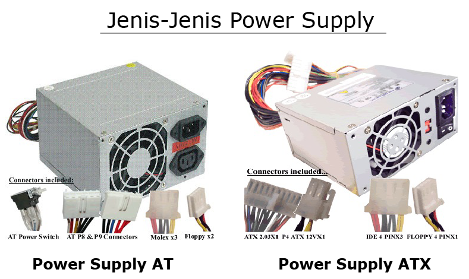

### Fuentes ATX

Las Fuentes ATX ("Advanced Technology Extended"), creadas por Intel en 1995, son actualmente de la versión 2.2.

Siempre hay energía circulando para encendido por software, como el wake-on-lan, wake-on-ring y la hibernación.

Estas fuentes tienen una alta compatibilidad con DDR2, PCI Express, SATA, entre otros. A diferencia de las anteriores, las fuentes ATX tienen un solo conector de 24 en lugar de dos, y a partir de 2000, también tienen un conector directo a la tarjeta gráfica, pudiendo ser de 6 o 8 pines.

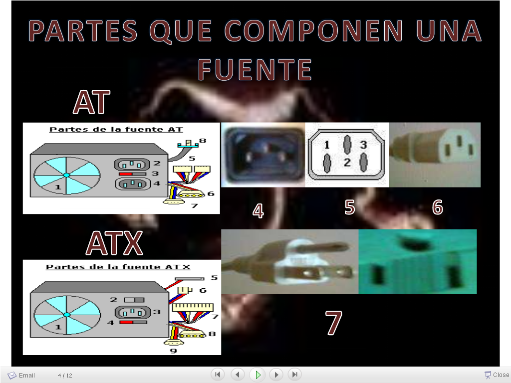

## Posibles averías

* _Posibles problemas_
* El ordenador
  * esta completamente parado\.
  * funciona momentáneamente pero después se para\.
  * falla después de estar un tiempo funcionando\.
  * se bloquea o reinicia por si solo\.
  * se enciende, la pantalla permanece negra y no se activa el ventilador de la fuente de alimentación ni el disco duro comienza a girar\.

* _Para solucionar los anteriores problemas podemos:_
* __Cable__   __de__   __alimentación__  esta bien conectado\.
* __Interruptor__  este en la posición de encendido\.
* Comprobar  __temperatura__  y correcto funcionamiento del  __ventilador__ \.
* Comprobar si la fuente cumple con los  __requisitos de consumo __ de los componentes del sistema\.
* Comprobar que dispositivo genera un  __cortocircuito__
  * Ir desconectando dispositivos hasta dar con el que tiene la avería\.
  * Examinar el voltaje de la línea \(220 V\)

## Fuentes modulares

Los sistemas de fuentes modulares ofrecen una gran cantidad de beneficios para los usuarios. Estas fuentes son una excelente opción para los usuarios que desean la **comodidad** de conectar solo los cables que realmente van a utilizar. Esto reduce significativamente el **desorden** de los cables, lo que mejora la estética de la computadora y reduce el riesgo de sobrecalentamiento.

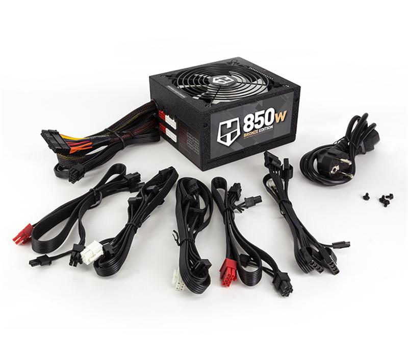

Otra gran ventaja de la tecnología modular es la posibilidad de utilizar **adaptadores** para convertir los conectores no estándar en conectores estándar. Esto significa que los usuarios no tienen que volverse locos tratando de encontrar el conector correcto para un dispositivo en particular. Esto simplifica el proceso de instalación de los dispositivos y la conexión de cables en la computadora.

Además, las fuentes modulares ofrecen una mayor **eficiencia**. Esto se debe a que solo se conectan los cables que realmente necesitamos. Esto significa que no hay cables innecesarios que consuman potencia. Esto hace que la computadora sea más eficiente y no desperdicie energía.

## Fuentes semimodulares

Las fuentes de alimentación semimodulares son un tipo de fuente de alimentación con una cierta cantidad de cables preinstalados para una configuración básica, pero también incluye una sección modular para conectar cables adicionales para satisfacer la configuración personalizada del usuario.

Esta característica ofrece la ventaja de no tener que trabajar con todos los cables al mismo tiempo y de no tener que lidiar con los cables sueltos en la parte trasera del chasis.

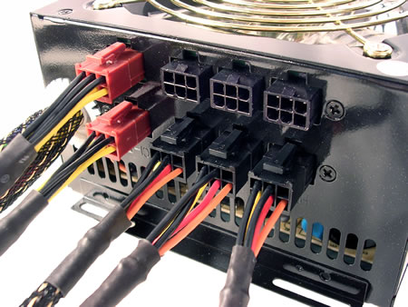

## Fuentes redundantes

Los sistemas redundantes tienen los datos y/o el hardware repetidos. Esto es especialmente importante en sistemas críticos, ya que aseguran su funcionamiento ante posibles fallos. Si uno de los elementos deja de funcionar, el otro ocupa su lugar.

Un ejemplo de esto es el uso de dos fuentes de alimentación en servidores, conectadas a diferentes sistemas eléctricos, con el fin de minimizar el riesgo de fallos, ya sea por la propia fuente o por el sistema eléctrico.

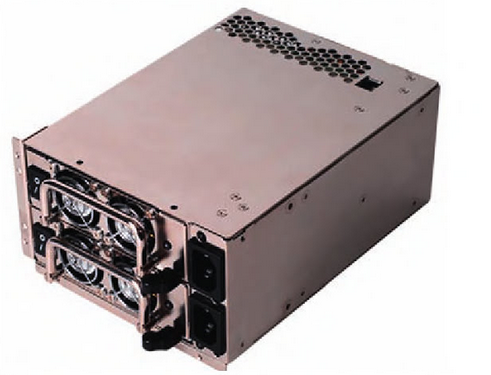

En la actualidad se aplican las fuentes de alimentación redundantes a los  __servidores, routers, switches, etcétera\. __

Fuentes de alimentación lineales

## Fuentes de alimentación conmutadas

También conocidas como SMPS \(switch mode power supply\), tienen el mismo objetivo que las fuentes de alimentación lineales, es decir, obtener una tensión en CC\. partiendo de una tensión en AC de alto valor\. No obstante, para conseguirlo se basan en un circuito y un funcionamiento bien diferentes\.

Las fuentes de alimentación conmutadas, en lugar de trabajar con la frecuencia de la red eléctrica de 50 Hz, trabajan con frecuencias mucho más altas, en torno a los 100 kHz\.

La principal ventaja de este tipo de fuentes respecto a las de tipo lineal es que el tamaño del transformador disminuye considerablemente y, por tanto, disminuyen las pérdidas de energía y el volumen de la fuente\.

No obstante, el circuito electrónico es mucho más complejo y, además, como funciona a base de pulsos a altas frecuencias, puede transferir ruido e interferencias electromagnéticas a la red eléctrica, que pueden afectar a otros circuitos cercanos\.

## Fuentes de alimentación conmutadas

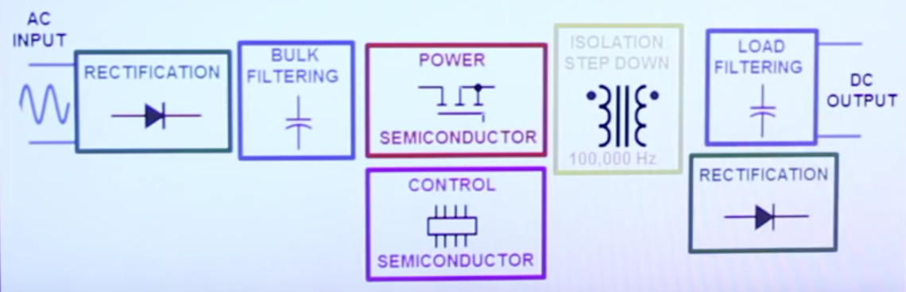

## Conectores de la fuente

- Berg / mini Molex
- Molex
- SATA
- PCIe \(6\+2\)
- PCIe 6
- PCIe 8
- ATX 4 pines \(procesador\)
- ATX 24 pines \(o ATX 20\+4\)

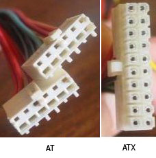

## Distribución de pines

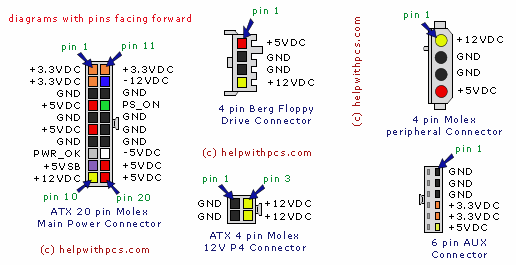

## Características eléctricas

Las fuentes de alimentación están diseñadas para ofrecer un rango específico de voltajes y frecuencias eléctricas.

### Voltajes

En la actualidad, existen dos rangos principales de voltajes eléctricos comunes en los sistemas de computación:

- 115-120 V para América del Norte
- 230-240 V para Europa y Asia.

### Frecuencias

Estos rangos de voltajes se utilizan en combinación con diferentes **frecuencias** eléctricas.

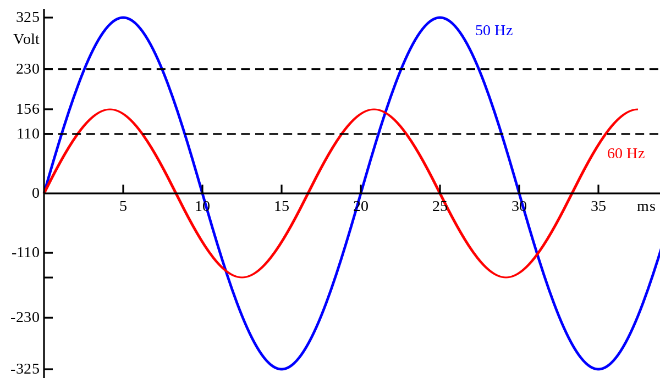

Por ejemplo:

- América del Norte usa una frecuencia de 60  Hz
- Europa y Asia usan una frecuencia de 50 Hz.

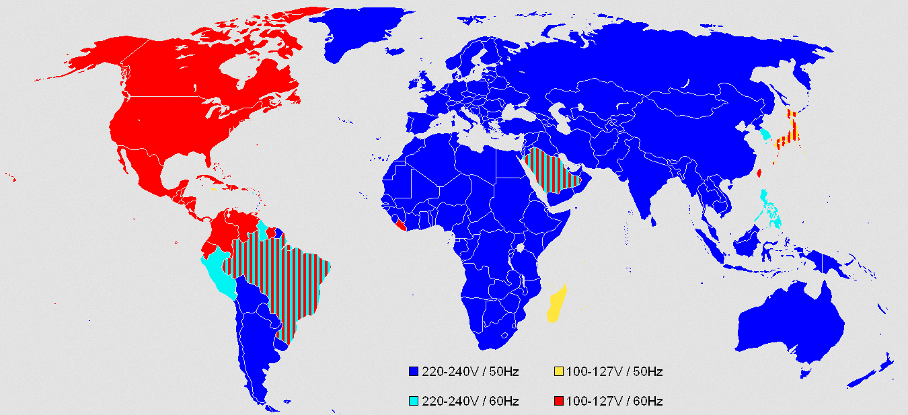

## Selector

Algunas fuentes de alimentación cuentan con un **selector** para seleccionar entre los dos sistemas de voltaje.

## Potencia

Por otra parte, deben tenerse en cuenta los riesgos que se pueden correr al utilizar una fuente de alimentación de potencia no adecuada. Si una fuente con un voltaje de 115V se utiliza con un sistema de 220-240V, la fuente se puede dañar y, en el peor de los casos, destruir la fuente y el resto del hardware.

Por el contrario, si una fuente con un voltaje de 230V se usa con un sistema de 110-120V, no se producen daños en la fuente.

## ¿Qué características tiene mi fuente?

Podemos encontrar las características eléctricas en la **etiqueta** de la fuente.

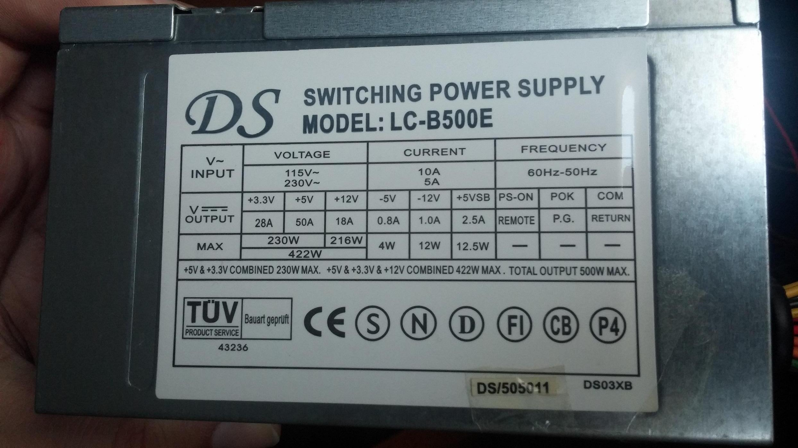

## Consumo eléctrico y coste

Para averiguar el precio del kWh hay que mirar la factura de la empresa que te vende la electricidad.

Por ejemplo, si el precio del kWh es de 0,11248€/kWh y el ordenador consume una potencia de 150w (0,15 kw):

- El coste en un día será de
0,41 €/día (0,15 kW · 24 h · 0,11248€/kWh)
- En un mes será de 12,15 €/mes (0,15 kW · 720 h · 0,11248€/kWh).

## Eficiencia

Con un 75% de eficiencia, una fuente que consume 100 W proporciona 75 W de salida en corriente continua y disipa 25 W en forma de calor.

A mayor eficiencia, se gasta menos energía en calor (menos desperdicio), se requiere menos aire para enfriar y la fuente es más silenciosa.

Sin embargo, hay que tener en cuenta que la eficiencia varía en función de la carga, siendo que a bajas cargas, la eficiencia disminuye drásticamente y la eficiencia más alta se suele producir entre el 50-75% de carga.

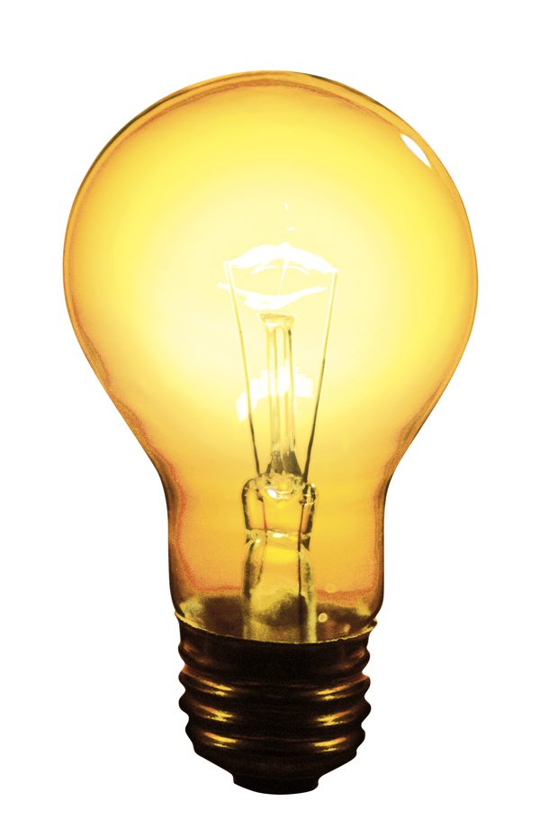

## Ejemplo de especificaciones técnicas

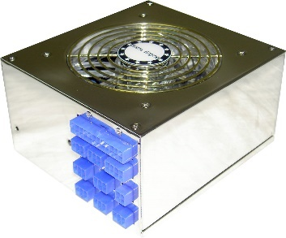

|   Model   | EP-550P5-T1 |       |       |       |       |       |       |
| :-------: | :---------: | :---: | :---: | :---: | :---: | :---: | :---: |
| AC Input  | 115-230Vac  |       |       |       |       |       |       |
|  Current  |    10/6A    |       |       |       |       |       |       |
| Frequency |   60/50Hz   |       |       |       |       |       |       |
| DC Output |    +3.3v    |  +5v  | +12v1 | +12v2 | -12v  |  -5v  | +5vsb |
| Max. Load |     28A     |  48A  |  20A  |  20A  | 1.0A  | 0.8A  | 2.5A  |
|  Wattage  |    210W     |       | 240w  | 240w  |  12W  |  4W   | 12.5W |
|           |    550W     |       |       |       |       |       |       |
|   Peak    |    650W     |       |       |       |       |       |       |

Especificaciones técnicas

|   Model   | Tuniq Miniplant 950W |       |       |       |       |       |       |
| :-------: | :------------------: | :---: | :---: | :---: | :---: | :---: | :---: |
| AC Input  |      110-230Vac      |       |       |       |       |       |       |
|  Current  |        10/6A         |       |       |       |       |       |       |
| Frequency |       60/50Hz        |       |       |       |       |       |       |
| DC Output |        +3.3v         |  +5v  | +12v1 | +12v2 | -12v  |  -5v  | +5vsb |
| Max. Load |         24A          |  30A  |  20A  |  20A  | 0.5A  | 0.8A  |  3A   |
|  Wattage  |         170W         |       | 810w  | 810w  |  6W   |  4W   |  15W  |
|           |         929W         |       |       |       |       |       |       |
|   Peak    |         950W         |       |       |       |       |       |       |

## Consumo eléctrico

Consumo de componentes

|       Componente        | Vatios  |
| :---------------------: | :-----: |
|    CD-ROM Drive SCSI    |   12    |
|     HD. 5400rpm IDE     |   10    |
|     HD. 7200rpm IDE     |   13    |
|    HD. 7200rpm SCSI     |   24    |
|    HD. 10000rpm SCSI    |   30    |
| Ventiladores caja (c/u) |  2 - 5  |
|      SDRAM (128M)       |    8    |
|     DDR RAM (128M)      |  2 - 8  |
|     DDR2 RAM (128M)     |  1 - 4  |
|    Procesador INTEL     | 25 - 75 |
|     Procesador AMD      | 21 - 72 |
|     Ventilador CPU      |  1 - 3  |
|          Ratón          |  ----   |
|       Placa Base        | 25 – 40 |

|         COMPONENTE          | Vatios  |
| :-------------------------: | :-----: |
|    Tarjeta de video AGP     | 30 - 50 |
|    Tarjeta de video PCI     |   20    |
| Adaptador de red 10/100 PCI |    4    |
|    Controladora SCSI PCI    |   20    |
|          MODEM PCI          |    5    |
|    Tarjeta de sonido PCI    |    5    |
|  Controladora FireWire/USB  |   10    |
|        Floppy drive         |    5    |

## Elección de una fuente

Factores a tener en cuenta

* _1\) Potencia necesaria_
  * Potencia insuficiente: posibles apagones inesperados
  * Demasiada potencia: elevado coste, menor eficiencia
* _2\) Capacidad máxima_
  * Capacidad media y pico
* _3\) Calidad de la fuente:_
  * Medidas de seguridad eléctricas
  * Sello de calidad
  * Marcas contrastadas

## Equipos portátiles

Equipos portátiles

* No tienen la fuente de alimentación integrada en la caja
* __Adaptador de corriente__
  * Un cable para conectar al equipo
  * Otro a la toma de corriente
* __Adaptadores universales__
  * Permiten regular el voltaje en función del equipo
  * Permiten utilizarse en diferentes gamas de equipos portátiles

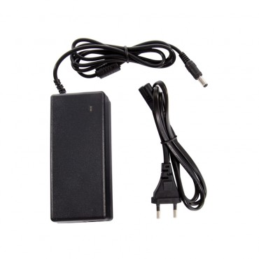

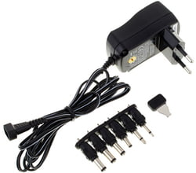

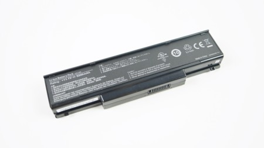

## Baterías

Las baterías se componen de celdas electroquímicas, las cuales almacenan corriente eléctrica. Aunque no siempre es así, en general a más celdas hay más capacidad.

Estas permiten trabajar sin necesidad de estar conectado a una toma de corriente, y se recargan mediante adaptador. La capacidad de una batería se mide en miliamperios hora (mah) y densidad de energía (mWh).

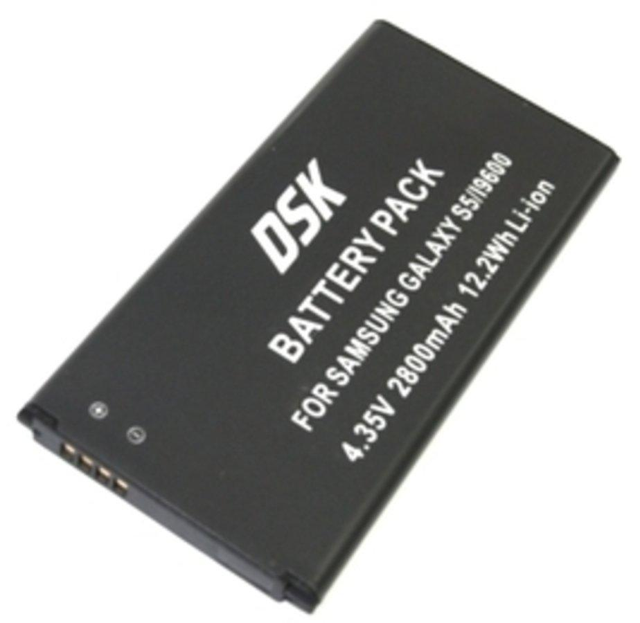

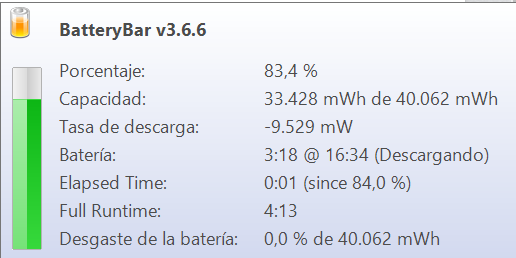

Equipos portátiles

* _Composición de las baterías_
* __Componentes__  más comunes
  * Níquel\-Cadmio
  * Níquel\-Hidruro metálico
  * Actualmente: Ión litio \(Li\-ion\)
* __Baterías ion litio__
  * Componentes ligeros
  * Alta capacidad energética
  * Gran resistencia a la descarga
  * Utilización en teléfonos móviles, reproductores de música, etc\.

## Etiqueta

Las baterías deben estar etiquetadas con un código de referencia, su voltaje, su capacidad mínima (en mAh y/o mWh) y la tecnología (Ni-Cd, Li-Ion).

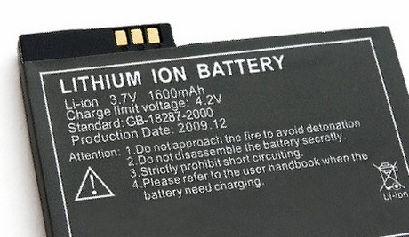

## Equipos portátiles

Los equipos portátiles se han desarrollado para requerir menos espacio, integrarse en carcasas finas y ser dispositivos **sin baterías extraibles**.

La tecnología de **polímeros** ha sido una gran contribución para optimizar los equipos portátiles.

_Optimización de la vida de la batería_

Algunas estrategias para alargar la vida de la batería pueden ser:

- Reducir brillo pantalla
- Desactivar WiFi o Bluetooth
- Cerrar aplicaciones que no se usen
- Cargar y descargar 100% primeras veces
- No dejar descargar por completo el resto
- Utilizar modo ahorro de energía

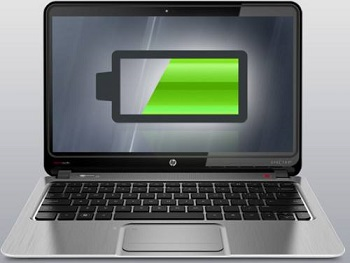

