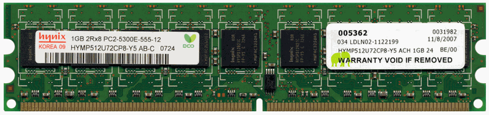
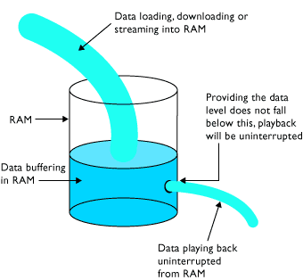

# Parámetros memoria RAM

Los parámetros más importantes de un módulo de memoria RAM son: Tipo de memoria RAM, Velocidad de memoria RAM, Tamaño de memoria RAM, Número de módulos, Latencia, Voltaje, Formato, Tecnología de memoria, o compatibilidad, entre otros muchos.

## Velocidad y ancho de banda

* _Frecuencia de trabajo_
* Mide la  _cantidad de operaciones que realiza la memoria en cada segundo_
  * Se mide en megahercios \( __MHz__ \)
  * 800 MHz = realizar 800 millones de lecturas y escrituras en un segundo\.
  * Cuanta más alta es, mayor es la tasa de transferencia \(MB/s\) entre la memoria y la CPU
* Ejemplo:  _2\.133 MHz_

__Memoria DDR2\-600 / PC2\-5300__

Frecuencia de 600 MHz = realiza 600 Millones de operaciones por segundo

Velocidad y ancho de banda

* _Velocidad de transferencia de datos_
* Máxima  _cantidad de información _ que puede transferir entre la memoria y el procesador por segundo
* Depende de:
  * __Frecuencia__ : cuantas operaciones se realizan por segundo
  * __Ancho de bus__ : cuantos bytes se transmiten por operación
  * __Tipo de memoria__ : DDR, DDR2, DDR3, etc\.
* Se expresa en MB/s o GB/s
* __Ejemplo: __  _17\.000 MB/s_

__Memoria DDR2\-600 / PC2\-5300__

Frecuencia de 600 MHz = realiza 600 Millones de operaciones por segundo

Transmite 5\.300 MB por segundo entre RAM y CPU

## Latencia CAS o CL

* _Latencia_
* Tiempo que transcurre desde que se piden los datos hasta que son enviados a los pines de salida del módulo\.
* Cuanto menor sea, más rápida será la respuesta de la memoria\.
* A veces se abrevia como  __CL __ \(Cas Latency\)  __o CAS\.__
* __Ejemplo: __
  * _CL14_ : 14 ciclos de reloj
  * _10 ns_ : tiempo de respuesta

__Memoria DDR2\-600 / PC2\-5300__

Frecuencia de 600 MHz = realiza 600 Millones de operaciones por segundo

Transmite 5\.300 MB por segundo entre RAM y CPU

Tiene una latencia de 6,7 ns

## ECC

* Memorias RAM pueden sufrir  __fallos__  \(bits pueden cambiar de valor\)
* Todas las memorias RAM experimentan errores
  * Fluctuaciones de energía
  * Interferencias
  * Componentes defectuosos
* _¿Qué es el ECC?_
* Mecanismo de detección y corrección de errores
* Memorias ECC gracias a la paridad pueden detectar y corregir algunos de estos fallos\.
* Se suelen encontrar en  __servidores__ , pero no en PC domésticos

KVR13S9S8/4 \- 4 GB \(1333 MHz, DDR3,  _Non\-ECC_ , CL9, SODIMM 204\-pin, 1\.5 V\)

KVR16E11/8 \- 8 GB \(1600 MHz DDR3  ECC  CL11 DIMM 240\-pin\)

## Buffered y registered

* Los  _buffers_  y los  _registros_  contienen datos y amplifican una señal
* justo antes de que los datos se escriban en el módulo\.
* Algunos DIMM usan búferes, algunos utilizan registros y otros no usan ninguno\.
  * Si un DIMM usa búferes, se llama  __buffered__  __ DIMM__
  * Si usa registros, se llama  __registered__  __ DIMM__
  * Si un módulo de memoria no admite registros o búferes, se lo denomina  __unbuffered__  __ DIMM\. __
  * __Full\-__  __buffered__  __ DIMM \(FB\-DIMM\):__  utiliza una técnica de almacenamiento en búfer avanzada que hace posible que los servidores admitan una gran cantidad de módulos DIMM\.
* Muescas en los módulos DIMM
  * Ubicadas para identificar las tecnologías que admite el módulo\.
  * Posición también evita que el tipo incorrecto de módulo se use en una placa base\.

## Características y efectos en el rendimiento

La memoria se refiere a la capacidad de almacenamiento de datos en una computadora. La **cantidad de memoria** disponible afecta directamente el rendimiento de un sistema. Cuanto más memoria hay, mejor será el rendimiento. Esto se debe a que la memoria ayuda a almacenar aplicaciones y datos que se están utilizando, lo que significa que los programas y datos se cargan más rápido.

Además, la **tecnología** de la memoria también juega un papel importante. DDR3 es más rápido que DDR2. Memorias buffered o registered pueden aumentar el rendimiento. La velocidad de la memoria también es importante. Utilizar la más rápida compatible con la placa base mejorará el rendimiento. Además, si instala módulos de diferentes velocidades, el sistema funcionará a la velocidad más lenta o podría ser inestable.

También hay que tener en cuenta si la memoria es **ECC** o no ECC. ECC es más fiable pero también más costoso. El ECC es más recomendable para los servidores. Sin embargo, el non-ECC es más rápido y menos costoso, aunque no es tan fiable.

Por último, la **clasificación CL** también puede influir en el rendimiento. Cuanto más bajo sea el CL, mejor. Además, la memoria multicanal también puede mejorar el rendimiento. Los módulos DIMM de diferente capacidad o velocidad pueden funcionar en canales individuales.

También se pueden utilizar **canales dobles o triples** si la placa es compatible con esta función. Para obtener el mejor rendimiento, se recomienda instalar parejas o tríos de módulos DIMM del mismo fabricante y características en cada grupo de ranuras de canales.
