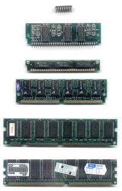
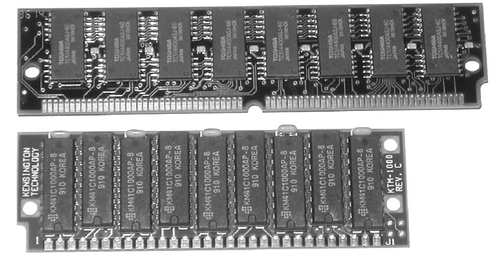
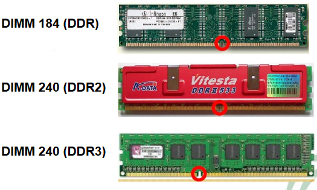

## Tipos de módulos

## Memoria RAM

* _¿Por qué estandarizar?_
* Necesidad de poder  __intercambiar__  los módulos
* Utilizar módulos de distintos  __fabricantes__
* __Creación estándares JEDEC__
* _Est_  _ándares_
  * SIP
  * SIPP
  * RIMM: Módulo propietario \(RAMBUS\)
  * SIMM
  * DIMM
  * SO\-DIMM: Portátiles
  * FB\-DIMM: Servidores

Módulos físicos \(línea temporal\)

## Módulos obsoletos

_Single In\-line _  _Memory_  _ Module_

Conectores \(pins\) por ambos lados interconnectados

_SIMM de 30 contactos_

__Longitud__ : 8,5 cm

Se deben instalar 4 módulos a la vez

__Capacidades:__  4Mb, 8Mb y 16Mb

Diferentes velocidades de acceso

_SIMM de 72 contactos_

__Longitud:__  10,5 cm

Se deben instalar 2 módulos a la vez

Bus de 32 bits\.

## Módulos DIMM \(Dual In\-line _  _Memory_  _ Module\)

* Tiene pines a lado y lado del borde de inserción
* Transfieren 64 bits de datos en cada ciclo de reloj
* No es necesario instalarlos módulos por parejas\.
* El más utilizado para la memoria SDR y DDR SDRAM
* Versiones para portátiles:  __SO\-DIMM y Micro\-DIMM__

## SO\-DIMM \(Small _  _Outline_  _ DIMM\)

* Versión compacta del módulo DIMM convencional\.
* Se utiliza en portátiles\.
  * SO\-DIMM de 200 contactos: DDR
  * SO\-DIMM de 200 contactos : DDR2
  * SO\-DIMM de 204 contactos: DDR3

## RIMM \(_  _Rambus_  _ In\-line _  _Memory_  _ Module\)_

  * Módulos de 184 pines y dos muescas
  * Trabaja con chips de memoria Rambus \(apareció con P4\)
  * Altas frecuencias de trabajo —> requieren disipadores de calor \(placa metálica que recubre los chips del módulo\)
  * Todos los zócalos de un banco deben estar ocupados y si no, habrá que instalar un módulo de continuidad para cerrar el canal

