# Conectores internos y externos

## Conectores internos

Algunos ejemplos

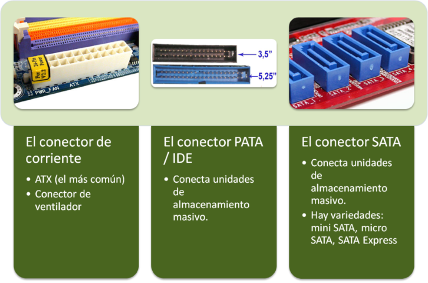

Conectores de energía

* Sirven para conectar los cables de la fuente de alimentación a la placa base
* La placa base suministrará la corriente a los componentes que se conectan a ella
  * Microprocesador, la memoria, las tarjetas de expansión, los ventiladores, etc\.
* Algunos de ellos son
  * __Conector ATX de 12 v de 4 pines \(P4\)__
  * __Conector ATX de 24 pines__
  * __Conector auxiliar de 8 pines__

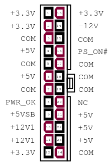

Conectores de energía

_Conector ATX de 24 pines \(_  _Molex 24 pines_  _\) _

Conector de 24 pines estándar por excelencia

Presente en la mayoría de las placas del mercado\.

Recibe todas las tensiones de la fuente de alimentación\.

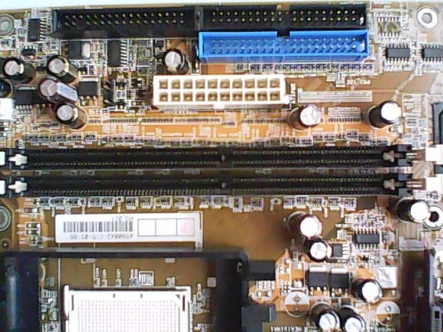

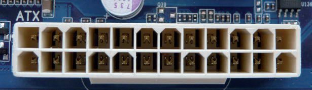

Conectores de energía

_Conector ATX 12 V de 4 pines \(_  _conector 2x2_  _\)_

Agregado a las placas base

Debido a la elevada demanda de energía por parte de los nuevos procesadores

Principalmente los de doble núcleo\.

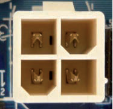

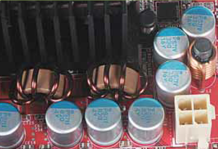

Conectores de energía

_Conector auxiliar de 8 pines: _

Se trata de un conector de ocho pines

Proporciona líneas de 12 V

Refuerza la alimentación de la placa base

principalmente para PCI Express

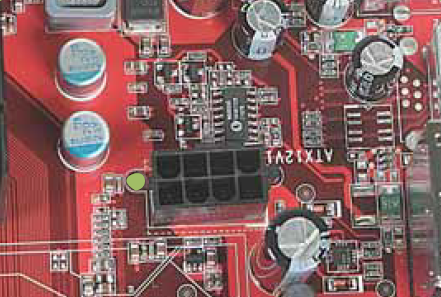

Dispositivos de almacenamiento

_FDD para disquetera_

__F__ loppy  __D__ isk  __D__ rive

Encargado de manejar la disquetera

Marcado como FLOPPY o las siglas FDD

Ya prácticamente obsoleto

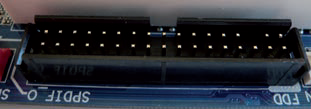

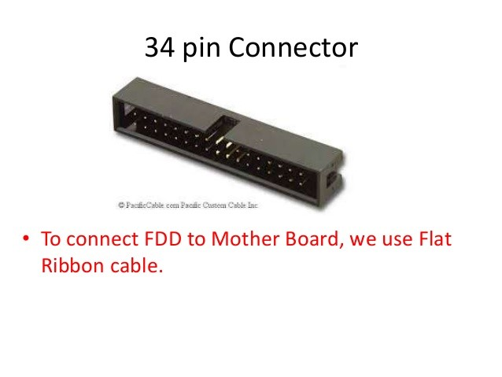

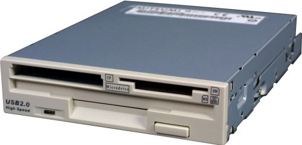

Dispositivos de almacenamiento

_IDE \(ATA paralelo, PATA\)_

Integrated Drive Electronics

Conectar discos duros y grabadoras o lectores de CD/DVD

2 canales IDE a los que podremos conectar hasta 4 dispositivos IDE, dos en cada canal\.

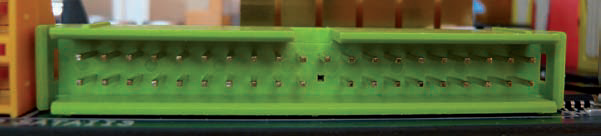

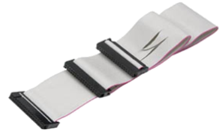

Dispositivos de almacenamiento

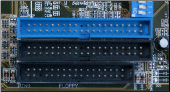

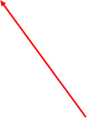

Dispositivos de almacenamiento

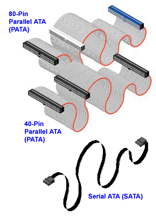

Dispositivos de almacenamiento

* _SATA \(Serial ATA o ATA Serie\)_
* Nueva interfaz para discos Serial Ata
* Mejorar las prestaciones de la interfaz ATA tradicional \(IDE o PATA\)
  * Mayor velocidad
  * Mejor aprovechamiento cuando hay varios discos
  * Mayor longitud del cable de transmisión de datos y
  * Capacidad para conectar discos en caliente

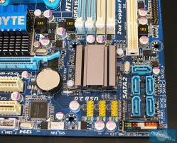

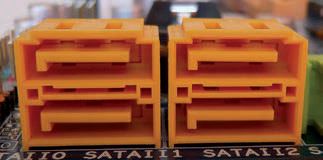

Destinados a conectar los discos duros y las unidades de CD/DVD/Blue Ray\.

Dispositivos de almacenamiento

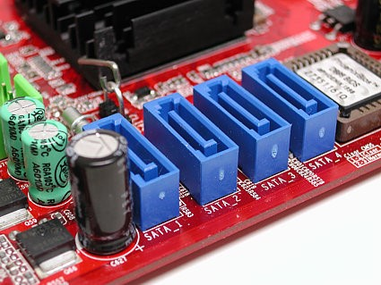

_SPDIF_

Conectores para entrada/salida digital de sonido

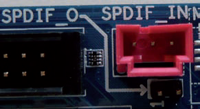

_FAN_

Conectan los ventiladores para el funcionamiento y refrigeración de componentes que funcionan a una gran velocidad

Ventilador para caja, CPU, etc

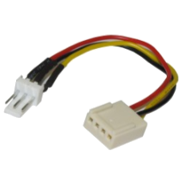

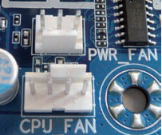

_CD\-IN_

Conecta el cable de audio al DVD o al CD para la reproducción de sonidos\.

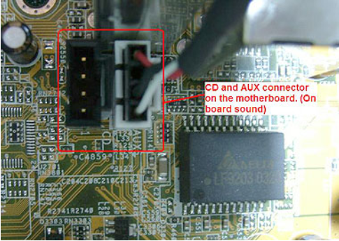

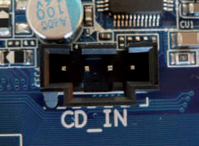

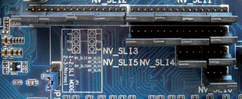

_Jumpers SLI_

Nos permitirán configurar las placas para que puedan admitir 2, 3 o más tarjetas de vídeo en los conectores  __PCI Express x16__

Por defecto, están configurados para una  __tarjeta de vídeo\. __

Consultar el manual de la placa base

* _Actualmente_
* __Nuevos chipset y placas detectan automáticamente:__
          * Qué tarjetas gráficas están conectadas
          * Si es la integrada o si es una o varias PCI\-Express
          * Si están puenteadas como SLI o como Crossfire\.

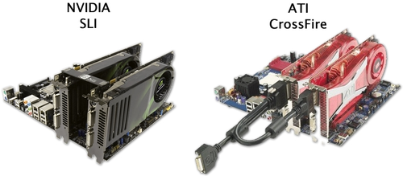

## Conectores externos

Conectores externos

Conjunto de conectores para todos los periféricos externos\.

Según las características de la placa podemos encontrar conectores USB, Ethernet, de audio, Firewire, eSata, FireWire

También DVI/VGA/HDMI/DisplayPort en el caso de que la placa base integre la tarjeta gráfica\.

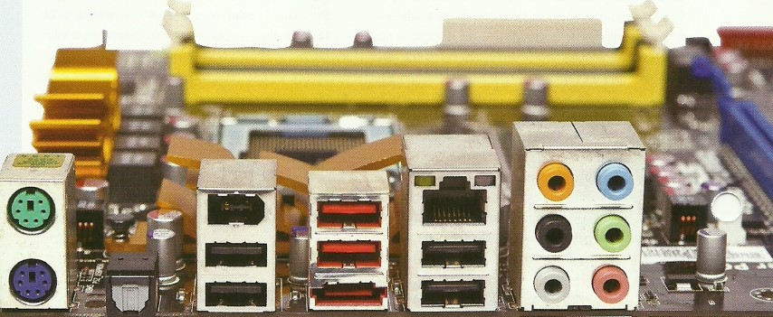

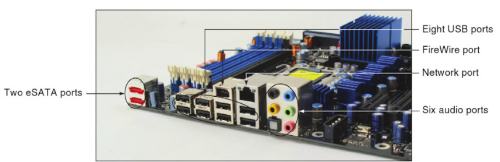

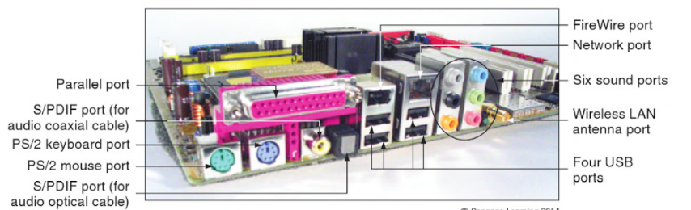

[https://hub\.totalsem\.com/content/2571\#path=2571,2576,2577](https://hub.totalsem.com/content/2571#path=2571,2576,2577)

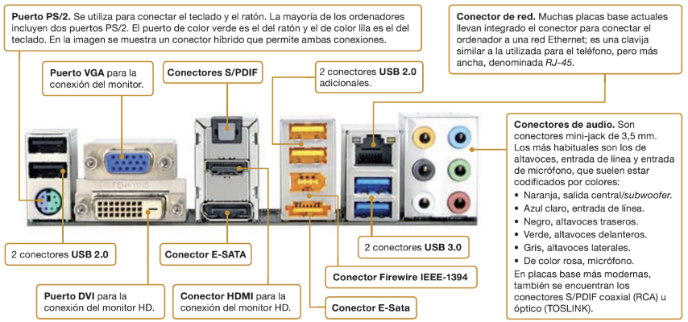

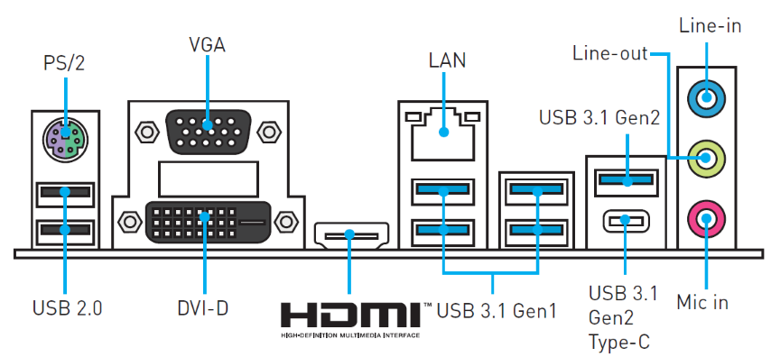

