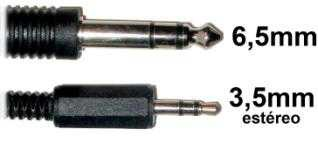
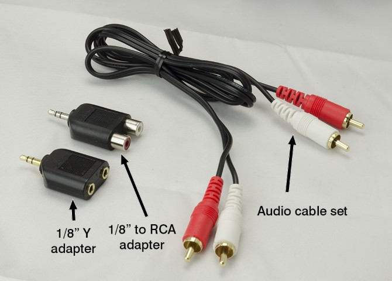
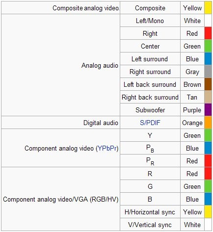
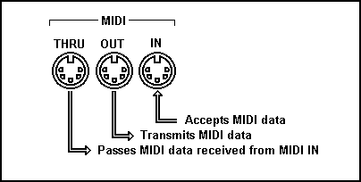
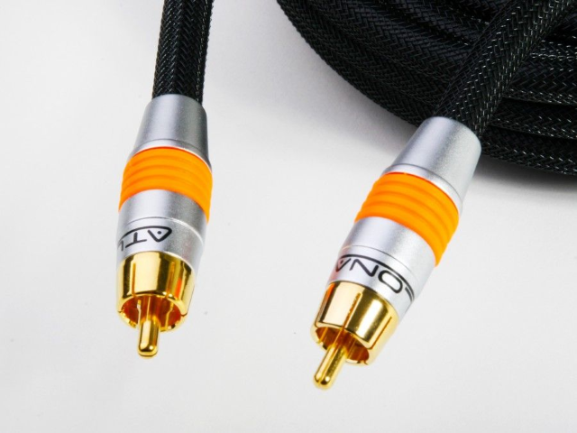
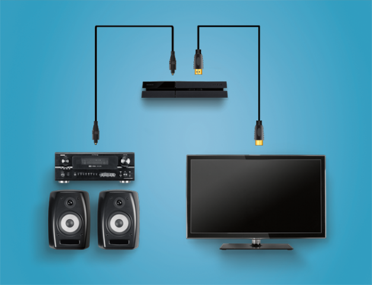

# Conectores de audio

## Conector jack

La conexión ``jack`` es un tipo de conector utilizado principalmente para la transmisión de señal de audio analógico. Se suele utilizar para conectar micrófonos, auriculares y otros sistemas similares. Posee un único pin central, que se divide en dos o más **secciones** mediante **aros** aislantes. Existen diferentes tipos de jack según su diámetro y sus anillos.

Los conectores Jack son una forma común de conectar dispositivos electrónicos, y hay dos tipos principales según el diámetro de su conector: el original de **6,5 mm**, que se utiliza principalmente para instrumentos musicales y dispositivos de audio profesional; y el más común, el de **3,5 mm**, que se usa en informática y otras áreas tecnológicas, y que está disponible en dos versiones: mono y estéreo.

El **Mini Jack (2,5 mm)** es un conector de audio utilizado en dispositivos pequeños como los auriculares, teléfonos móviles, tablets y otros dispositivos portátiles. Está diseñado para transmitir señal de audio mono, lo que significa que solo puede enviar una sola fuente de audio a los auriculares o altavoces.

### Tipos de conectores según anillos

* Tipos de conectores Jack según su construcción
  * __TS: __ Tip\-sleeve o punta\-funda\. Se utiliza en audio mono\.
  * __TRS: __ Tip\-ring\-sleeve o punta\-anillo\-funda\. Se utiliza en estéreo\.
  * __TRRS: __ Tip\-ring\-ring\-sleeve o punta\-anillo\-anillo\-cuerpo\. Utilizado en dispositivos en los que los auriculares incluyen micrófono

Conectores jack: códigos de colores

## Conectores RCA Audio

El formato RCA también se utiliza para señal de audio, tanto  _analógica como digital_ \.

Se diferencian mediante un  _código de colores _ en función del tipo de señal\.

Se utiliza en sistemas estéreo, así como sistemas de sonido envolvente\.

Adaptador jack a RCA

Código de colores para sonido envolvente.

## MIDI

MIDI significa  _Musical _  _Instrument_  _ Digital Interface_ \. Se utiliza para conectar dispositivos MIDI

Es un estándar para  _generar, transmitir y guardar composiciones musicales_ \.

Permite que los instrumentos “hablen” entre ellos\. Un piano, batería u otro instrumento,  _genera información acerca de cómo se ha generado una acción_

- Qué tecla se ha pulsado
- Cuando se ha pulsado
- Cómo de fuerte o rápido
- Por cuanto tiempo se ha mantenido presionada

* El conector utilizado es del tipo DIN de 5 pines
* Es un tipo de comunicación que  _solo funciona en un sentido_ \. Se diferencia entre
  * Quien envía la señal \( __maestro__ \)
  * Quien la recibe \( __esclavo__ \)\.

### Puertos MIDI

* Un dispositivo MIDI,  _3 tipos de puertos_ :
  * __MIDI __  __Out__  __: __ Salida de mensajes
  * __MIDI In: __ Entrada de mensajes\.
  * __MIDI __  __Thru__  __: __ Pasar copia de los mensajes que llegan a MIDI In
* Se pueden conectar varios equipos MIDI en cascada\.
* El estándar General MIDI permite 128 sonidos y efectos de todo tipo

Utilizado para  __audio profesional__ \. Módulos de sonido de estudio, micrófonos, y aparatos de alta gama\.

Permite tiradas de cable hasta 350 metros\.

Transmite audio estéreo y codificado en Dolby Digital y DTS

No admite sonido en alta definición

## SPDIF

* De Sony/Philips Digital Interface Format\.
* Se trata de un tipo de conexión de audio digital para distancias cortas\.
* La señal completa se transmite a través de un único cable en lugar de varios\.
* Se utiliza principalmente para interconectar equipos  _home _  _theatre_  _ _ y otros sistemas digitales de  _alta fidelidad _ \(Hi\-Fi\)
* Se puede transmitir sobre
  * _Cable coaxial _ \(señal eléctrica\) mediante conectores RCA
  * _Cable de fibra óptica _ \(señal óptica\) mediante conectores  _TOSlink_
* Soporta audio  _estéreo_ , y sonido codificado en  _Dolby Digital, _ pero no soporta audio en alta definición\.

### Fibra óptica

La conexión de audio ``S/PDIF`` emplea una señal óptica para transmitir los datos digitales. Esta señal óptica se genera a través de un LED que emite pulsos de luz, que son captados en el otro extremo. La señal óptica es inmune a interferencias electromagnéticas y de RF, aunque se pueden producir cortes de señal si se presiona o se dobla el cable. El cable de fibra óptica tiene una longitud máxima de aproximadamente 10 metros.

