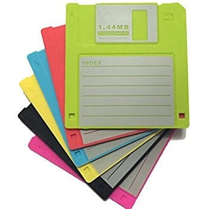
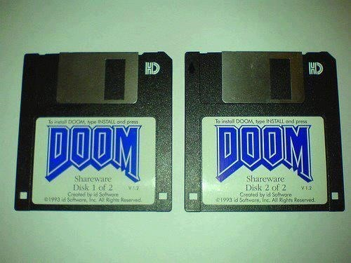
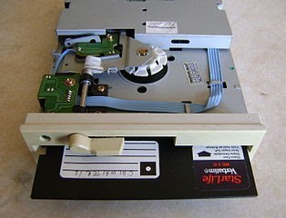
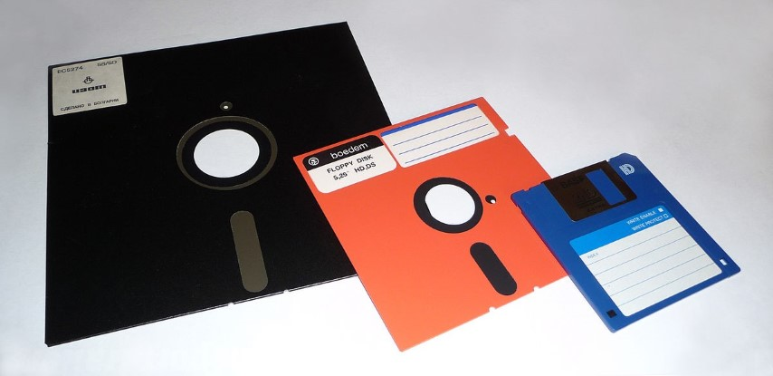
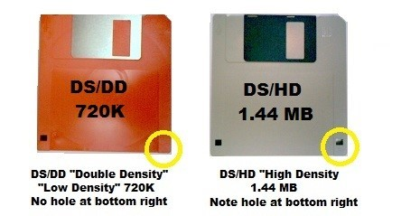
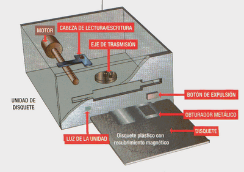
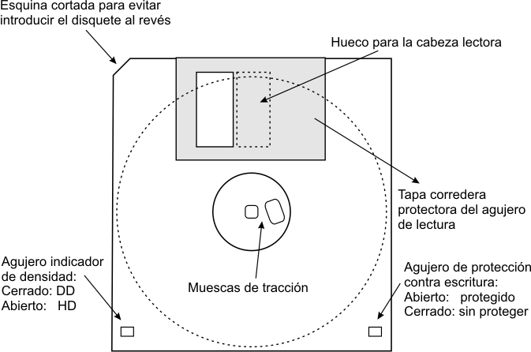

# 1. Disquetes

## Discos flexibles

El disco flexible o  __floppy disk__  es el soporte magnético que almacena permanentemente la información\.

Las unidades de discos flexibles o  __disqueteras__  son aquellas que leen y escriben la información contenida en unos discos que son transportables e independientes de la unidad\.

Las características principales de los disquetes son:

## Tamaño físico

Existen diferentes formatos de disquetes, el de 3 ½ pulgadas y el de 5 ¼ pulgadas\.

El de 5 ¼ apenas se usa, y anteriormente a este último hubo un disquete de 8"\.

_Capacidad de los discos:_

Existen varias capacidades que dependen del tamaño del disco

__Formato de 3 ½__  __:__  __ __ 720 KB\. 1,44 MB o 2,88 MB\.

__Formato de 5 ¼: __ 360 KB y 1,2 MB\.

Además de estas características particulares los disquetes tienen otras características similares a los discos duros, aunque sus valores son inferiores\.

Dichas características son:

## Velocidad de transferencia

Es la velocidad a la cual se transmiten los datos desde la disquetera hasta la tarjeta controladora a través del bus de datos\.

Tiene una media de 1\.500 Mbits/segundo\.

_Tiempo de acceso: _

Es el tiempo que tarda hasta que las cabezas lectoras leen el primer bit desde el momento que se da la orden\.

Suele ser de una media de 300 ms

## Proceso de lectura y escritura

Cuando se introduce un disquete en la unidad, este presiona contra un sistema de palancas, y su  __lámina metálica __ de protección se desplaza automáticamente para exponer el disco circular magnético que tiene en su interior\.

En el caso de los obsoletos disquetes de 5 ¼ , simplemente tenemos que meterlos con el de lectura hacia el fondo y luego cerrar una pestaña que lleva la disquetera\.

Otro movimiento de palancas y engranajes mueve dos cabezas de lectura/escritura hasta que casi tocan el disco por ambos lados\.

Las cabezas, que son  __electroimanes__  minúsculos, utilizan impulsos magnéticos para cambiar la orientación de las partículas magnéticas incorporadas en el revestimiento del disco\.

El disco se pone a girar gracias a un motor eléctrico, que es puesto en funcionamiento por medio de una uña que se inserta en la muesca del concctor del disco\.

* Tiene unos  __circuitos__  que reciben señales de la tarjeta controladora, que incluyen instrucciones e información para escribir en el disco\.
* Estos circuitos traducen las instrucciones en señales que
  * Controlan el movimiento del disco
  * Controlan las cabezas de lectura/escritura\.
* Cuando esas señales incluyen instrucciones para escribir en el disco, se comprueba que no pasa ninguna luz a través de la ventana o muesca de protección contra escritura\.

* __Disquetes de 3 ½ __
  * Si la  __ventana__  está abierta el disco está protegido y no se puede escribir en él
* __Disquetes de 5 ¼  __
  * Si no pasa la luz en la muesca está protegido
* En ambos casos si ocurre lo contrario de lo descrito se puede escribir en él\.
* Las cabezas se desplazan hacia el disco y se ponen en contacto con él para transmitir las señales y grabarlas o leerlas del disco al ponerse en contacto con este\.

