## Unidad: Verificación y testeo

## Verificación y testeo

Índice de contenidos

[Proceso de arranque](slide3.xml)

[Secuencia POST](slide19.xml)

[Verificación y testeo de la BIOS](slide31.xml)

Verificación y testeo de hardware

Herramientas de diagnóstico de software

Herramientas de comprobación y optimización de soportes de información

## Proceso de arranque y verificación

El proceso de arranque y verificación se refiere al procedimiento que sigue un computador desde el momento en que se enciende hasta que se carga el sistema operativo.

1. Esto se inicia con el botón de encendido, que suministra la corriente al PC.
2. Luego, se ejecuta la ``BIOS``, la cual es una memoria que contiene un programa llamado SETUP.
3. Seguidamente, se realiza una auto-prueba llamada ``POST`` para comprobar la operatividad de los dispositivos conectados. Después de esto, el ``Master Boot Record (MBR)`` busca el sector de arranque.
4. El ``Boot Manager`` toma el control del sistema e inicia el sistema operativo, finalizando así el proceso.

## Arranque en frío y en caliente

La BIOS es quien controla la secuencia de arranque del ordenador\. Cada vez que se enciende la máquina se realizan una serie de operaciones\. Esto es lo que se conoce como  __arranque en frio__ \.

Si el reinicio se hace mediante la pulsación de  _++ctrl++\+Alt\+Supr_ , se realiza un  __arranque en caliente__ , produciéndose el mismo proceso descrito a continuación  pero saltando el POST

__Recuerda: __ No es igual un arranque  del ordenador cuando está apagado, que un reseteo\. Al resetear un equipo parte de la BIOS ya está cargada en la memoria RAM y obviamente hay fases que se pueden  obviar puesto que ya han sido comprobadas\.

Secuencia de arranque

_1\) Pulsar el botón de encendido_

Se pone en marcha la fuente de alimentación del PC

Empieza a dar electricidad a todos los componentes

La corriente llega  a la placa base, microprocesador, ventiladores, unidades de almacenamiento y demás dispositivos conectados\.

Los ventiladores comienzan a funcionar

Se percibe el sonido del motor del disco duro\.

Fuente de alimentación realiza autocomprobación

Cuando los valores son aceptados, manda a la placa base la señal  __POWER GOOD__

El procesador empieza a operar

Lee y ejecuta las instrucciones de la BIOS\.

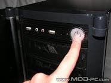

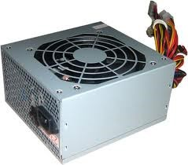

Secuencia de arranque

_2\) El microprocesador se inicia y carga la BIOS_

El PC ejecuta los comandos que se encuentran en memoria\.

Nada más arrancar la máquina, la memoria no contiene aún ningún tipo de software

La  __BIOS__  quien asume las funciones de control en el PC\.

__¿Dónde se encuentra la BIOS?__

El microprocesador acudirá a una dirección  de memoria estandarizada

En ese lugar de memoria se encuentra el inicio de la BIOS\.

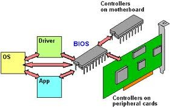

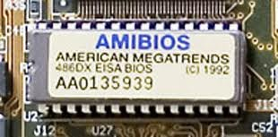

## POST

Durante el proceso de arranque de la BIOS, se ejecuta el ``POST`` o Test de autochequeo para comprobar el hardware detectado. Esta comprobación permite detectar posibles problemas de los componentes físicos y/o una mala configuración de la BIOS.

El ``POST`` realiza un recuento de la memoria RAM, verifica la propia BIOS, detecta dispositivos y buses de sistema, ejecuta programas específicos como el SCSI-BIOS, Video BIOS, etc., asigna los canales DMA e IRQ, y busca adaptadores que también incluyan su propia BIOS, como la tarjeta gráfica y el disco duro, para poder ejecutar sus instrucciones.

Si hay algún **error** durante el POST, se detendrá el proceso y se generarán los mensajes acústicos y ópticos pertinentes. En caso de que el proceso continúe de todos modos, se evaluarán el resto de los dispositivos.

## 4. Detección de hardware adicional_

Pasadas estas comprobaciones se habilitará el monitor, mostrando el conteo de memoria del sistema

Se realizará un “inventario” de los componentes del PC, para habilitar un chequeo por cada uno de los dispositivos instalados\.

Es ahora cuando se inicia el proceso de  _Plug&Play_  mostrando en pantalla todos los elementos encontrados\.

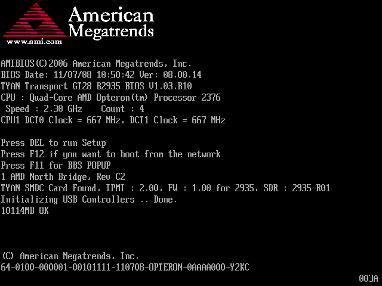

Secuencia de arranque

## 5. Buscar unidad de arranque

Se busca la ``unidad de arranque`` del sistema operativo, la **secuencia** definida en el BIOS determina el orden de arranque de la memoria CMOS. Esta secuencia es modificable por el usuario para poder acceder al sistema operativo desde otros dispositivos como un disco duro, una unidad de CD-ROM, una unidad de red o un pendrive.

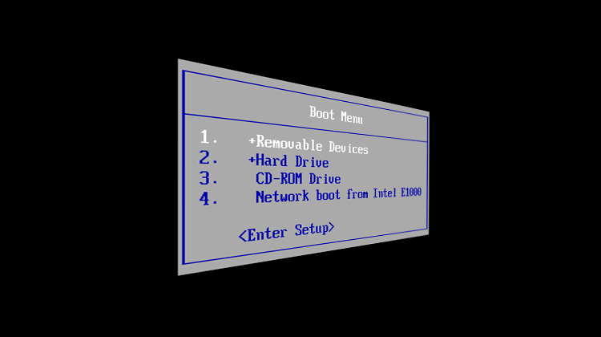

## 6. Buscar el sector de arranque:_

En el arranque de un sistema, la BIOS busca en una ubicación física específica, conocida como el sector de arranque, también llamado Master Boot Record (``MBR``), que se encuentra en el primer sector del disco duro, específicamente en el cilindro 0, cabeza 0 y sector 1.

El ``MBR`` se crea cuando se realizan las particiones en el disco duro y suele contener el Boot Manager, un programa que realiza la carga del sistema operativo. Si el sector de arranque está preparado con las rutinas oportunas, el sistema se iniciará; en caso contrario, la búsqueda continuará en otras unidades.

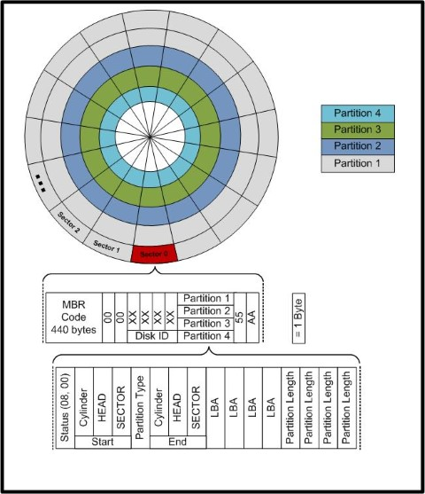

## 7. Carga del gestor de arranque_

El ``gestor de arranque`` es un pequeño programa que permite al usuario elegir el sistema operativo que desea cargar, permitiendo tener varios sistemas operativos instalados en una misma máquina. Existen distintos programas de gestores de arranque, como ``LILO`` o ``GRUB`` para Linux y ``NTLDR`` para Windows. Estos programas cargan el sistema operativo elegido por el usuario y permiten tener varios sistemas operativos en una misma máquina.

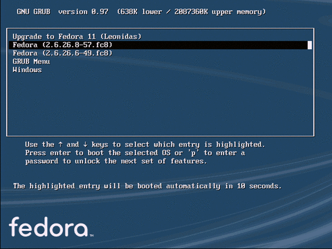

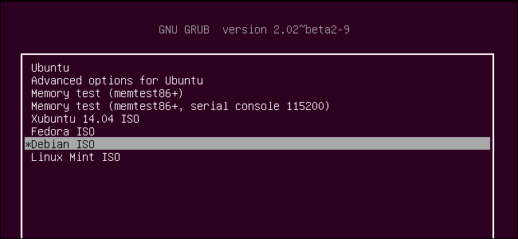

Secuencia de arranque

Secuencia de arranque

## 8. Proceso de carga del SO

Una vez que el ``gestor de arranque`` toma el control, si tenemos varios sistemas operativos, nos preguntará cuál deseamos cargar; mientras que si solo hay uno, el equipo lo ejecutará automáticamente.

El proceso de carga del sistema operativo consiste en cargar el núcleo o ``Kernel``, que ejecuta las operaciones básicas del sistema. Posteriormente se ejecutan los demás procesos que realizan las operaciones del sistema, como las funciones de red, sonido, visualización, escritorio, etc.

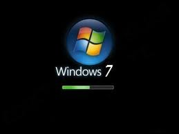

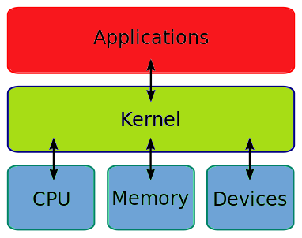

Secuencia de arranque

## ¿Qué ocurre si no hay SO?

En caso de evaluar todas las unidades y no encontrar el arranque del sistema operativo,

Error en pantalla indicativo del problema del tipo “ _No _  _boot_  _ device _  _available_ ” \(ningún dispositivo de arranque disponible\)

Se solicitará la inserción de un disco de arranque\.

Este mensaje variará según la BIOS\.

Esperando    Power Good

Ejecución del POST

P&P y otras comprobaciones

Búsqueda del S\.O

Arranque del Sistema\.

## Configuración de la BIOS

* La BIOS o “Basic Input Output System”
* Interfaz que actúa entre el hardware y el sistema operativo implementado a bajo nivel\.
* __Configuración de la BIOS__
* Contiene un programa,  _BIOS SETUP_ , encargado  de configurar la máquina\.
* En estas pantallas de  __configuración__  es posible ajustar diferentes aspectos
  * Velocidad  de acceso a la memoria RAM
  * Multiplicador  de la CPU
  * Habilitar, deshabilitar o configurar los componentes  integrados en la placa base,
  * Gestión de energía
  * Comprobar valores de temperatura, voltajes, etc\.

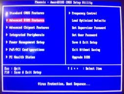

Interpretación de los códigos POST

* Indicamos el significado de los pitidos que escuchará:
  * Un solo pitido corto, el sistema se inicializa correctamente\.
  * Un pitido corto seguido de dos largos, desmontar y volver a montar la tarjeta gráfica en el puerto AGP\.
  * Una serie de pitidos espaciados, se trata de un problema de los módulos de memoria\. Desmonte y vuelva a montarlos\.
  * Una serie de pitidos que parecen una alarma, se trata del procesador, que está defectuoso o mal insertado\.
  * Una serie de pitidos muy seguidos, se trata del teclado que puede tener una tecla cogida,  muévalo poniéndolo hacia abajo\.
  * Un bip continuo es el indicador de una alimentación de corriente defectuosa\. Comprobar que el cable de alimentación no esté haciendo  tierra con la caja\.

## Secuencia POST

## BIOS

Memoria especial alojada en placa base

Contiene una aplicación básica \(BIOS\)

Se inicia cuando se enciende o resetea equipo

La aplicación \(BIOS\) da nombre a la memoria que la contiene

## Funciones de la BIOS

* Funciones principales \(en orden\)
  * Comprobar hardware del sistema \(POST\)
  * Buscar unidad de arranque del SO \(Boot\)
* No carga SO si hay fallo en el test del sistema
* Desde 2011: EFI BIOS

## Secuencia POST

* _Power_  _\-_  _On_  _\-_  _Self_  _\-Test_  \(autocomprobación de arranque\)
* Conjunto de rutinas
* Comprueban el estado de puntos del equipo
* Gama variada de POST
  * Diferentes partes comprobadas y orden
  * Se adapta a las prestaciones de la placa

* 2 secuencias más comunes corresponden a
  * Placas con  BIOS AMI
  * Placas con  BIOS AWARD
* Actualidad:
  * AMI forma parte de AWARD
  * AWARD es versión predominante

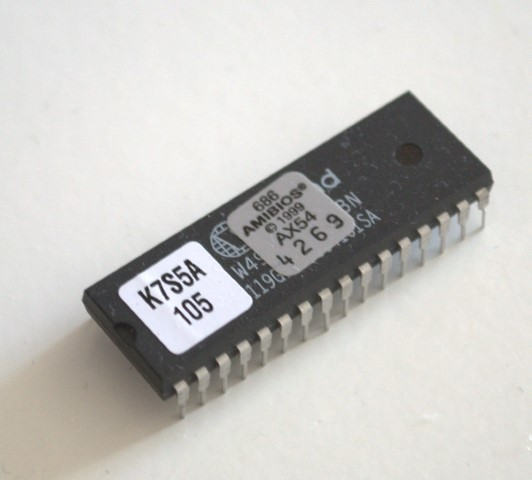

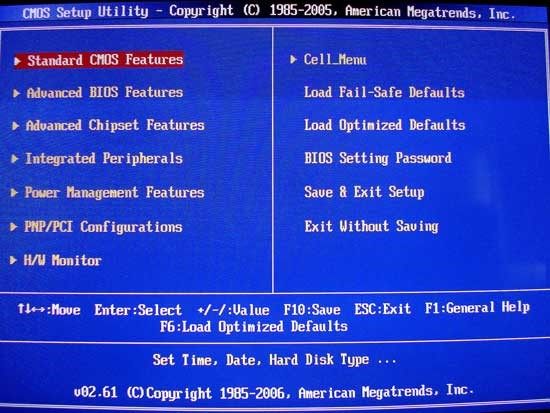

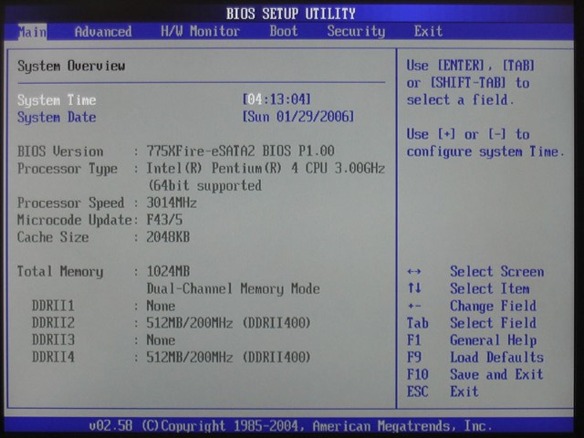

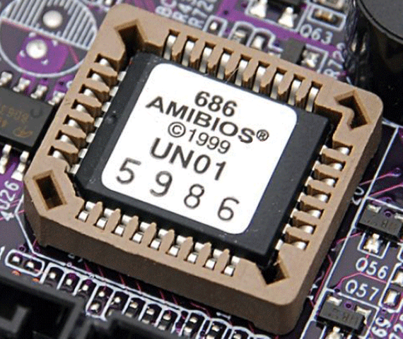

__Secuencia del POST en una BIOS AWARD__

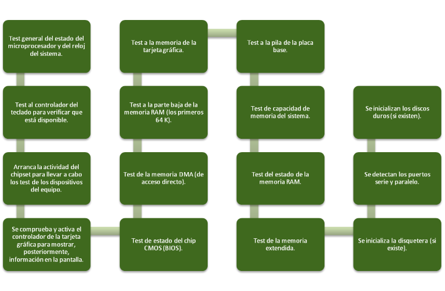

__Secuencia del POST en una BIOS AMI__

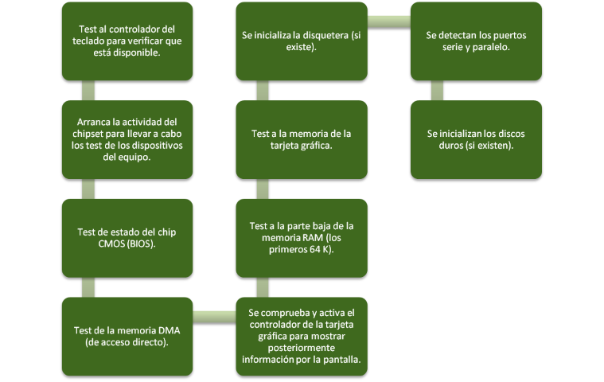

* _Si no ha fallado ningún test_
  * Se pasa el testigo al BOOT
    * Carga el SO en el equipo

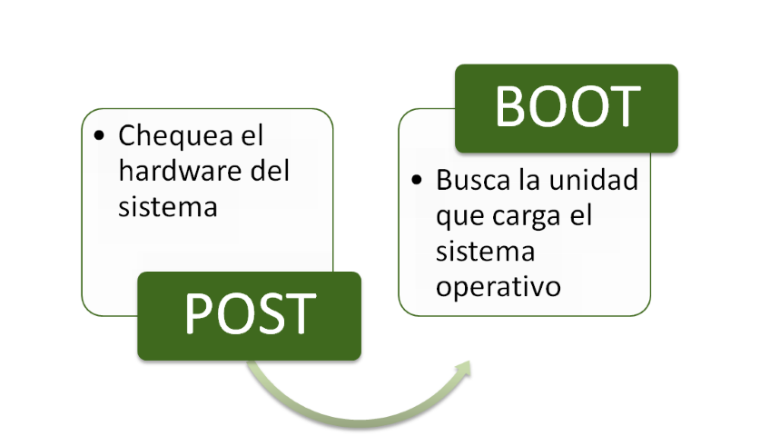

## Notificaciones de error POST

* _Notificación de fallos_
  * Secuencia de pitidos
  * Mensajes de error en pantalla
* _Según el error_
  * Permitirá seguir carga del sistema
  * Obligará a solucionar el fallo

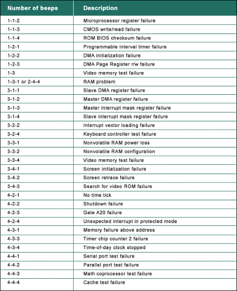

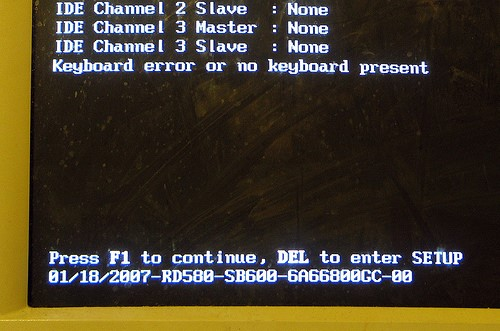

Cada BIOS tiene sus mensajes

Prácticamente son los mismos

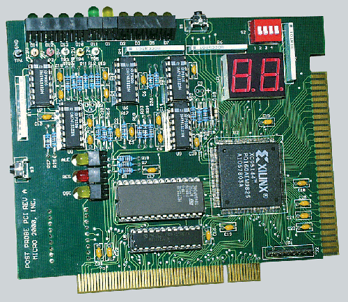

## Tarjeta de diagnóstico

* Tarjeta de diagnóstico
  * Permite visualizar códigos POST\.
  * Manual  de operación y tablas de  códigos
  * Se acopla a placa base: slot  PCI o ISA
  * Display código hexadecimal
  * 00 o FF:  Test completados\. preparado para BOOT

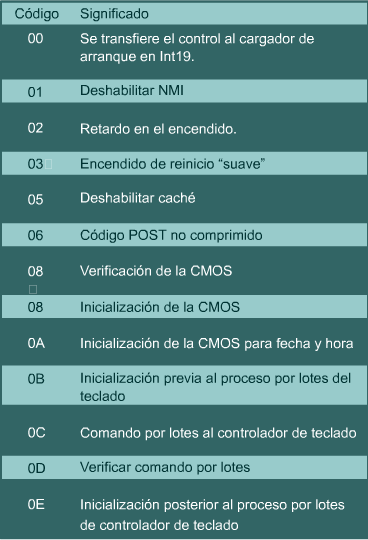

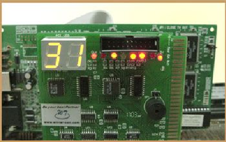

## Borrado de BIOS

* Si modificamos erróneamente la configuración básica de la BIOS
* Podemos volver a cargar la  _configuración de fábrica _
* _Clear CMOS_
* Borrado de las modificaciones, volviendo los valores a los grabados en fábrica\.
* Dos opciones
  * Con jumpers \(interruptores que cierran y/o abren circuitos\)
  * Quitando la pila que alimenta la BIOS durante unos segundos y luego colocarla nuevamente, todo volverá a la normalidad

 __Posiciones Jumper__ 

1\)  __Jumper en pines 1\-2: __ Configuración actual 2\)  __Jumper en pines 2\-3: __ Permite entrar en un menú para borrar la configuración establecida\.3\)  __Sin Jumper: __ Permite acceder a un modo Recovery para recuperar la Bios en caso de fallo de actualización

 __Extrayendo la Pila de la BIOS__ 

Antes que nada debemos desconectar la PC de la corriente y localizar nuestra pila en la placa base\.

La quitamos de su lugar, esperamos 1 minuto aprox\.

Esto será suficiente para borrar las modificaciones\.

Volvemos a colocar nuevamente en su lugar en la misma posición\.

Luego encendemos la PC y la configuración de la BIOS volverá a su estado inicial\.

## Verificación y testeo BIOS

## Verificación y testeo en el arranque

Configuraciones BIOS

Verificación de  voltajes y temperaturas

Verificación y testeo de  memoria RAM

Verificación y testeo de  placa base

Verificación y testeo del  chipset

Verificación y testeo de  unidades de disco

## Configuraciones BIOS

* Tipos
  * Configuración por defecto:  Programada por el fabricante
  * Configuración óptima:  Adaptada a prestaciones de la placa
  * Configuración establecida por el usuario\.
* Resetear BIOS:
  * Jumper  o quitar  pila

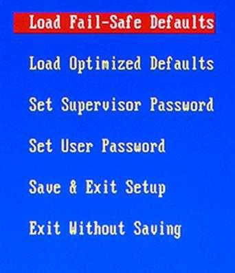

## Verificación de voltajes y temperaturas

* Comprueba voltajes y temperaturas de la placa:
  * AMIBIOS: HW MONITOR
  * Award\-BIOS: PC HEALTH STATUS
  * BIOS convencional: no disponible

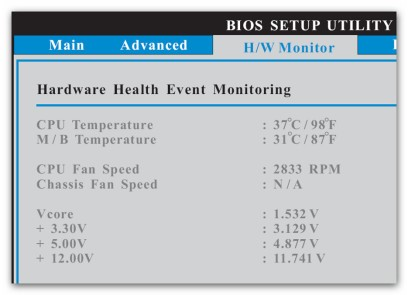

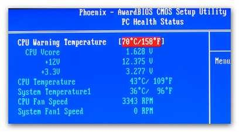

## Verificación y testeo de la memoria RAM

* Detalla la cantidad de memoria reconocida en el sistema:
  * AMIBIOS: MAIN
  * Award\-BIOS: STANDARD CMOS FEATURES

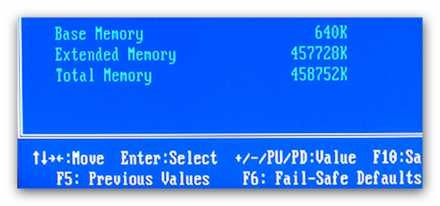

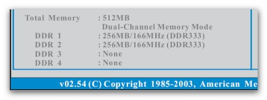

## Verificación y testeo de la placa base

* Verifica los conectores y dispositivos integrados en la placa base
  * AMIBIOS: MENU AVANZADO
  * Award\-BIOS: INTEGRATED PERIPHERALS

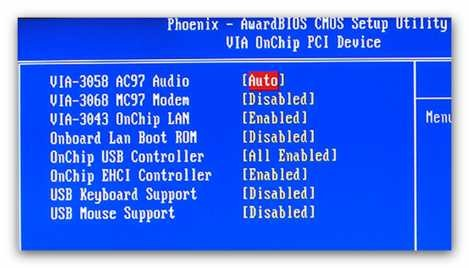

## Verificación y testeo del chipset

* Permite modificar 
  * Valores de trabajo de la RAM
  * Buses comunicación chipset
* Permite compartir 
  * Memoria RAM con la tarjeta gráfica

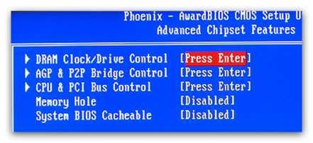

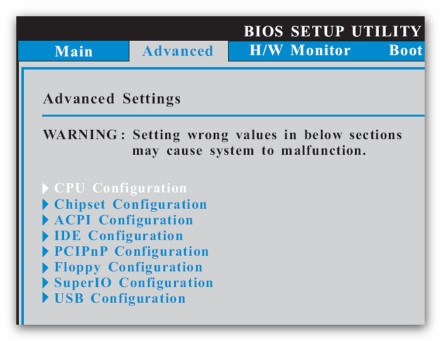

## Verificación y testeo de unidades de disco

* Verificar
  * Conexión de las unidades de disco al equipo
  * Su posición \(maestro y esclavo\)
* Establecerse orden de arranque \(   _boot_   \)
  * AMIBIOS: IDE CONFIGURATION
  * Award\-BIOS: STANDARD CMOS FEATURES

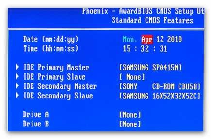

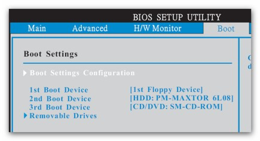

## Herramientas de diagnóstico de software

## Diagnóstico de software

* Diagnóstico del software:
  * Sistema operativo
    * Drivers instalados y actualizados, registro, etc\.
  * Seguridad del sistema
    * Actualizaciones de seguridad, eliminación de malware, etc\.
  * Soportes de información
    * Desfragmentación, eliminación de datos y programas basura

## Herramientas de diagnóstico de software

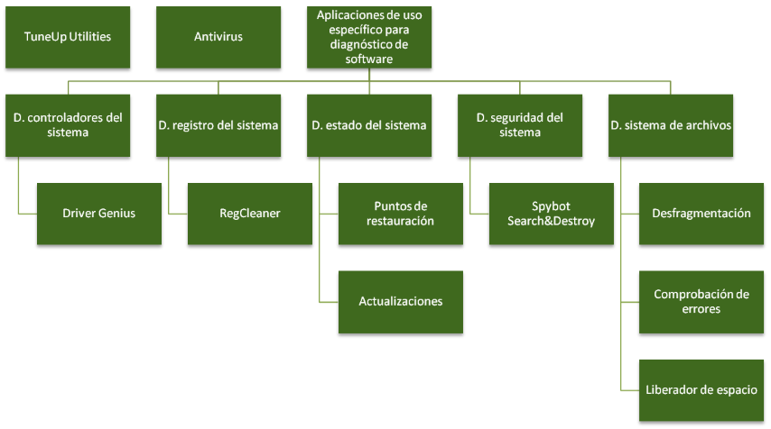

## TuneUp Utilities

Es muy común encontrar aplicaciones que reúnan más de una herramienta para que el usuario pueda llevar a cabo prácticamente todas las tareas del mantenimiento de software desde una misma interfaz, sin necesidad de utilizar diferentes aplicaciones para ello\.

Este es el caso de Tuneüp, que es una aplicación de pago con la que se pueden realizar diversas tareas de análisis y optimización del equipo: desde un mantenimiento completo del sistema operativo hasta la resolución de problemas de seguridad, limpieza I de los discos e incluso restauraciones completas del sistema\.

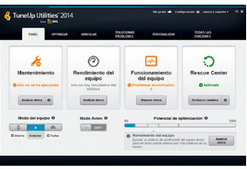

## Antivirus

Un sistema está obligado a tener un antivirus, y más aún si se dispone de acceso a Internet\.

Los antivirus son aplicaciones que velan por la seguridad de los equipos\. La oferta en el mercado es muy amplia, y existen además muchos antivirus que se ofrecen de forma gratuita y que disponen de todas las funcionalidades que puede ofrecer un antivirus de pago\.

Los antivirus actuales, sobre todo los de pago, son verdaderas suites y ofrecen al usuario protección a diferentes niveles: de su información en el equipo, su correo electrónico, su navegación en Internet, etc\.

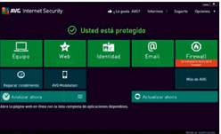

## Aplicaciones de sofware específico

## Diagnóstico de controladores del sistema (drivers)

* Drivers necesarios para funcionamiento de
  * Componentes internos
  * Periféricos
* Driver genius
  * Identificar componentes
  * Actualizar drivers automáticamente
  * Hacer copia de seguridad

##

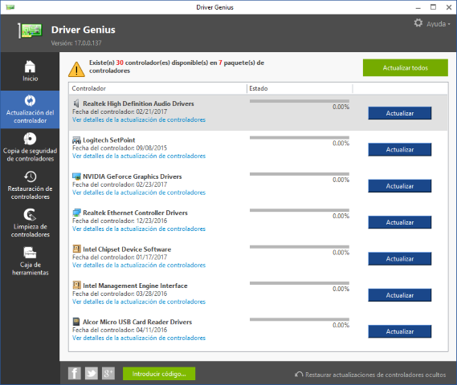

## Diagnóstico del registro del sistema

* Registro
  * Elemento propio de Windows
  * Rastro programas \(instalados y desinstalados\)
  * Necesaria limpieza
* Regcleaner
  * Limpia el registro de Windows
  * Modificar secuencia de arranque de Windows

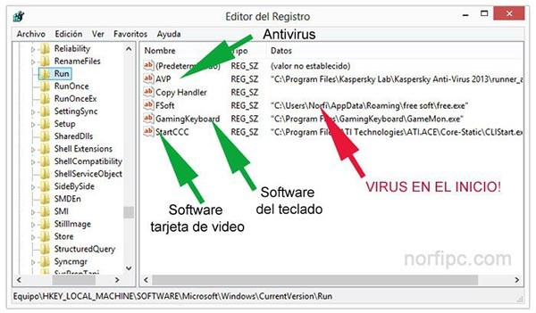

## Diagnóstico del estado del sistema

*  __Actualizaciones__ 
  * Aumentar alguna funcionalidad
  * Optimizar una función del sistema
  * Corregir un fallo de seguridad
  * Mantenerse al día
  * Crean punto de restauración
  * Automáticas o no

*  __Punto de restauración__ 
  * Copia del estado de un sistema
  * Después de instalación de programa o dispositivo
  * Restauración en caso de fallo
  * Volver a una fecha anterior

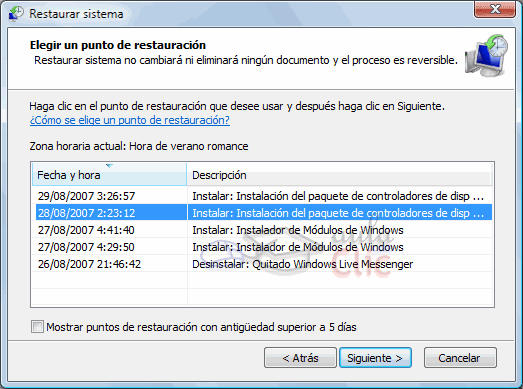

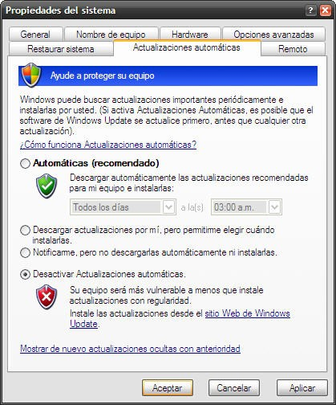

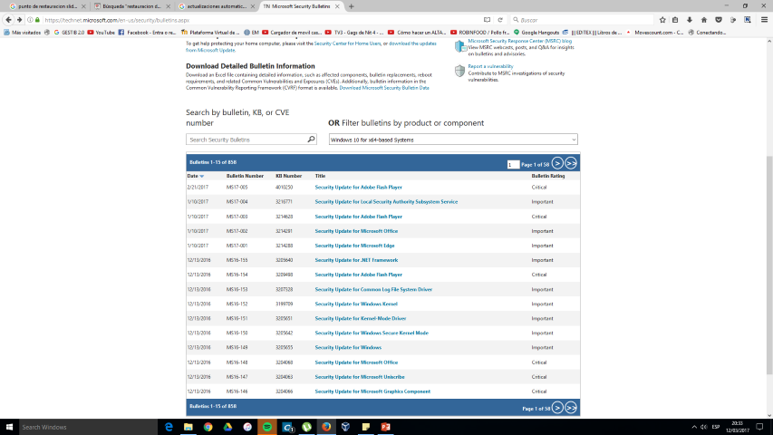

## Diagnóstico de seguridad del sistema

La seguridad es importante, conviene dedicarle tiempo y recursos\.

Además de los tradicionales antivirus, se pueden utilizar otras herramientas más específicas que se encargan de analizar y proteger el equipo contra otro tipo de amenazas como pueden ser los troyanos, el spyware, los gusanos, etc\. Aplicaciones como Spybot Search&Destroy \(con version gratuita y de pago\) cumplen a la perfección con este tipo de cometidos\.

Gran parte del malware \(todos esos programas que se infiltran en el equipo con un objetivo malintencionado\) proviene de software de dudoso origen y de páginas web con contenido ilícito\.

La mejor forma de protegerse es evitar exponerse: utilizar software legal, descargado de las páginas oficiales, y no navegar por lugares poco convenientes\.

## Diagnóstico del sistema de archivos

Los sistemas adolecen de un problema denominado fragmentación que, de forma muy resumida, consiste en la división de la información en fragmentos que se hubican en diferentes lugares del disco, la que origina lentitud en las operaciones de lectura y escritura\.Conviene mantener el sistema de archivos por debajo del 5% de fragmentación\. Para ello se puede emplear el defragmentador de disco, que se incluye en el propio sistema\.Las continuas operaciones de lectura y escritura, asi como otras acciones sobre el disco pueden originar errores en el disco\.Para evitarlo  se puede utilizar la herramienta de comprovación de errores que proporciona el propio sistema operativo\.Tanto los errores como otros archivos que se generan en el sistema se acaban convirtiendo en información residual\.El liberador de espacio en disco, integrado en el propio sistema, busca datos innecesarios y permite eliminarlos de forma segura\.
