# Herramientas

Las herramientas realmente imprescindibles para la manipulación de los componentes hardware de un PC son pocas, lo cual hace que sea muy recomendable  hacerse con todas ellas\.

Tener a mano las herramientas adecuadas antes de comenzar a trabajar hará que todo resulte más cómodo y te ayudará a mejorar la calidad del resultado final\.

## Destornillador plano de tamaño medio

Es probable  que apenas lo utilices para su función convencional, pero será muy útil para extraer dispositivos o abrir la caja, ya que tendrás la posibilidad de usarlo como palanca\.

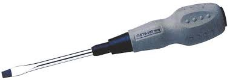

Técnicas  de montaje, sustitución y conexión de componentes y periféricos microinformáticos

Un destornillador plano de tamaño medio

Técnicas  de montaje, sustitución y conexión de componentes y periféricos microinformáticos

## Destornillador de estrella

Estos destornilladores tienen la punta en forma de estrella o, para ser más exactos, de cruz tipo Phillips\.

Debe tenerse en cuenta que los fabricantes suelen emplear tornillos de escasa resistencia, lo que supone que en muchas ocasiones estos no resisten la tensión a la que están sometidos e, irremediablemente, acaban erosionándose, lo que dificulta sobremanera su extracción\.

## Destornillador eléctrico

Así mismo se recomienda en el caso de que tengamos que montar o reparar varios equipos el tener un  __destornillador eléctrico de batería __ y con diferentes tipos de puntas: planas, estrellas, tork, tubular, etc\., pues nos facilita y agiliza el trabajo\.

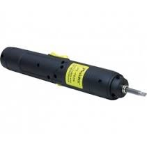

## Acaparador o herramienta de recuperación

Esta herramienta es de gran ayuda para recuperar aquellas pequeñas piezas que se hayan quedado dentro de la caja del PC, en lugares a los que resulta imposible acceder con los dedos\.

Un acaparador flexible de entre 10 y 15 cms lo más recomendable para trabajar con un PC\.

Técnicas  de montaje, sustitución y conexión de componentes y periféricos microinformáticos

## Pinzas de plástico o metal

Algunos componentes del PC, por ejemplo los discos duros, pueden configurarse mediante pequeños contactos metálicos, recubiertos de plástico, denominado _ _  _jumpers_ \. Dependiendo de su tamaño y posición, habrá que usar las pinzas para introducirlos o extraerlos\.

Las pinzas especificas para electrónica, se conoce como “antiestáticas” o ESD, y suelen ser de acero inoxidable no magnético o de plástico\.

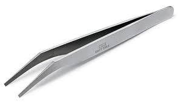

Evita las puntas  __imantadas__ , pues no es recomendable introducir campos magnéticos en las proximidades de los chips o tarjetas de expansión\.

Naturalmente, una punta imantada evita muchos quebraderos de cabeza a la hora de trabajar con tornillos de difícil acceso, pero más vales tener que perder unos minutos en colocar un tornillo que dejar inservible algún componente del ordenador\.

## Linterna o luz orientable

Para trabajar en lugares repletos de componentes, como en el interior de la carcasa de un PC, contar con una buena iluminación resulta de vital importancia, en especial cuando realizas algunas operación con el PC apoyando en el suelo o bajo una mesa\.

Un flexo orientable o bien una linterna resultan de gran utilidad en estas situaciones\.

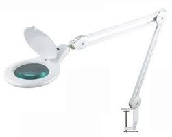

## Pulsera antiestática

Es muy importante y aconsejable utilizarla para evitar descargas electrostáticas\.

De vez en cuando, al tocar un  __objeto metálico __ puedes notar una pequeña descarga  provocada por la electricidad estática acumulada en nuestro cuerpo\.

Electricidad suficiente para destruir algunos componentes electrónicos del interior del PC\.

Para evitar este riesgo debes usar una  __pulsera__   __antiestática__ , cuya finalidad es conseguir que tu cuerpo esté al mismo potencial eléctrico que el objeto que toques\.

En caso de no disponer de una pulsera antiestática, debes  __tocar la estructura metálica __ de la caja con cierta frecuencia, antes de tocar cualquier chip o tarjeta del PC\.

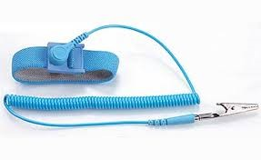

## Alicates planos de punta alargada

Deben utilizarse con sumo cuidado para evitar ejercer excesiva fuerza sobre los componentes o romper partes delicadas de los mismos, como los condensadores de la placa base y las tarjetas de expansión\.

Sin embargo, a veces no queda más remedio que usarlos para extraer dispositivos de difícil acceso o tornillos cuyo cabezal ha quedado destruido\.

Necesario para operaciones como enganchar  _jumpers_  y poder realizar configuraciones con ellos\.

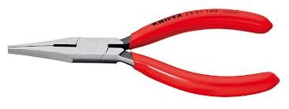

## Alicates de corte

Muy utilizado para cortar bridas y materiales duros que con una tijeras normal no puede cortar\.

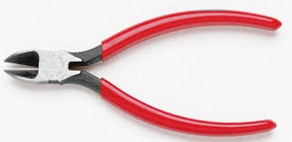

## Pequeños recipientes

Una o varias pequeñas cajas, a ser posible transparente y con tapa, nos será muy útiles para depositar tornillos, jumpers  y otros pequeños dispositivos\.

Esto evitaría la perdida de estos elementos y tiempo intentando encontrarlo\.

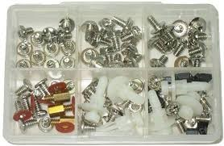

## Alfombrilla de espuma

* Se recomienda una superficie aproximada de al menos 20 cm x 30 cm y 2 cm de grosor como base para dispositivos sin montar\.
* Lo importante es que sea un material
  * Aislante
  * No muy duro
  * Seco \(cartón, corcho o la goma para la sujeción de componentes\.

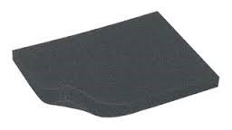

## Limpiador de aire comprimido

* Funciona a base de impulsos de aire comprimido y sirve para limpiar determinadas partes del ordenador de difícil acceso
  * Aspas de los ventiladores del procesador  o de la tarjeta gráfica
  * Interior de los disipadores de calor\.
* Al utilizarlo, no conviene acercarlo excesivamente a la pieza que se quiere limpiar, ya que durante el paso del aire de estado líquido a gaseoso puede provocar condensaciones que dejen humedad en esa zona\.

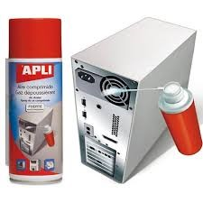

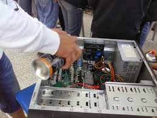

## Material fungible

__Jumpers__ \. El Jumper es un puente eléctrico que opera a modo de interruptor\.

__Cables y adaptadores eléctricos__ \. Cualquier equipo cuenta con varias tomas de alimentación libres, destinadas a posibles ampliaciones\.

__Cables de datos__ \. Para la conexión de cualquier dispositivo a la placa base, o la conexión de dos dispositivos entre sí, necesitamos su cable correspondiente\. Los más comunes son los cables SATA e IDE, utilizados para conectar discos duros y unidades DVD o Blu\-ray\.

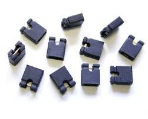

Material fungible

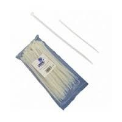

_Bridas y cinta aislante_

Su función será agrupar los cables del interior de la caja\.

De este modo se obtiene un espacio más  __ordenado__ , se reduce los destrozos accidentales y se mejora la  __circulación__  del  __aire__  dentro del PC\.

_Tornillos_  __ __

Es muy práctico contar con algunos tornillos de  __repuesto__  tanto para la caja como para los componentes \(DVD, disco duro, tarjeta de expansión, etc\.\)\.

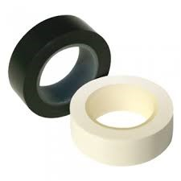

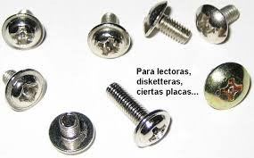

La superficie del disipador y el procesador no son estrictamente lisas\.

En los huecos entre el microprocesador y disipador quedaría aire

Para ello, se utiliza  __pasta térmica __ para cubrir  esos huecos que quedan\.

La pasta térmica conduce mejor el calor que el aire por eso se aplica\.

La pasta térmica cuanto más conductora sea mejor, podemos reducir unos cuantos grados menos la temperatura del microprocesador\.

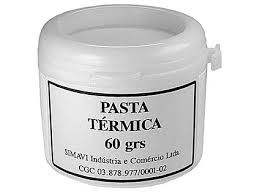

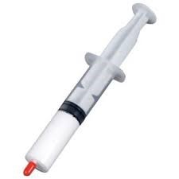

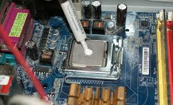

__Mono dosis:__   pequeñas bolsitas que suele contener una determinada cantidad de pasta térmica para aplicar solamente la justa

Hay  __disipadores__  que ya vienen con la pasta térmica de fábrica, con lo cual no hace falta aplicarlo\.

No hay que aplicar pasta térmica en exceso pues es mucho menos conductora que el aluminio y bastante peor que el cobre\.

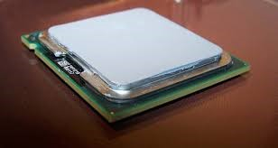

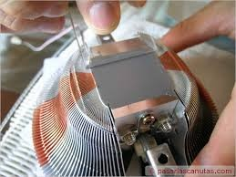

La  __pasta térmica __ es diferente a la pasta de silicona\.

La  __silicona térmica __ no transmite tan bien el calor pero pega mucho más, con lo cual nos será más difícil separar el microprocesador del disipador\.

Otras herramientas

* Estas herramientas pueden ser de utilidad, pero seguramente se usan con menos frecuencia:
  * __Cúter__
  * __Soldador y estaño__ \. Para acortar o empalmar cables, sustituir componentes, etc\.
  * __Desoldador\.__

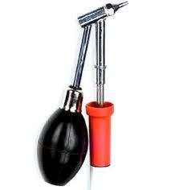

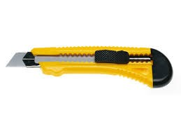

## Tarea

Kit básico de herramientas

* Buscar material para equipar un pequeño taller de reparación
  * Caja de herramientas
  * Riñonera portaherramientas
  * Kit de destornilladores con puntas intercambiables
  * Magnetizador de destornillador
  * Kit de pinzas
  * Alfombrilla antiestática
  * Alicate universal
  * Cinta aislante
  * Bridas
  * Espray de aire comprimido
  * Pasta térmica
  * Pulsera antiestática
  * Luz tipo flexo con lupa
  * Cúter

