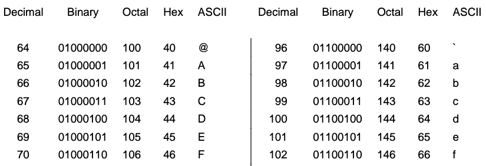
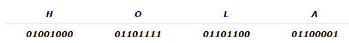

# Código ASCII

Cada vez que un carácter es escrito en un teclado, se transmite un número de código al computador. Estos números de código se almacenan en binario en los computadores como conjuntos de caracteres llamados ASCII.

El Código ASCII fue creado en 1963 como una tabla que asignaba un código binario a cada letra y una serie de símbolos (alfanuméricos y otros). Esta tabla representaba caracteres utilizando 7 bits, lo que permitía 128 caracteres posibles, enumerados del 0 al 127. Los caracteres de control (códigos 0 al 31) tienen efecto sobre cómo se procesa el texto. Además, los códigos 65 al 90 representan las letras mayúsculas, mientras que los códigos 97 al 122 representan las letras minúsculas.

## Código ASCII Extendido

Los problemas con el ASCII original eran que fue desarrollado para utilizarse con inglés y no poseía caracteres acentuados o caracteres específicos de otros idiomas, por lo que para codificar estos caracteres se necesitaba un sistema de códigos distinto.

La solución fue la extensión del código ASCII para 8 bits (byte) y la codificación de hasta 256 caracteres (ASCII extendido).  Esto permitió añadir caracteres acentuados, símbolos y otras letras de idiomas distintos al inglés.

El código ASCII extendido asigna valores del 0 al 255 a mayúsculas, minúsculas, dígitos, marcas de puntuación y otros símbolos. Para mantener la compatibilidad con ASCII, el primer bit del byte es 0 para caracteres ASCII, y 1 para caracteres ASCII extendidos.

Los caracteres ASCII extendidos incluyen letras alfabéticas no inglesas, símbolos de moneda no ingleses, letras griegas, símbolos matemáticos, caracteres para gráficos, caracteres para gráficos de barras y caracteres sombreados.

Sin embargo, el ASCII extendido sigue siendo limitado y no soporta caracteres complejos como los usados en el **chino o el japonés**, para los cuales se usan otros sistemas de codificación.
