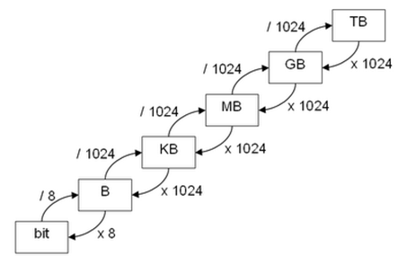

# Conversión de unidades

Para realizar la conversión de las medidas de almacenamiento, se multiplica o divide por 1024 cuantas veces sea necesario hasta llegar a la medida deseada.

El único salto diferente es para pasar de Bytes a bits, en el que deberemos multiplicar o dividir por 8.
