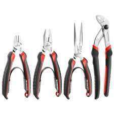
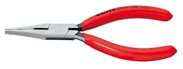
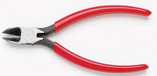

## Alicates

Son herramientas manuales tipo tenaza que se pueden utilizar en cualquier operación de mecanizado, aunque adquieren especialmente importancia en el montaje de instalaciones eléctricas y circuitos electrónicos.

Un alicate está formado por el mango, la articulación y la boca.

Se comercializan con muchas formas y tamaños, siendo los tipos mencionados a continuación los más utilizados en electricidad y electrónica.

## Alicates universales
Muy utilizados por los electricistas, su boca está diseñada para realizar
diferentes operaciones: agarrar, doblar y cortar.
## Alicates de punta plana
Su boca es de tipo plano y se utiliza para sujetar cables y pequeñas
piezas.

## Alicates de punta redonda

Son de aspecto similar a los anteriores, pero en este caso las puntas son
redondas o semirredondas.
Permiten doblar cables rígidos con gran precisión y se pueden utilizar
a modo de pinzas para sujetar pequeños elementos, como los compo-
nentes de los circuitos electrónicos.

## 1.3.4. Alicates de punta curvada

Similares a los de punta redonda, pero en ellos la boca está ligeramente
curvada.
Son especialmente útiles cuando es necesario amarrar algún elemento
o componente en un lugar poco accesible.
Figura 1.25. Alicate de punta y de punta curvada (CHAVES).

## 1.3.5. Alicates de corte

Su boca está formada por dos dientes afilados que permiten cortar todo
tipo de cables y alambres.
Los de mayor tamaño se utilizan en electricidad y los más pequeños en
operaciones que requieren cortes con mayor precisión, como es el corte
de las patillas de los componentes electrónicos cuando están soldados
a la placa de circuito impreso.

## 1.3.6. Alicates Seeger

Son alicates para extraer las arandelas o anillos denominados Circlip o
Seeger. Este tipo de arandelas se utilizan como retén, especialmente
en aquellos equipos que disponen de ejes rotativos o lineales, como
pueden ser los motores o cilindros neumáticos. Son de acero flexible
y de tipo abierto. En ambos extremos del arco tienen orificios para su
fijación y extracción.
Los alicates Seeger o de retén tienen un aspecto similar al de los alicates
de puntas redondas (rectas o curvadas). Sin embargo, los extremos de
las bocas disponen de dos dientes puntiagudos, que se insertan en los
orificios de las arandelas.
Los hay para exteriores e interiores, dependiendo de si abre o cierra la
arandela al presionar sobre sus mangos. Los de exteriores disponen de
un resorte que facilita la extracción y al presionar el mango del alicate
abre la arandela. Los de interiores hacen lo contrario, al presionar sobre
el mango cierra la arandela.
Figura 1.29. Alicates Seeger de interiores y exteriores y su forma de uso (cortesía Torqueleader).

## Pinzas

La pinza es una herramienta que se utiliza para sujetar y coger objetos.
En electrónica es especialmente útil para manipular componentes electrónicos de tamaño reducido.

Se comercializan en diferentes formas y tamaños, y pueden ser de tipo recto, curvo, de puntas, de palas, cruzadas, de metal, aisladas, de plástico, etc.
Figura 1.31. Diferentes tipos de pinzas.
Figura 1.28. Arandela o anillo Circlip o Seeger.
Figura 1.30. Uso de la pinza.