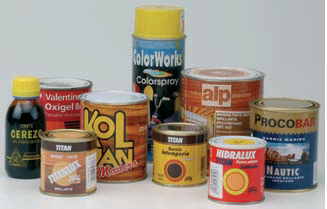
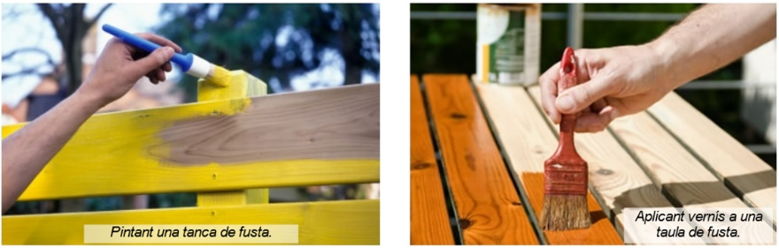
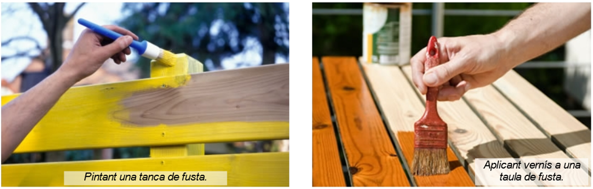
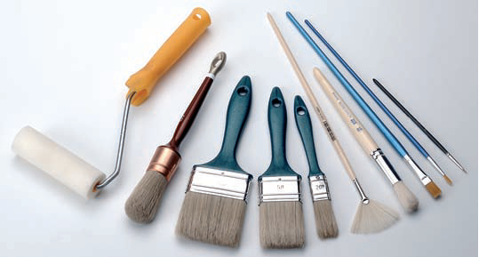

# Eines d’acabat

Els acabats més comuns són les pintures i els vernissos. La seva funció és recobrir la fusta per protegir-la dels agents externs, com la humitat, els fongs o els insectes. També es fan servir per millorar-ne l'aspecte, modificant-ne el color, el to i la lluentor.

## Pîntura

Es la mescla de 3 components:

- Un pigment (substància que proporciona color)
- Un aglutinant (substància que reté els pigments)
- Un dissolvent

Quan el dissolvent s'evapora, la pintura s'asseca, deixant una capa protectora sobre la fusta que, a més, hi dona color.

Les pintures solen ser a l'oli o esmaltades i acríliques. Aquestes últimes es s'assequen ràpidament i s'adhereixen a tot tipus de superfícies.

## Vernís

És una pintura transparent. Està compost per resines (normalment artificials, com el poliuretà) dissoltes en dissolvent. Quan el dissolvent s'evapora, queda una capa de resina que protegeix la fusta. El vernís manté l'aspecte natural de la fusta: se'n veuen les vetes i els nusos, encara que l'hi canviï el to i la lluentor.

## Pinzells i brotxes

Els pinzells i les brotxes són estris compostos per un floc de truges o fibres que va subjecte a l'extrem d'una vareta.

Es fabriquen de diferents mides i qualitats.

Les truges o metxes poden ser d'esquirol, bou, porc, teixó, mostela o marta.  No obstant això, totes elles estan sent substituïdes gradualment per materials sintètics.

Les pintures solen ser a l'oli o esmaltades i acríliques. Aquestes últimes es s'assequen ràpidament i s'adhereixen a tot tipus de superfícies.

## Procediment de pintat i vernissatge

El procediment a seguir és el següent:

La superfície ha d'estar llisa i sense irregularitats.

Per evitar un consum excessiu de pintura o vernís, es recomana aplicar una capa de **tapaporus** que redueixi els porus que tingui la fusta.

Quan la fusta estigui seca, **s'escatarà** la superfície, ja que, com més llisa estigui aquesta, menys vernís o pintura necessitarem per obtenir un acabat polit i brillant.

La pintura i el vernís s'apliquen sempre en la **mateixa direcció** amb un pinzell o un pinzell. També es poden utilitzar **rodets**, depenent de la mida de la fusta.

És convenient donar diverses capes de pintura o vernís per aconseguir l'acabat desitjat. Es deixa assecar bé la superfície entre una mà i la següent. A l'acabar de pintar o envernissar, s'han de tancar els pots correctament i netejar i assecar els pinzells.