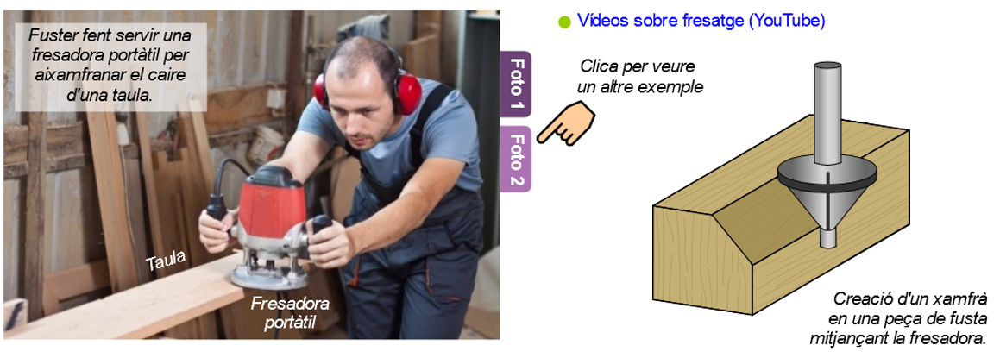

# Eines de fresatge

El fresatge és una operació de mecanització (suposa arrencament d'encenalls) que es fa amb una màquina anomenada fresadora.

Les fresadores tenen una peça rotatòria de vores tallants, anomenada fresa, que, quan gira, va erosionant la fusta per donar-hi la forma desitjada.

Canviant la forma de la fresa podem fer diferents operacions a la fusta:

- Motllures (llistons que tenen un perfil decoratiu)
- Ranures
- Rebaixos, xamfrans, etc.

 

## Fresadores CNC

Per a treballs més complexos o de grans sèries, existeixen fresadores controlades per ordinador (fresadores CNC).

A més de la fusta, també s'utilitzen fresadores per treballar el metall, encara que són més robustes que les de fusta.