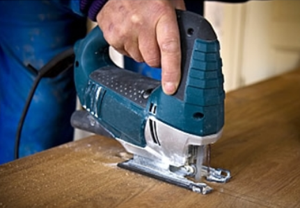
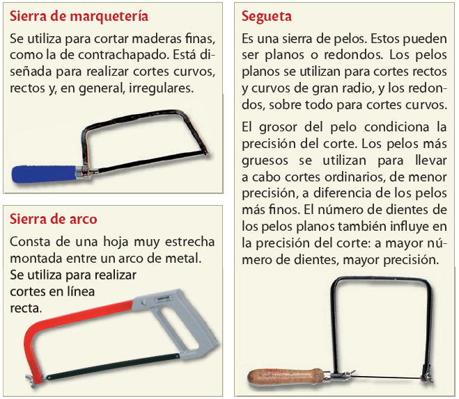
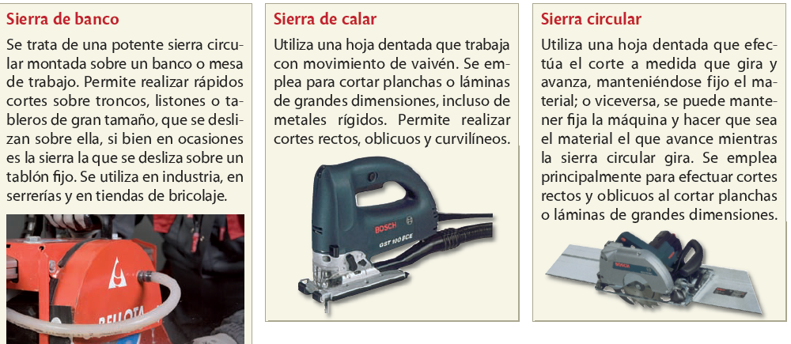

# Eines de tall

Els productes de fusta que trobem al mercat (taules, taulers, llistons, etc.) es presenten amb unes dimensions estandarditzades, per la qual cosa normalment s'han de tallar. En aquest cas, són útils el xerrac o la serra de vogir.

Abans de tallar la fusta és imprescindible prendre mides i marcar amb un llapis on hem de tallar. Si l'operació de mesurar i marcar no es fa bé, la peça tallada no serà útil i es malgastarà material i feina

## Serra de vogir

Tipus de serra elèctrica més corrent. Talla gràcies a l'acció d'una petita fulla que puja i baixa alternativament. Permet fer talls rectes i corbs.

A més de la serra de vogir, els petits tallers i les indústries disposen d'altres serres mecàniques per a fusta. N'hi ha diversos tipus, en podem destacar les circulars i les de cinta.

