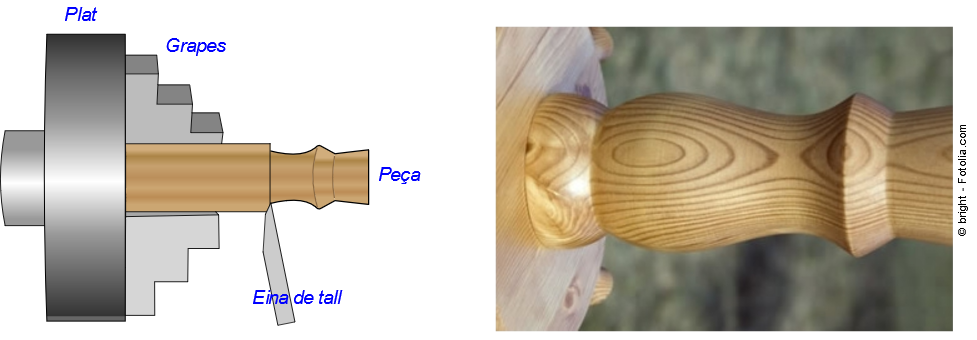
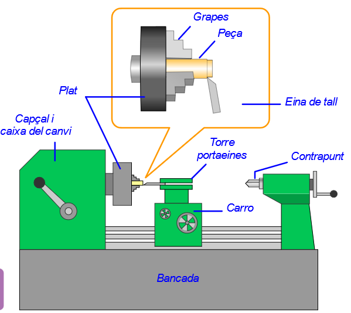

# Eines de tornejat

El tornejat és una operació de mecanització que es realitza mitjançant una màquina anomenada torn.

Consisteix en fer girar la peça que es vol mecanitzar i anar-li arrencant petites partícules amb una eina de tall fins arribar a donar-li la forma desitjada.

Un torn permet mecanitzar peces amb formes cilíndriques, còniques i esfèriques.

En funció de la duresa de la fusta usada i de l'operació que s'executarà, es regula la velocitat del gir de la peça i del moviment de l'eina de tall.

