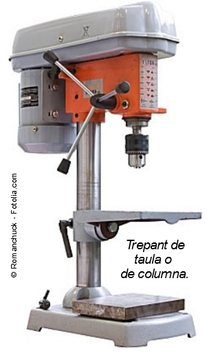

# Eines per trepat

Trepant

El trepant consisteix en fer perforacions cilíndriques en un material utilitzant una eina anomenada trepant.

L'accessori que, girant, realitza la perforació es diu broca.

Els trepants percutors, a més de foradar, permeten fer força simulant un martell al mateix temps. D’aquesta forma poden travessar parets i superfícies dures que d’altra forma serien molt difícils de foradar.

Els trepants portàtils poden ser transportats fàcilment fins on siguin necessaris, fins i tot hi ha models amb bateries (de potència menor) que no necessiten una presa de corrent.

Incorporen unes bateries recarregables per poder donar-los l’electricitat que necessiten per funcionar.

Altres trepants més petits s’utilitzen per petites feines, així com a muntar i desmuntar mobles d’una forma més fàcil.

Trepants de columna

Els trepants de taula o de columna s'instal·len fixos en un banc de treball. Són més potents que els trepants portàtils i, com que estan quiets, permeten treballar amb més precisió.

Els components són els següents:

## Barrina

A més dels trepants elèctrics, de vegades també s'utilitza la barrina. És una eina de perforació més senzilla, n'hi ha prou que es faci girar manualment per foradar el material.

Es sol utilitzar per:

Perforar fusta i materials tous

Per iniciar el cargolament dels cargols

Broques

## Tipus de broques

En funció del tipus de material que s’ha de foradar:

- Per a metall: broques d’acer ràpid
- Per a fusta:  broques d’acer al carboni, serra de campana i broques de pala
- Per a plàstic: broques d’acer ràpid
- Per a obra: broques de vídia

## Capses de broques

Les broques habitualment es guarden en capses, on les broques s’ordenen segons el seu diàmetre, per tenir-les totes juntes, siguin més fàcils de trobar i no es perdin.

## Clau de portabroques

Aquest accessori permet apretar i amollar les broques amb més facilitat i força. Solen venir amb el trepant.

Col·locar broques

Per a col·locar les broques, hem de tenir el trepant desconnectat i aturat, i obrir el portabroques fins que hi càpiga la broca. Una vegada col·locada, es torna a girar fins que no es pugui més i es fixa amb la clau.

## Corones

