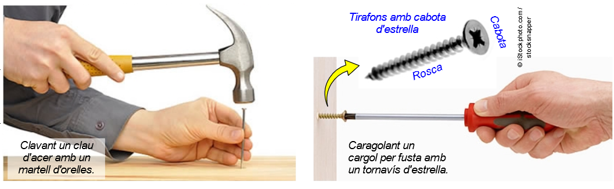
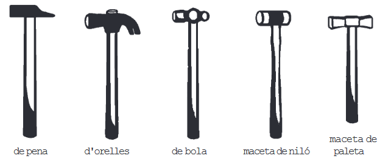
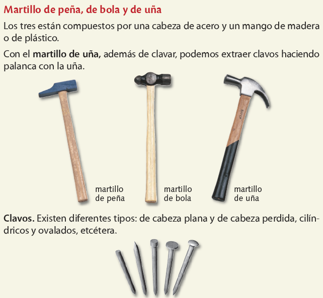
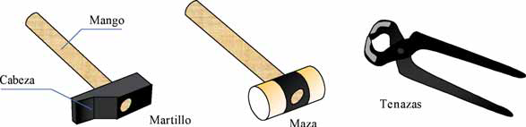
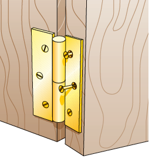
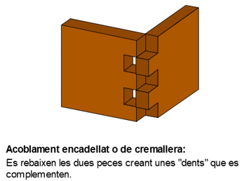
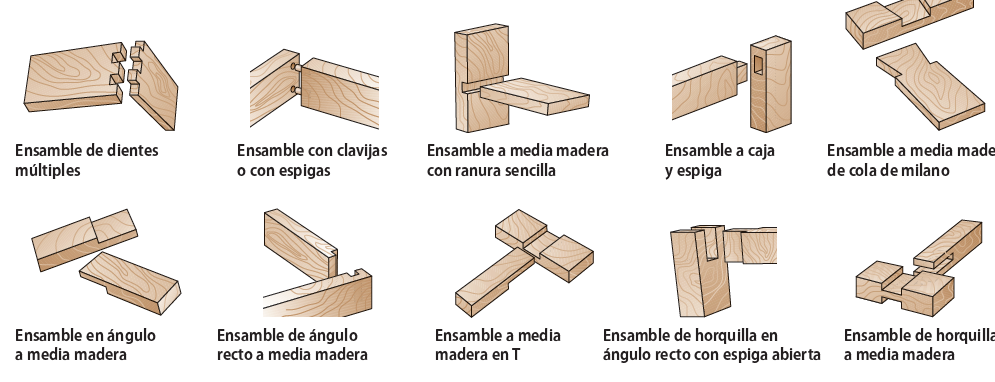
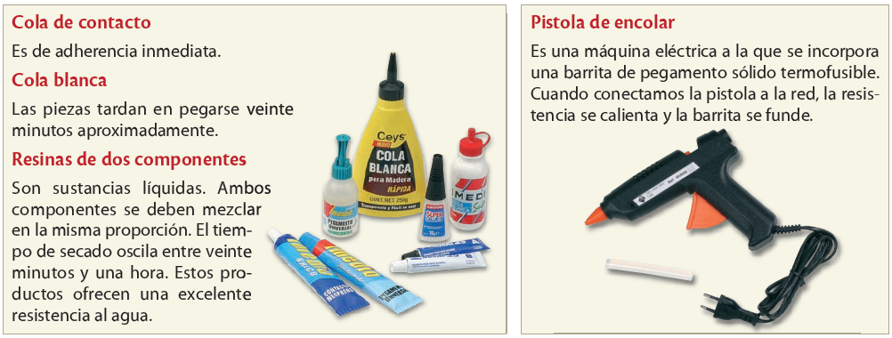

# Eines d'unió

Unió mitjançant claus i cargols

Hi ha diverses maneres d'unir peces per formar objectes més complexos.

- Les unions no desmuntables no es poden desfer sense trencar alguna peça.
- Les unions desmuntables, en canvi, permeten separar fàcilment les peces quan és necessari. Un exemple d'unió no desmuntable és la realitzada mitjançant **claus**.

## Clau

Un clau és un cilindre de metall que té un extrem esmolat (la punta) i l’altre eixamplat (la cabota). Per clavar-lo a la fusta només cal colpejar-lo amb un martell.

## Cargols

La unió desmuntable més corrent és la que utilitza caragols.

Un caragol, cargol o vis és un cilindre metàl·lic que té una rosca mascle (cap a l'exterior) al lateral. Hi ha caragols especials per fusta anomenats tirafons.

## Tirafons

Els tirafons són autoenroscants, que vol dir que no és necessari fer una rosca femella (cap a l'interior) al material, sinó que ells mateixos, en fer-los girar, van creant la pròpia rosca a la fusta. Hi ha diferents tipus de caragols en funció del sistema

## Martells

## Unions mitjançant frontisses

Les unions mitjançant frontisses són desmuntables. Una frontissa consta de dues fulles de metall unides normalment mitjançant un eix comú que permet el gir d'aquestes. Cada full es subjecta a una peça de fusta per mitjà de cargols.

Un full va lligada a una peça de fusta fixa, i l'altra, a una peça mòbil com, per exemple, la tapa d'una caixa, una porta o una finestra.

## Unions amb encoblaments

La forma d'aconseguir una unió no desmuntable més corrent a la fusta és utilitzar un adhesiu, especialment cola blanca. Per tal de millorar la resistència de la unió, abans d’aplicar la cola es fa un acoblament, és a dir, es practica un rebaixament a cada peça amb la finalitat que encaixin entre sí.

Per fer aquests rebaixaments, els fusters usen l’enformador, una eina que té un mànec i una fulla d’acer bisellada (amb un tall diagonal). A continuació pots veure alguns exemples dels acoblaments més utilitzats:

## Unions encolades

