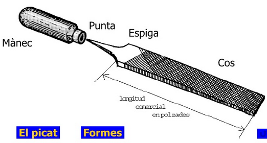
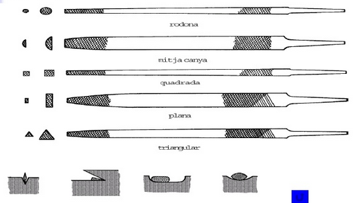
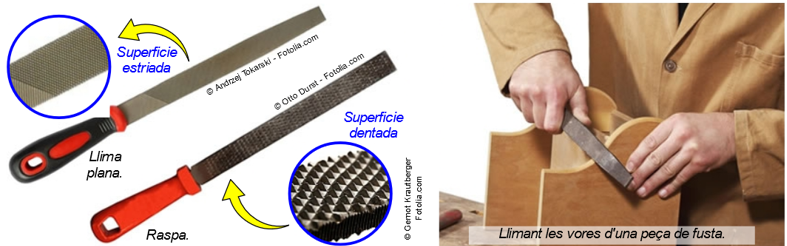
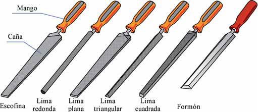
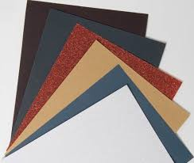
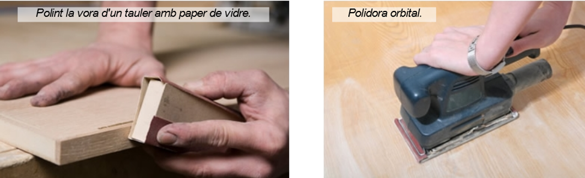
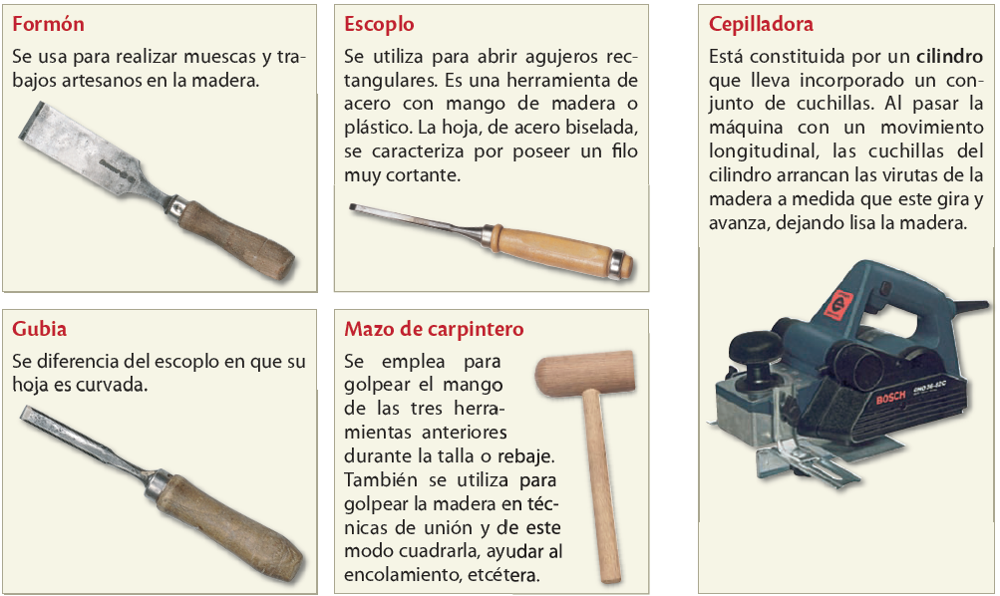

# Eines per llimar

Sovint la fusta tallada ha de ser rebaixada perquè s'ajusti a una forma o a unes mides, o polida, per eliminar estelles tallants i proporcionar-li un acabat llis. Per aconseguir-ho, es fan servir les llimes i les raspes, unes eines que sotmeten el material a abrasió (desgast).

Llimes

Les llimes tenen la superfície estriada i permeten arrencar partícules de material a cada passada. Es classifiquen en fines o gruixudes, segons la mida de les estries. Les llimes gruixudes s'utilitzen per treballar fusta, mentre que les fines s'usen per polir.

Formes de les llimes:

Raspes

Per treballar i donar forma a la fusta també es fan servir les raspes.  S’assemblen molt a les llimes, però en comptes de tenir la superfície estriada, tenen unes dents de forma triangular que erosionen ràpidament la fusta. Són útils quan cal eliminar una gran quantitat de material. Un cop passada la raspa, s'haurà de llimar la fusta per allisar-la, ja que la raspa deixa un acabat molt bast.

Tipus de picadura

Seg

Normes d'ús de les llimes i les raspes

El moviment de la ma ha de ser regular ¡ precís.

S'han de subjectar les peces per evitar vibracions.

S'ha de treballar amb les dues mans

Cal netejar les llimadures amb la carda.

El mànec ha d'estar ben subjectat i net de greix.

No s'han de pegar cops amb les llimes.

El cos de les llimes no han d'estar greixoses, desgastades o plenes de llimadures.

Eines per polir

Paper de vidre

Per polir (allisar) la fusta, a més de les llimes, també s'utilitza el paper de vidre. Sovint es fa servir després d'haver passat la llima, per aconseguir un acabat encara més llis.

Es tracta d'un paper fort que porta enganxades petites partícules de material abrasiu (és a dir, que si hi freguem un cos, té la capacitat de desgastar-lo).

N'hi ha de diferents tipus, segons la mida de les partícules:

- De gra fi
- De gra mitjà
- De gra gruixut.

Com més petit sigui el gra, més llis quedarà el material treballat.

## Polidores

Polir a mà una superfície gran pot ser una feina molt pesada i que requereix molt temps, per això normalment es fa servir una màquina-eina que es diu polidora. N'hi ha de molts tipus, a la foto hi pots veure una de les més usades, la polidora orbital.

Un altre tipus molt corrent és la polidora de banda.

Eines per raspallat

El raspallat consisteix en treure les capes fines de material d'una peça de fusta amb la intenció d'anivellar-la (deixar la superfície recta), disminuir-ne les dimensions o obtenir un acabat més llis.

## Ribots

El raspallat es fa mitjançant una eina anomenada ribot. Es fa servir molt, per exemple, per reduir lleugerament la mida de les portes i finestres i fer que no hi hagi fricció amb el marc. El ribot manual està format per una caixa de fusta de la qual sobresurt una fulla de metall a la part inferior. La fulla està molt esmolada, de manera que, en arrossegar el ribot per sobre d'una superfície de fusta, arrenca els encenalls en forma de làmina fina.

Actualment s'usen molt els ribots elèctrics.

