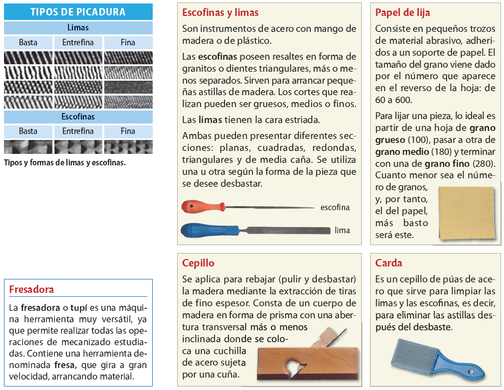

# Eines per llimar

Sovint la fusta tallada ha de ser rebaixada perquè s'ajusti a una forma o a unes mides, o polida, per eliminar estelles tallants i proporcionar-li un acabat llis. Per aconseguir-ho, es fan servir les llimes i les raspes, unes eines que sotmeten el material a abrasió (desgast).

## Llimes

Les llimes tenen la superfície estriada i permeten arrencar partícules de material a cada passada. Es classifiquen en fines o gruixudes, segons la mida de les estries. Les llimes gruixudes s'utilitzen per treballar fusta, mentre que les fines s'usen per polir.

Formes de les llimes:

## Raspes

Per treballar i donar forma a la fusta també es fan servir les raspes.  S’assemblen molt a les llimes, però en comptes de tenir la superfície estriada, tenen unes dents de forma triangular que erosionen ràpidament la fusta. Són útils quan cal eliminar una gran quantitat de material. Un cop passada la raspa, s'haurà de llimar la fusta per allisar-la, ja que la raspa deixa un acabat molt bast.

Tipus de picadura

Seg

## Normes d'ús de les llimes i les raspes

El moviment de la ma ha de ser regular ¡ precís.

S'han de subjectar les peces per evitar vibracions.

S'ha de treballar amb les dues mans

Cal netejar les llimadures amb la carda.

El mànec ha d'estar ben subjectat i net de greix.

No s'han de pegar cops amb les llimes.

El cos de les llimes no han d'estar greixoses, desgastades o plenes de llimadures.
