# Eines per mesurar i marcar

---

## Esquadra metàl·lica

L'esquadra metàl·lica s'empra per a comprovar amb exactitud els angles rectes

Els seus braços permeten traçar rectes paral·leles i perpendiculars, ja que formen un angle de 90 °.

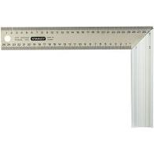

---

## Metro de fuster

El metro de fuster  o plegable és rígid i fàcil de transportar i guardar a una butxaca.

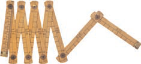

---

## Flexòmetre

El flexòmetre, també denominat cinta mètrica, està format per una fina xapa metàl·lica sobre la qual es troben impreses les divisions de centímetres i mil·límetres.

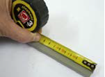

S'enrotlla a l'interior d'una carcassa metàl·lica o de plàstic. És l'eina de mesura més usada causa de la seva flexibilitat, mida petita i facilitat d'ús.

Es fabriquen amb diverses longituds (3 m, 5 m, 8 m, etc.).

---

## Llapis de fuster

Per marcar les mesures a la fusta es sol utilitzar un llapis de fuster.  La seva forma és ovalada i, la seva mina, plana. Per esmolar-se necessita una fulla especial.

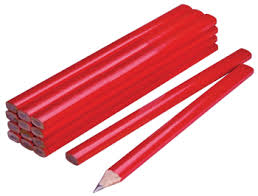

---

## Compàs de puntes d'acer

El compàs de puntes d'acer  ens permet traçar circumferències i arcs en la fusta, així com per transportar mesures d’un lloc a un altre de la fusta, o a una altra fusta.

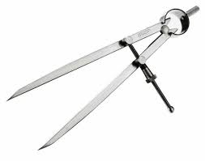

---

## Punxó

La alena o punxó consta d'un mànec de plàstic o de fusta unit a una agulla de punta cònica metàl·lica.

S'utilitza per practicar una petita esquerda sobre la superfície de la fusta, que indica el punt exacte on s'ha de realitzar una perforació.

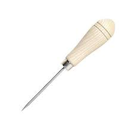

---

## Peu de rei

El peu de rei, calibre o Vernier, és un instrument de mesura de precisió capaç d’apreciar dècimes i centèsimes de mm en mesurar un objecte. Pot realitzar mesures exteriors, interiors i de profunditats en qualsevol objecte.

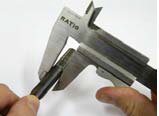

---

Aquí podem comprovar les diferents parts que té un peu de rei i la seva utilitat.

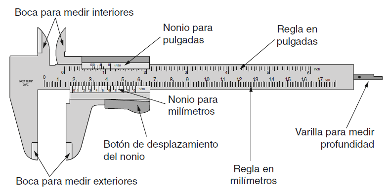

---

També existeixen versions digitals, que indiquen directament en una pantalla la mesura que s’ha pres de forma automàtica.

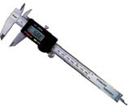

---

Podem treure 3 tipus de mesures diferents:

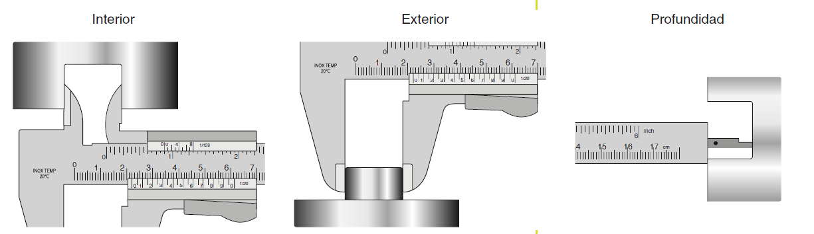

---

Mesurar amb peu de rei

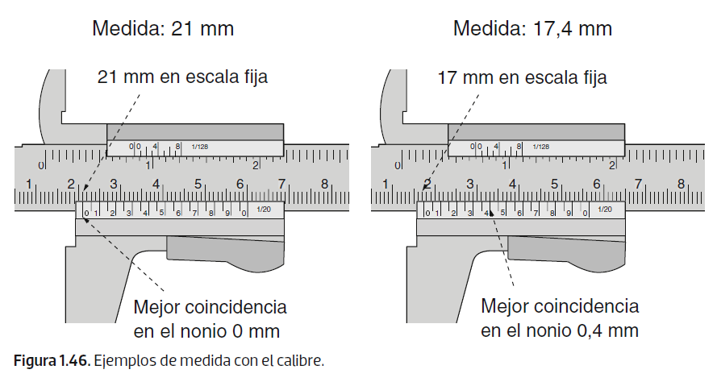

---

## Micròmetre

El Pàlmer o micròmetre és també un instrument de mesura de molta precisió. Amb aquest aparell podem realitzar amidaments de fins una cinquantena part de mil·límetre.

 El pàlmer utilitza un cargol micromètric per girar i valorar el tamany de l'objecte a mesurar.

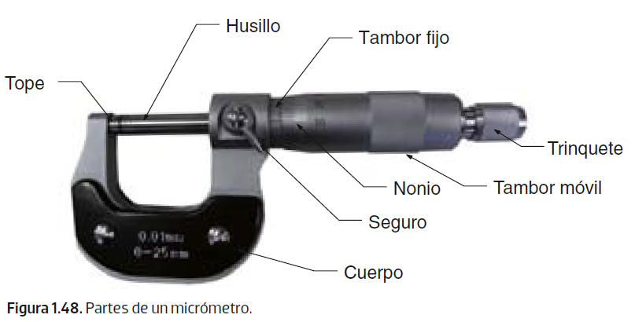

---

Mesures amb micròmetre

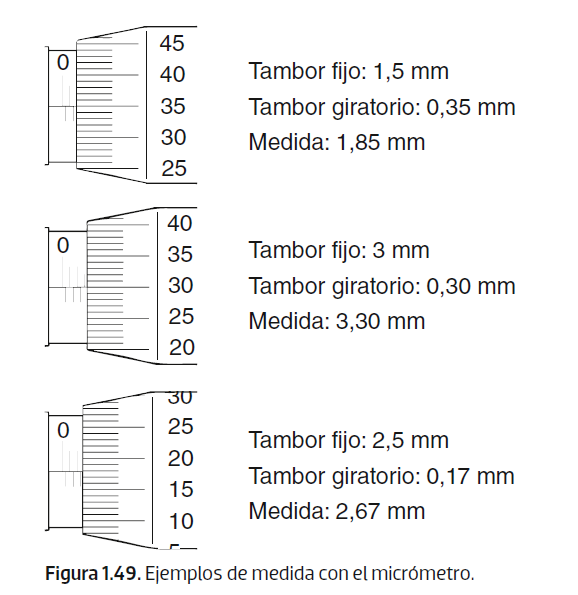
