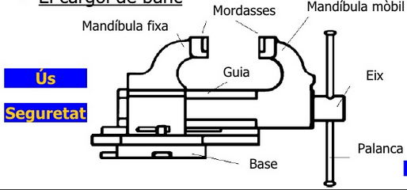
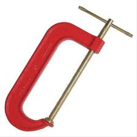
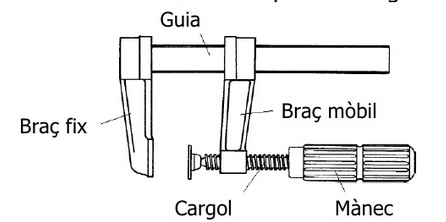

# Eines per subjectar

## Cargol de banc

Es fixa a la taula de treball. Consta d'una mordassa fixa i una altra mòbil. Aquesta última llisca per una guia quan es gira la palanca, de manera que les peces queden subjectes entre les dues mordasses.

!

# Cargol de mà

Està constituït per un límit fix i un cargol que, a l'ésser girat, pressiona el material que es vol subjectar entre tots dos.

## Gat o sergent

Es fa servir per subjectar peces a la taula de treball o per unir dues peces a l'enganxar-les.

És un instrument de metall format per dos topalls: un de fix i un altre mòbil. Aquest últim es llisca per la guia apropant-se al fix. Al girar el mànec, els topalls dels cargols subjecten la peça.
