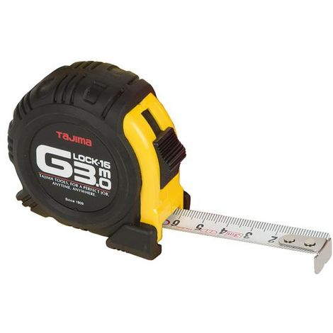

# Herramientas de medida

Permiten medir la distancia entre dos puntos. Las más utilizadas en el taller de reparaciones eléctricas y electrónicas son el flexómetro, el calibre y el micrómetro.

## Flexómetro

También denominado «cinta métrica», está formado por una fina chapa metálica sobre la que se encuentran impresas las divisiones de centímetros y milímetros.

Se enrolla en el interior de una carcasa metálica o de plástico. Es la herramienta de medida más usada debido a su flexibilidad, pequeño tamaño y facilidad de uso. Se fabrican con diversas longitudes (3 m, 5 m, 8 m, etc.).

## Calibre

El calibre, también llamado «pie de rey», es un instrumento de medida que ofrece una precisión mucho mayor que las reglas y los flexómetros.

Se utiliza para medir piezas y orificios de pequeño tamaño, donde la exactitud de la medida es importante.

Con un calibre se pueden medir interiores, exteriores y profundidades.

Para ello dispone de dos bocas, una en la parte superior para los interiores, y otra en la inferior para los exteriores, y una varilla que sale de la parte trasera para la profundidad.

También dispone de un botón o freno que permite desplazar o bloquear la parte móvil del instrumento.

Consta de una pieza con una escala graduada (fija) y de otra pieza con una graduación distinta que se desliza sobre la anterior, también denominada «nonius» (nonio).

El número de divisiones que presenta el nonio determina la precisión del calibre de acuerdo a la siguiente expresión:

Para realizar una medida, se desliza el nonio sobre la escala principal.

Con la escala fija se miden los milímetros y gracias al nonio se pueden apreciar hasta décimas de milímetro.

El calibre es una herramienta que no debe faltar en el maletín de herramientas del técnico de reparación de equipos eléctricos y electrónicos, ya que permite conocer con precisión la medida de piezas y componentes a sustituir.

Cada vez se utilizan más calibres digitales en los que no es necesario contar divisio-
nes, sino que disponen de una pantalla digital en la que se indica directamente la medida.

## El micrómetro

También conocido como **«palmer»**, es un instrumento de precisión que
puede medir centésimas y/o milésimas de milímetro. Basa su funciona-
miento en el desplazamiento de un tornillo micrométrico a través de una
tuerca. Así, la precisión del instrumento viene marcada por la longitud
del avance de dicho tornillo en cada vuelta completa (paso).
