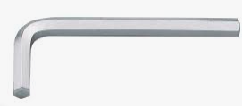
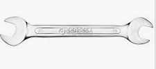
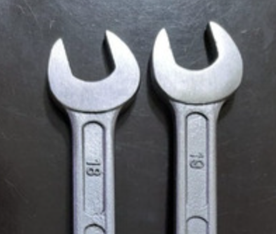
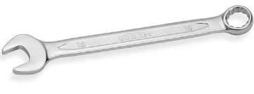
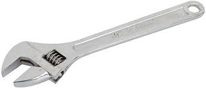
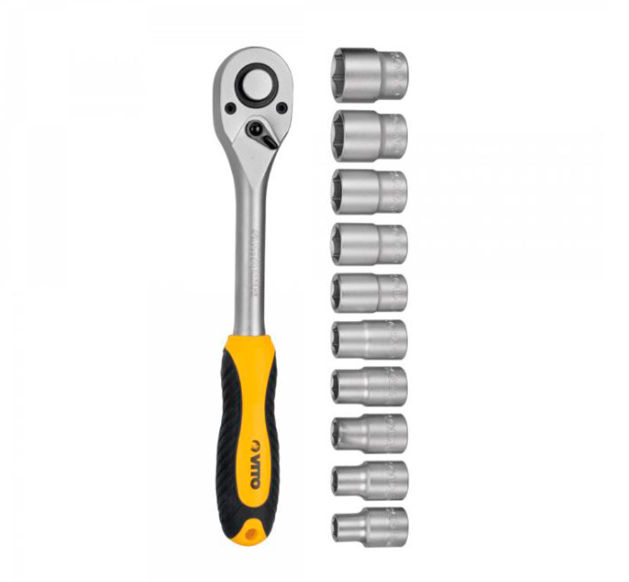

# Herramientas tipo llave

Son herramientas portátiles y manuales utilizadas en técnicas de apriete.
Pueden ser de diferentes tipos, como veremos a continuación.

---

## Llaves para tornillos

Son llaves que sustituyen en algunos casos a los destornilladores convencionales, especialmente en operaciones de ajustes con difícil acceso.

No disponen de mango. Presentan forma de ``ángulo recto``, de cuyos lados uno es más corto que el otro, pudiéndose utilizar indistintamente por ambos.

Las más habituales son las de tipo ``Allen`` (hexagonales interiores) y las de cabeza TORX.

---

## Llaves para sistemas tornillo-tuerca hexagonales

Son herramientas de mano que permiten el ajuste de tornillos y tuercas de tipo hexagonal. Son muy utilizadas en tecnología mecánica y automoción, pero en ocasiones también son requeridas para la reparación de equipos eléctricos y electrónicos, especialmente para el ensamblado y el desensamblado de electrodomésticos.

Pueden ser fijas o ajustables.

---

## Llaves de boca fija

Existen muchas formas y tamaños, pero las más conocidas son las de tipo plano.
Estas suelen disponer de dos bocas abiertas con medidas contiguas ubicadas en cada uno de los extremos de la llave.

La medida de la boca se da en **milímetros** según el Sistema Internacional de Unidades (SI), aunque es habitual encontrar las dimensiones en
pulgadas.

---

En el taller de reparación es aconsejable disponer de un set de llaves que abarquen desde los números más bajos (4-5) hasta números más altos (16-17).

---

También existen modelos ``combinados``, que en un lado disponen de una boca fija de tipo abierto, y en el otro extremo, de una boca cerrada de la misma medida.

Las **llaves fijas** están diseñadas para usarse con desplazamientos de 30°.

Cada vez que se hace un desplazamiento, la llave debe rotarse sobre sí misma para embocar la tuerca de forma correcta. De esta forma se pueden realizar operaciones de ajuste en lugares con poca libertad de movimiento.

---

## Llave de boca ajustable

También conocida como «llave inglesa», permite, mediante un tornillo sin fin, ajustar la apertura de la boca facilitando así su adaptación a diferentes medidas de tuercas y tornillos.

El uso de la llave inglesa es similar al de la llave de boca fija.

La medida de la boca de la llave debe ser la misma que la de la cabeza del tornillo o tuerca. Nunca se debe utilizar para ajustar medidas inferiores.

En trabajos eléctricos es aconsejable que
las herramientas estén aisladas.

---

## Llaves de tubo

Se utilizan como complemento o en sustitución de las llaves de boca fija. Reciben este nombre por su aspecto tubular, y en cada extremo disponen de una boca para una medida de tornillo.

En su cuerpo tienen un par de orificios para meter un pasador y así poder girar la llave.

---

## Llaves de carraca

Son muy populares en la actualidad en todas las profesiones que requieren realizar operaciones de apriete.

Su funcionamiento se basa en un sistema mecánico de carraca que permite apretar o aflojar, sin necesidad de separar la llave de la tuerca o tornillo sobre la que se trabaja.

Disponen de un mango al que se le pueden acoplar diferentes tipos de ``vástagos`` (fijos y flexibles), y cabezas con llaves de vasos o de destornillador.

Un gatillo, tipo palanca, permite seleccionar el funcionamiento de la ``carraca``, bien para apretar, o bien para aflojar.

---

