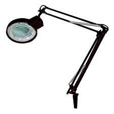

# Lupa-flexo

Es un instrumento para realizar trabajos de precisión. Se instala sobre
el banco de trabajo del reparador de los equipos eléctricos y electrónicos.

Dispone de una lupa de grandes dimensiones, a la que se le ha incorporado iluminación, y se encuentra montada sobre una estructura de flexo, que permite movimientos en cualquier posición.

En el mercado existen diferentes modelos. Los modelos de propósito general pueden adaptarse a cualquier profesión que requiera visualizar pequeños objetos con precisión. No obstante, hay otros modelos, especialmente destinados para los técnicos electrónicos, que disponen de brazos articulados con pinzas, para sujetar las placas de circuito impreso que se van a analizar.

