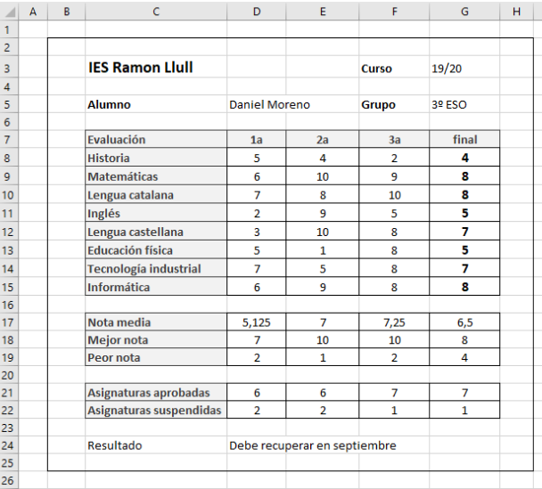

# Instrucciones boletín de notas



# Paso 1. Calcular la nota media de cada evaluación

---

Por ejemplo la media de las notas de la primera evaluación. Para hacer la media, podemos hacer:

```excel
=(A1+A2+A3)/3
```

Esto nos calculará la media de 3 celdas,

---

Existe una función más sencilla, llamada PROMEDIO.

```excel
=PROMEDIO(A1:A3)
```

Esto calculará la media de las celdas que hay entre la A1 y la A3.

# Paso 2: Calcular la nota media para cada evaluación

---

La función ``PROMEDIO()`` nos calculará la nota media, pero nos la dará con decimales. Para redondear, podemos utilizar la función ``REDONDEAR()``.

Dentro de una fórmula puedo poner otra fórmula y combinarlas en una sola celda, para hacer 2 operaciones en una:

``=REDONDEAR(PROMEDIO())``

# Paso 3: Calcular las filas de mejor y peor nota de cada evaluación

---

Para ello podemos utilizar las funciones MIN y MAX.

```excel
=MIN(A1:A10)
```

Calculará la nota más pequeña en el rango de celdas entre A1 y A10. La función MAX funciona de la misma manera.

# Paso 4: Calcular la cantidad de asignaturas aprobadas y suspendidas

---

Ejemplo:

```excel
=CONTAR.SI(D1:D20;”>=3”)
```

Cuenta las celdas de ese rango que tienen un valor de 3 o más.

# Paso 5: Escribir si pasamos de curso o no.

---

Tenemos que informar si pasamos o no de curso, en función de las asignaturas que suspende a final de curso.
Promociona al siguiente curso si al final todas las asignaturas están aprobadas
Debe recuperar en septiembre si hay una asignatura o más suspendidas

# Función SI()

La función SI() permite mirar el valor de una celda, u otra función, y mostrar una frase u otra en función de lo que haya.

# Función SI()

La función tiene 3 partes dentro del paréntesis, separadas por ;
```
=SI(“D1>5”;”muy bien”;”muy mal”)
```

# Función SI()

La primera es la condición que vamos a comprobar:

=SI(**“D1>5”**;”muy bien”;”muy mal”)

Es decir, si lo que hay en la celda D1 es un número mayor que 5 (6,7,8..)

# Función SI()

Si la condición se cumple, en la casilla en la que hemos escrito esta función aparecerá este mensaje:

=SI(“D1>5”;**”muy bien”**;”muy mal”)

# Función SI()

Si la condición no se cumple, aparecerá este otro mensaje:

=SI(“D1>5”;”muy bien”;**”muy mal”**)

# Resumen

```
=SI(“D1>5”;”muy bien”;”muy mal”)
```

- Si se cumple que lo que hay en la celda D1 es más grande que 5 (6,7,...), sale la primera frase.
- Si no se cumple, la segunda.
