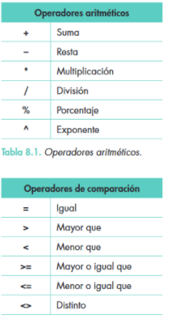

# 5. operadores

En las fórmulas debemos tener en cuenta algunos aspectos elementales:
Empiezan con el signo igual «igual» (=).t
Todas las fórmulas utilizan uno o varios operadores aritméticos (Tabla 8.1) para combinar los números o las referencias a las celdas.
Si en una fórmula se usan varios operadores aritméticos, se pueden incluir paréntesis para especificar la manera de evaluarla.
Cuando en las fórmulas se utilizan funciones, no son necesarios los operadores aritméticos.

