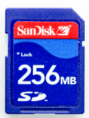
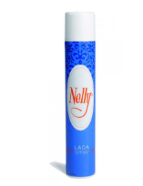

# Què accessoris tenim per treballar amb la impressora

Al departament tenim un lector de targetes USB per a targetes SD

Dues targetes SD, de 256 MB i de 8 GB. La de 8 GB no m'ha funcionat, l'altra si. La de 256 ja venia amb diversos arxius d'altres anys.

Laca per fer a sobre del llit calenta parell que l'objecte adherència millor i no es deixi anar a meitat de la impressió

Una rasqueta per arrencar restes de plàstic del llit calent.

