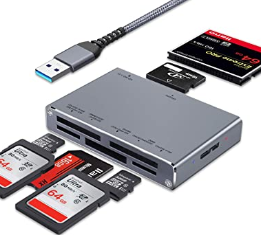

# Què accessoris tenim per treballar amb la impressora

## Tarjetes de memòria

Al departament tenim un lector de targetes USB per a targetes SD

Dues targetes SD, de 256 MB i de 8 GB. La de 8 GB no m'ha funcionat, l'altra si. La de 256 ja venia amb diversos arxius d'altres anys.

## Lector de targetes

Un lector de targetes SD USB que permet llegir i escriure dades a una targeta SD a través del port **USB** d'un ordinador.

## Laca

La **laca** es pot utilitzar per ajudar a adherit les capes de plàstic durant la impressió, especialment quan s'imprimeixen peces grans o amb una base ample. La laca s'aplica a la superfície d'impressió **abans de començar la impressió**.

Quan la boleta de la impressora comença a afegir capes de plàstic, la laca ajuda a mantenir-les fermament adherides a la superfície. Això pot ajudar a evitar que les capes es moguin durant la impressió, el que podria provocar deformacions o altres problemes.

## Rasqueta

Una rasqueta per arrencar restes de plàstic del llit calent.

