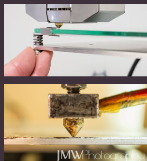

# Posada en marxa i calibració

A la dreta de la màquina hi ha un  __botó d'encesa__  per posar en marxa la impressora.

Per manejar-la, hi ha un **panell LCD** amb una rodeta per desplaçar-nos per les diferents opcions i prémer-la quan vulguem entrar en una o acceptar.

El primer que he fet és provar que funciona, i per això he anat a prepari> autohome, i el extrusor s'ha col·locat en el punt inicial.

## Calibració

Necessitem calibrar la impresora abans de començar a imprimir per primer cop.

Aturar els  __motors stepper __ al menú LCD

En primer lloc cal  __calibrar l'eix Z__  i mirar que les dues barres estan a la mateixa altura amb un  __peu de rei__

A continuació __ calibrar les quatre cantonades __ del llit amb extrusor posant el foli al mig i girant les claus fins que fregui però passi el paper.

