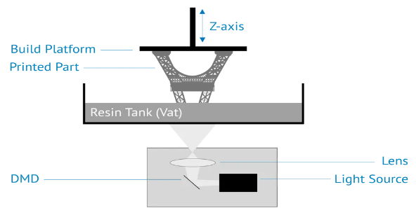

# 10. Impresión de resina

Las impresoras de resina son uno de los avances más recientes en impresión 3D. Estas impresoras utilizan una lámina de material de resina que se endurece con luz ultravioleta para crear objetos tridimensionales.

Estas impresoras ofrecen una impresión de alta calidad con detalles finos y una resistencia a la abrasión superior a la de las impresoras de filamento. Estas impresoras también son significativamente más rápidas que las impresoras de filamento, lo que las hace ideales para la producción en masa.

Las impresoras de resina pueden ser una excelente opción para aquellos que buscan imprimir modelos de precisión con una alta calidad de impresión.

## Inconvenientes

Sin embargo, también hay algunos inconvenientes. Las impresoras de resina son más costosas que la mayoría de las otras impresoras 3D, por lo que no son adecuadas para todos los presupuestos.

Además, la resina utilizada en estas impresoras puede ser tóxica si se inhala, por lo que es importante trabajar en un área bien ventilada cuando se utiliza.

Finalmente, debido a que la resina se endurece al contacto con la luz, los objetos impresos pueden ser más frágiles que los impresos en filamento, por lo que no siempre es la mejor opción para aplicaciones de uso rudo.