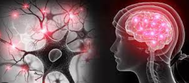
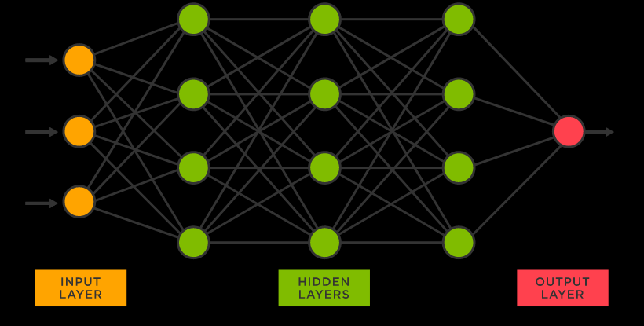
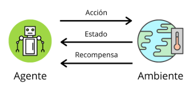

# 3. Redes neuronales

## ¿que son las redes neuronales?

Redes neuronales artificiales (ANN) son modelos de computación basados en la estructura y el funcionamiento de los sistemas nerviosos.

Las **redes neuronales artificiales** están compuestas de una gran cantidad de unidades de procesamiento simples, llamados **neuronas**, que se conectan entre sí y trabajan en conjunto para realizar tareas de procesamiento de información.

Estas redes pueden ser entrenadas para realizar una amplia variedad de tareas de **procesamiento** de información, como:

- **reconocimiento de patrones**
- **aprendizaje** de reglas
- **optimización**
- predicción y la generalización

## Aprendizaje por refuerzo

Los redes neuronales son herramientas poderosas para el aprendizaje, y el aprendizaje por refuerzo es una técnica poderosa para entrenarlos. En el aprendizaje por refuerzo, se entrena a una red neuronal para que realice una tarea aprendiendo a maximizar una señal de recompensa. La señal de recompensa suele ser una función del rendimiento de la red en la tarea, y el proceso de entrenamiento suele ser un proceso iterativo de ensayo y error.

## Ventajas

Uno de los beneficios del **aprendizaje por refuerzo** es que se puede usar para entrenar redes neuronales para realizar tareas que son difíciles o incluso imposibles de especificar mediante los métodos tradicionales de aprendizaje supervisado. Por ejemplo, se ha utilizado el aprendizaje por refuerzo  para entrenar redes neuronales para jugar videojuegos y para controlar brazos robóticos.

Otro beneficio del aprendizaje por refuerzo es que se puede usar para entrenar redes neuronales de manera completamente no supervisada. Esto se debe a que la única retroalimentación que recibe la red durante el entrenamiento es la señal de recompensa. Esto significa que el aprendizaje por refuerzo se puede usar para entrenar redes neuronales para realizar tareas en las que no hay datos de entrenamiento disponibles.