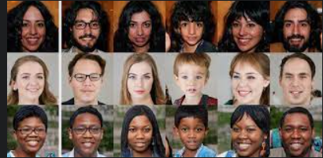

# 6. This person doesnt exist

[Thispersondoesntexist](https://thispersondoesnotexist.com/) es un sitio web que genera imágenes de personas artificiales usando una red neuronal generativa.

Al entrenar la red neuronal con millones de imágenes reales de personas, el sitio web puede generar imágenes de personas que parecen reales, pero que en realidad no existen.

Thispersondoesntexist puede ser útil para probar la tecnología de reconocimiento facial, ya que la red neuronal puede generar imágenes de personas con diferentes características faciales.

También puede ser utilizado para generar avatares en videojuegos o para crear personajes de ficción.

Thispersondoesntexist es un ejemplo de una red neuronal generativa adversarial (GAN).