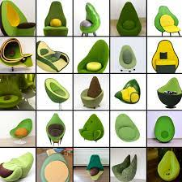

# Dall-e

Dall-e es una aplicación de inteligencia artificial creada por OpenAI. Dall-e genera imágenes a partir de texto, lo que le permite crear imágenes de objetos que no existen en la realidad.

Por ejemplo, si se le pide que genere una imagen de un "perro volador", Dall-e creará una imagen de un perro con alas.

## ¿Cómo funciona?

Dall-e funciona al analizar el texto y luego generar una imagen en base a lo que entiende. Esto significa que puede interpretar el texto de forma abstracta y no solo como una lista de instrucciones.

Por ejemplo, si se le pide que dibuje un "sol", Dall-e dibujará una imagen de un sol. Si se le pide que dibuje un "sol rojo", Dall-e dibujará una imagen de un sol con un tono rojizo.

Dall-e también es capaz de comprender el contexto de una frase. Por ejemplo, si se le pide que dibuje un "perro volador", Dall-e dibujará un perro con alas. Si se le pide que dibuje un "perro en un avión", Dall-e dibujará un perro en un avión.