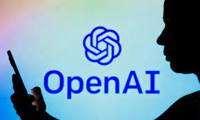

# OpenAI

OpenAI es una organización sin fines de lucro dedicada a la investigación y desarrollo en Inteligencia Artificial (IA). Buscan desarrollar tecnologías avanzadas en IA y garantizar su uso seguro a través de la colaboración abierta y el código abierto. La meta de OpenAI es desarrollar una IA segura, diversa y generalmente útil para el beneficio de todos.

https://openai.com/api/

