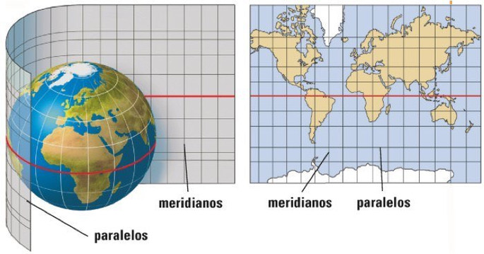
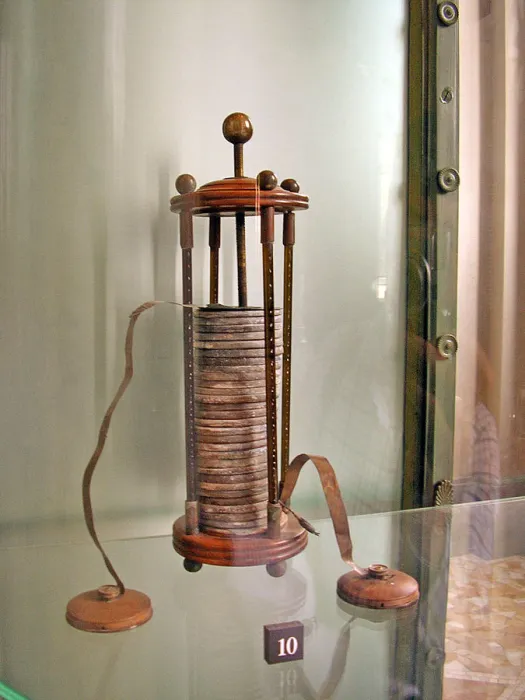
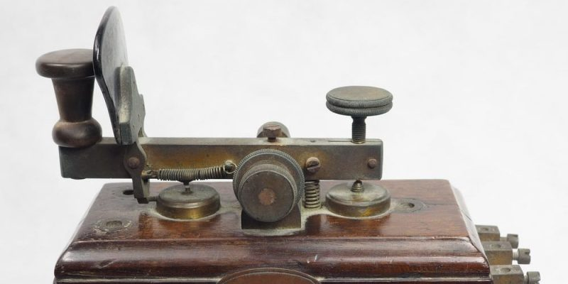
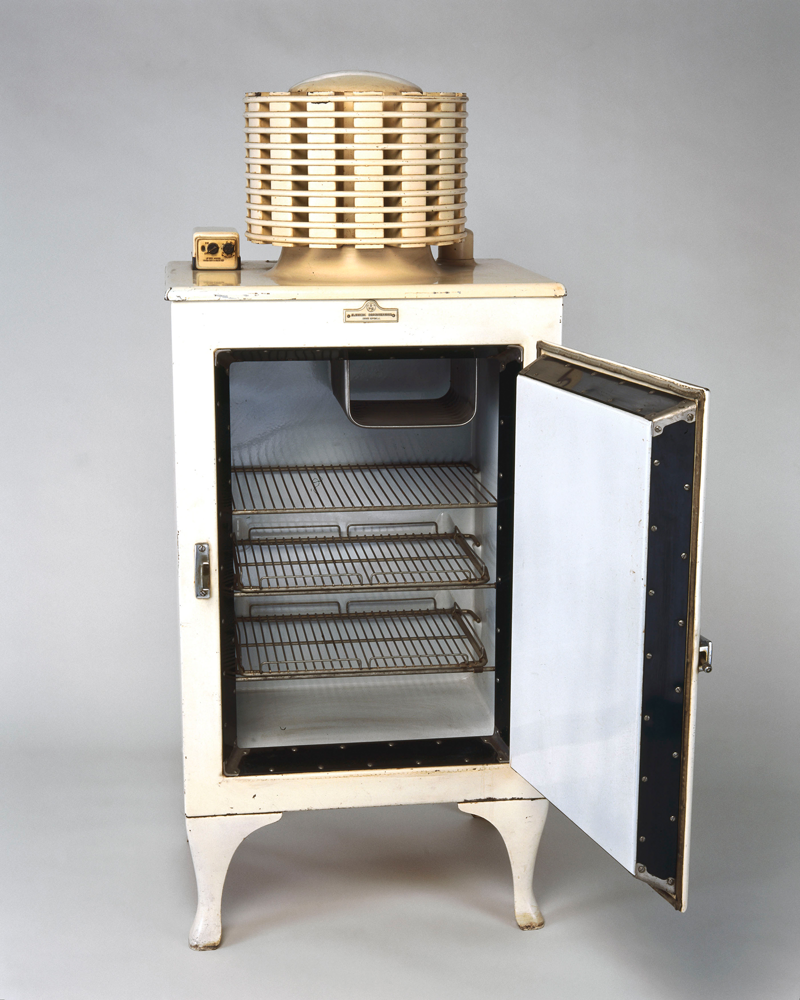
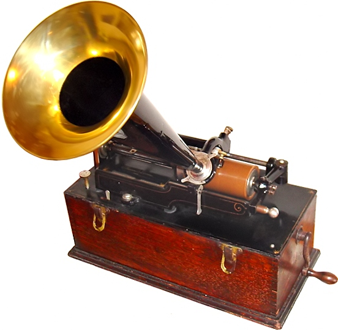
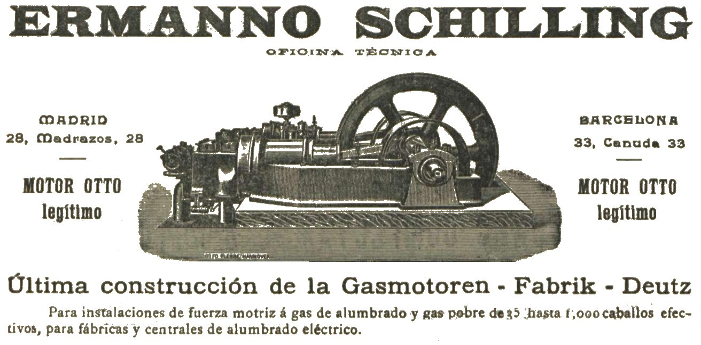
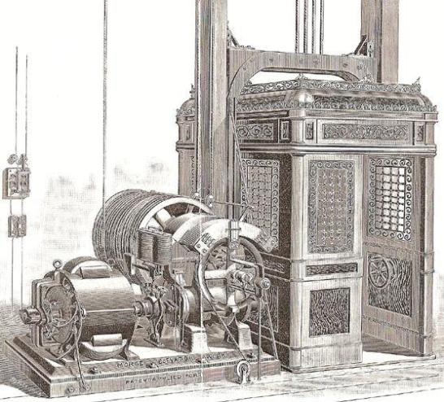
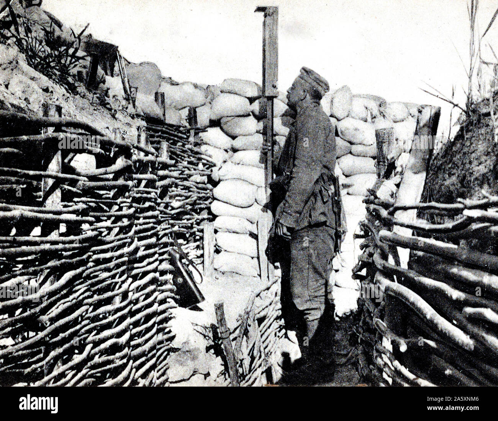

[🔙 Enrere](../) | [🏠 Pàgina principal](http://danimrprofe.github.io/apuntes/)

#  Cronología de los inventos

---

#  Antes de cristo

20.000 aC Agujas de hueso
18.000 aC Pinceles
18.000 aC Cabañas de hueso de mamut
Se realizan las primeras herramientas de piedra
13.000 aC Arpones
12.000 aC Cestería en mimbre
11.000 Empiezan a domesticar perros
10.500 aC Vasijas de arcilla
10.000 Extinción de mamuts de pelo
10.000 aC Redes de pesca
8.000 aC Peine
8.000 Primeras cosechas en Oriente Medio
7.500 aC Canoas
6.500 aC Fonería de cobre
6.000 aC Mahón
5.500 aC Rueda
5.000 aC Libra
3.500 aC Embarcaciones de vela
4.000 aC
3.500 aC Arado
3.300 aC Escritura Cuneiforme
3.000 aC Ábaco
1.747 aC Calendario
1.500 aC Foneria del Hierro
600 aC Monedas

---

#  Siglo III

La palanca
El caracol sin fin
Caracol elevador de agua
La rueda dentada
La balanza hidrostática
Los espejos ustorios

---

#  150 aC Sismoscopio

Un sismoscopio es un dispositivo usado para registrar los sismos y temblores. Está formado por una placa sísmica conectada a un dispositivo electrónico para registrar y medir los movimientos sísmicos. El sismoscopio se utiliza para medir la intensidad de los temblores y los sismos, así como su ubicación y profundidad.

287-212 a.C. Arquímedes, notable matemático e inventor griego, nacido en Siracusa, Sicilia, y educado en Alejandría, Egipto, se anticipó en su época con investigaciones y
inventos.
0-33 Vida y Pasión de Jesucristo.
50 Herradura
105 Papel
124 Cúpula
200 a 300 Carro con ruedas
300 - El Cristianismo se ha difundido en el Imperio Romano
350 estribos
400 a 500 Astrolabio
Fines del Siglo V: Caída del Imperio Romano de Occidente
476 Comienzo de la Edad Media.
650 Molino de viento
800-900 Papel moneda
800 Partituras

---

#  800 a 900 Pólvora

La ``pólvora`` está compuesta por salitre (nitrato de potasio), azufre y carbón vegetal. Estos ingredientes se mezclan en diferentes proporciones para producir una mezcla explosiva.

Cuando se enciende la mezcla, el calor generado por la combustión del carbón hace que el nitrato de potasio se descomponga en nitrógeno y oxígeno. Esto provoca una reacción exotérmica que libera grandes cantidades de gas a alta presión. Esta presión hace que la mezcla explote, liberando energía en forma de ondas de choque. Estas ondas de choque son las que proporcionan la fuerza necesaria para propulsar proyectiles, como balas de cañón.

https://www.youtube.com/watch?v=XCaPo6fzcnw

868 Impresión de libros

---

#  Siglo X

950 Arado de ruedas
999 Cristales coloreados en ventanas de Inglaterra
Pleno desarrollo precolombino de las civilizaciones
aborígenes americanas, especialmente Mayas, Aztecas,
Chibchas e Incas.
En el S. X aparece la herradura para caballos y un arnés
1000 Lentes
1000 Cámara oscura

---

#  Siglo XII

---

#  1100 Brújula magnética

La primera brújula magnética conocida en navegación marítima, está señalada en Europa en 1187, por el inglés Alexander Neckham. Describe una aguja transportada a bordo, que permite seguir un rumbo, incluso cuando la estrella polar está cubierta por las nubes.

---

#  1105 Primer molino de viento en Francia

---

#  1118 Cañón (Usado por los moros)

---

#  1121 Clavecín

La invención del clavecín supuso un gran cambio en la música. Esta nueva tecnología permitió a los músicos y compositores crear música de una forma más precisa y controlada. El clavecín fue el precursor de los instrumentos de teclado modernos, como el piano. Además, el clavecín también fue una fuente importante de innovación en la composición y la interpretación musical. Esto se debe a sus características únicas, como la capacidad de ajustar los tonos y la facilidad de producir una melodía más compleja. Estas características permitieron a los compositores crear obras más complejas con más detalle y profundidad. Además, también ayudó a desarrollar el concepto de la tonalidad.

1140 "Mio Cid" - Dos juglares de Medinacelli componen el primer texto en lengua romance castellano.

Durante el siglo XI, se inventó la brújula magnética, un instrumento que permitió a los navegantes descubrir su posición en el mar sin necesidad de mirar las estrellas. Esta nueva tecnología permitió a los navegantes llegar a sus destinos con más facilidad y seguridad. Además, los primeros molinos de viento en Francia cambiaron la forma en que se obtenía la energía. Estos molinos permitieron a los franceses producir energía de forma mucho más eficiente que los antiguos métodos de usar caballos y oxígeno.

Otro avance tecnológico importante fue el cañón, que fue utilizado por los moros para defender sus territorios. Esta tecnología fue una de las principales razones del éxito de los moros en la conquista de Andalucía. Por último, pero no menos importante, la clavecín fue inventada durante el siglo XI y se convirtió rápidamente en el instrumento musical más popular de la época. Esta nueva tecnología permitió a los músicos crear nuevas melodías y ritmos.

---

#  Siglo XIII

1200 Timón de popa
1232 Globo de aire caliente (China)
1257 Espejos cóncavos
1268 Anteojos
1271 Parte de Venecia Marco Polo rumbo a China.
1272 Máquina de bobinas de seda en Bolonia
1298 Reloj mecánico

En el S. XIV se perfecciona la fabricación del vidrio y se
inventa el telar en pedal.

---

#  Siglo XV

Siglo XV Imprenta de tipos móviles
Laúd

Algunas de estas innovaciones marcaron una gran diferencia en la forma en que se hacían las cosas y cambiaron el curso de la historia.

---

#  1400 Rueda de hilar

Una de las principales innovaciones de este período fue la invención de la rueda de hilar en 1400. Esta rueda mejoró significativamente la productividad de la industria textil.

---

#  1420 Pinturas al óleo

Otra innovación importante del siglo XV fue el desarrollo de la pintura al óleo. Esta nueva técnica permitió a los pintores crear una variedad de hermosas obras de arte con una gran profundidad de color. Esta técnica se desarrolló en 1420 y se ha convertido en una técnica muy popular en la pintura moderna.

---

#  1439 La imprenta

La imprenta fue inventada por Johannes Gutenberg en 1439. Fue una de las mayores innovaciones en el campo de la comunicación y el intercambio de información. Anteriormente, todos los libros estaban escritos a mano, lo que era un proceso muy lento y costoso. La imprenta permitió la producción masiva de libros a un costo mucho más bajo.

---

#  1450 Velocípedo

Otro importante invento del siglo XV fue el velocípedo, inventado en 1450. Esta bicicleta fue una de las primeras bicicletas de tres ruedas y se convirtió rápidamente en una forma popular de transporte. Esto permitió a la gente recorrer distancias más largas y más rápido que antes.

---

#  1492 Descubrimiento de América

En 1492, el descubrimiento de América trajo consigo una serie de cambios e innovaciones. Esto incluyó el comercio de alimentos, especias, metales preciosos y textiles. Esto tuvo un gran impacto en la economía europea y cambió el curso de la historia.

---

#  Siglo XVI

El siglo XVI fue un periodo de gran actividad científica y tecnológica, a lo que contribuyeron los avances en la navegación, la imprenta, la minería, la industria textil y otros campos. Esta era una época en la que la ciencia moderna emergía, y los inventos y descubrimientos cambiaban la forma en que la gente vivía.

1500 Reloj

1522 Sebastián Elcano completa el viaje por todo el mundo
1530 Empieza el comercio de esclavos

1569 Mapa en proyección
1589 Telar
1589: Sir John Harrington (GB) inventa el inodoro con
depósito, pero pasó mucho tiempo antes de imponerse, y se
siguieron usando bacinas y inodoros con agujeros hacia pozo
o foso
1590 Microscopio compuesto
1593 Termómetro de agua

Uno de los principales avances tecnológicos de este siglo fue la invención del reloj. A principios del siglo XVI, el ingeniero alemán Peter Henlein inventó el primer reloj de bolsillo, y el reloj de pared fue inventado en 1510. Estos relojes eran imprescindibles para la navegación, permitiendo a los navegantes medir con precisión la longitud de sus viajes.

---

#  1500 Puntilla

Otra invención importante de este siglo fue la puntilla, inventada por la artesana italiana Isabella Cataneo. Esta técnica permitió la elaboración de prendas de vestir con detalles finos y decorados. A partir de entonces, la puntilla se convirtió en una forma de arte y se extendió por toda Europa.

En 1522, el navegante español Sebastián Elcano completó el primer viaje alrededor del mundo. Este logro contribuyó a la expansión del comercio marítimo y la apertura de nuevos mercados. Esto también permitió a los europeos traer esclavos de África para trabajar en sus colonias. Esta práctica fue muy común en el siglo XVI y contribuyó a la economía europea.

---

#  1565 Lápices

En 1565, el alemán Faber-Castell inventó el lápiz, revolucionando el proceso de escritura. Esto permitió el uso generalizado de escritura a mano y la producción de documentos y obras de arte.

---

#  1581 Péndulo

Otro avance importante en el siglo XVI fue la invención del péndulo por el físico italiano Galileo Galilei, en 1581. Esta invención permitió la medición precisa del tiempo y el desarrollo de relojes de precisión.

En 1569, el cartógrafo alemán ``Gerardus Mercator`` inventó el mapa en proyección cilíndrica, que permitió la representación de los mares y continentes con mayor precisión. Esto contribuyó a la navegación y la exploración marítima.

En 1589, el inglés Sir John Harrington inventó el inodoro con depósito. Aunque este avance fue importante, tardó mucho tiempo en imponerse y se siguieron usando bacinas y inodoros con agujeros hacia pozos o fosos.

En 1590, el italiano Galileo Galilei inventó el microscopio compuesto, una importante herramienta para la microscopía.

En 1593, el físico italiano Galileo Galilei inventó el termómetro de agua, lo que permitió la medición de la temperatura con mayor precisión.

---

#  Siglo XVII

En 1605, Miguel de Cervantes publicó su famosa obra "El Ingenioso Hidalgo Don Quijote de la Mancha", una novela que sigue siendo una de las más respetadas y admiradas de todos los tiempos.

En 1609, se inventó el telescopio refractor, un instrumento que permitió a la humanidad ver detalles de los cuerpos celestes que antes eran invisibles.

En 1620, el barco inglés "Mayflower" llegó a América del Norte, iniciando el proceso de colonización europea de aquel continente.

---

#  1640 Bayoneta

En 1640, se inventó la bayoneta, un arma diseñada para ser usada con fusiles y pistolas. En 1642, Blaise Pascal inventó la primera calculadora mecánica, una herramienta revolucionaria para el cálculo matemático.

En 1657, Christiaan Huygens inventó el reloj de péndulo, una herramienta que permitió la medición precisa del tiempo.

En 1665, Robert Hooke construyó un microscopio mejorado, lo que permitió a la gente ver detalles mínimos del mundo de la microscopia.

En 1668, Isaac Newton construyó un telescopio reflector, una herramienta que permitió la exploración de los cuerpos celestes más lejanos.

En 1672, Otto Von Guericke inventó la primera bomba neumática, una herramienta revolucionaria para comprender los principios de la física.

En 1682, Edmund Halley descubrió el cometa que lleva su nombre, un descubrimiento que ayudó a la gente a comprender la naturaleza de los cuerpos celestes.

Por último, en 1687, Gabriel Fahrenheit inventó el higrómetro, un dispositivo que permitió la medición precisa de la humedad en el aire.

---

#  Siglo XVIII

---

#  1709 Piano

Uno de estos inventos fue el piano de 1709. Esta maravilla de la ingeniería permitió a los músicos tocar una amplia variedad de melodías. El uso de pianos se ha extendido hasta el día de hoy y se utiliza en muchos géneros diferentes.

---

#  1710 Termómetro de alcohol

Otro invento importante fue el termómetro de alcohol de 1710. Esta herramienta de medición permitió a los médicos controlar la temperatura de los pacientes con precisión. Esto permitió que los médicos pudieran detectar y tratar enfermedades con mayor precisión.

1740 Estufa Franklin

En 1740, también se inventó la imprenta en colores. Esta innovación permitió a los impresores imprimir documentos con mayor nitidez y detalle. Esto permitió a los artistas y escritores mejorar la calidad de sus trabajos.

Un año después, en 1741, se inventó la escalera centígrada. Esta herramienta permitió a los médicos medir la temperatura del cuerpo humano con precisión. Esto ayudó a los médicos a diagnosticar y tratar enfermedades mucho más rápido y con mayor precisión.

En 1745, se inventó el condensador eléctrico. Esta innovación permitió a los científicos controlar la cantidad de corriente eléctrica que circulaba por un circuito. Esto permitió a los científicos estudiar la electricidad de manera más precisa y segura.

---

#  Pararrayos

En 1752, se inventó el pararrayos. Esta innovación ayudó a las personas a protegerse de los efectos dañinos de los rayos. Esto permitió a las personas construir edificios y otras estructuras con mayor seguridad.

---

#  1757 Sextante

El año 1757 vio el invento del sextante. Esta herramienta permitió a los marineros navegar de manera más segura al permitirles calcular su posición en el océano de manera precisa.

En 1761 nació el cronómetro. Esta herramienta permitió a los marineros navegar con mayor precisión al medir con precisión el tiempo y la distancia.

En 1763, se inventaron los reflectores parabólicos. Esta innovación permitió a los astrónomos ver estrellas y otros objetos astronómicos con mayor nitidez. Esto permitió a los astrónomos ampliar su conocimiento sobre el universo.

En 1769, se inventó el automóvil de vapor. Esta innovación permitió a las personas viajar más rápido y con mayor comodidad. Esto abrió la puerta a una era de movilidad moderna y eficiente.

En 1776, se inventaron los globos, lo que permitió a las personas volar y ver el mundo desde una perspectiva diferente. Esto abrió la puerta a la exploración aérea y el descubrimiento de nuevos lugares.

---

#  1782 Máquina de vapor Watt

En 1782, James Watt inventó la ``máquina de vapor``. Esta innovación cambió la forma en que se producían los productos al permitir a las personas producir productos en mayor cantidad y con mayor rapidez.

---

#  Globo de aire caliente

En 1783, se inventó el globo de aire caliente. Esta innovación permitió a las personas volar más alto y con mayor seguridad. Esto permitió a las personas ver el mundo desde nuevas perspectivas.

En 1784, se inventó la lámpara de aceite con mecha vacía.

Esta innovación permitió a las personas iluminar sus hogares con mayor seguridad. Esto permitió a las personas ver y trabajar aún mejor en la oscuridad.

En 1785, se inventó la hélice. Esta innovación permitió a los científicos estudiar el movimiento de los fluidos de manera más precisa. Esto permitió a los científicos entender mejor la física y desarrollar tecnologías más avanzadas.

En 1789, estalló la Revolución Francesa. Esta revolución cambió el curso de la historia y abrió la puerta a nuevos cambios sociales y políticos.

---

#  Siglo XIX

---

#  1800 Martillo pilón

El martillo pilón fue una herramienta mecánica inventada en 1800 que se usaba para forjar metales. Esta herramienta era una parte esencial de la industria y se utilizaba para fabricar y reparar diferentes tipos de herramientas y objetos metálicos.

---

#  1801 Pila eléctrica

1801 Pila eléctrica: La primera pila eléctrica fue inventada por Alessandro Volta en 1801. Esta fue la primera fuente de energía eléctrica que funcionaba sin la necesidad de una fuente externa de energía. Esta pila producía energía eléctrica a partir de la reacción química de dos electrodos inmersos en una solución conductora.

---

#  1801 Electróforo

1801 Electróforo: El electróforo fue inventado por William Nicholson en 1801. Esta era una herramienta eléctrica que se usaba para generar electricidad estática. Esta herramienta estaba formada por una placa metálica conectada a una fuente de energía, una varilla metálica, y un recipiente de líquido aislante.

---

#  1801 Endiómetro

1801 Endiómetro: El endiómetro fue inventado por Henry Cavendish en 1801. Esta herramienta se usaba para medir la capacitancia de un condensador. Esta herramienta fue un avance muy importante en el campo de la medición eléctrica.

---

#  1802 Locomotora de vapor

1802 Locomotora de vapor: La primera locomotora de vapor fue inventada por George Stephenson en 1802. Esta locomotora fue una revolución en el transporte y abrió la puerta a una nueva era de transporte seguro y rápido.

---

#  1803 Acumulador eléctrico

1803 Acumulador eléctrico: El primer acumulador eléctrico fue inventado por Alessandro Volta en 1803. Esta herramienta fue la primera batería capaz de almacenar energía eléctrica y fue un avance muy importante en el campo de la energía eléctrica.

---

#  1805 Telar Jacquard

1805 Telar Jacquard: El telar Jacquard fue inventado por Joseph-Marie Jacquard en 1805. Esta máquina fue una innovación en el campo de la fabricación textil. Esta máquina estaba equipada con una tarjeta perforada que permitía que se tejan patrones de tejido complicados.

---

#  1815 Napoleón es derrotado en Waterloo

1815 Napoleón es derrotado en Waterloo: En 1815, Napoleón fue derrotado en la batalla de Waterloo por una coalición de fuerzas lideradas por el duque de Wellington. Esta fue la última batalla de Napoleón y marcó el fin de su reinado.

---

#  1816 Lámpara de seguridad para mineros, termoelectricidad

1816 Lámpara de seguridad para mineros, termoelectricidad: En 1816, Sir Humphry Davy inventó la lámpara de seguridad para mineros. Esta lámpara funcionaba con una pila eléctrica basada en la termoelectricidad. Esta herramienta fue una importante innovación para la industria minera.

---

#  1827 Cortadora de césped

1827 Cortadora de césped: La primera cortadora de césped fue inventada por Edwin Budding en 1827. Esta herramienta fue una innovación importante en el campo de la jardinería y permitió que los jardines se mantuvieran limpios y bien cuidados.

---

#  1830 Dínamo eléctrica

1830 Dínamo eléctrica: La primera dínamo eléctrica fue inventada por Michael Faraday en 1830. Esta herramienta fue un avance importante en el campo de la energía eléctrica y permitió que la electricidad se produjera de forma continua y fiable.

---

#  1831 Cosechadora

1831 Cosechadora: La primera cosechadora fue inventada por Cyrus McCormick en 1831. Esta herramienta fue una innovación importante en el campo de la agricultura y fue una de las primeras herramientas mecánicas usadas para cosechar. Esta herramienta permitió que la cosecha se realizara de forma más rápida y eficiente.

---

#  1834 Telégrafo eléctrico

---

#  1837 Alfabeto Morse

---

#  1837 Estereoscopio

---

#  1838 Bicicleta

---

#  1839 Estampilla de correos

Los barcos con casco de hierro fueron inventados en 1840 por la Compañía Naval de Scott. Estos barcos revolucionarios fueron diseñados para navegar a velocidades mucho más altas que los barcos de madera. Esto abrió nuevas formas de transporte y comercio.

---

#  1840 Reloj eléctrico

El reloj eléctrico fue inventado en 1840 por Alexander Bain. Esta innovación tecnológica permitió a las personas medir el tiempo con precisión y exactitud. Esto ayudó a mejorar la eficiencia y la productividad en muchos campos.

---

#  1842. Anestésicos

En 1842, el cirujano británico ``James Simpson`` descubrió el uso de los anestésicos, permitiendo a los cirujanos realizar procedimientos quirúrgicos sin provocar dolor a los pacientes.

Por aquel entonces, los cirujanos habían empezado a usar éter como anestésico.

El 4 de noviembre de 1847, los tres médicos quedaron en casa de Simpson para inhalar ``cloroformo`` que les dejó en un estado inconsciente hasta la mañana siguiente. A partir de ese momento, Simpson lo empezó a usar en algunas cirugías menores y en varios partos con excelentes resultados.

Esta innovación revolucionó el campo de la medicina, cambiando para siempre la naturaleza de los procedimientos quirúrgicos.

En 1846, el inventor alemán Adolph Sax inventó el saxofón, un instrumento musical de viento que combina la potencia del clarinete y la afinación del oboe. Esto abrió la puerta a nuevas formas de expresión musical, y el saxofón se ha convertido en uno de los instrumentos más populares en la música de jazz y pop moderna.

En 1846, el inventor alemán Friedrich Koenig inventó la prensa rotativa, una máquina que imprimía una hoja completa de papel a la vez. Esta innovación permitió a los periódicos aumentar la velocidad de producción de las noticias, aumentando la demanda de información entre el público.

En 1846, el inventor británico Linus Yale inventó la cerradura de seguridad, un mecanismo de bloqueo mejorado que ofrecía una mayor seguridad contra el robo. Esta innovación revolucionó el campo de la seguridad, y las cerraduras de seguridad se han convertido en uno de los dispositivos de seguridad más populares.

En 1851, el inventor francés Louis Daguerre inventó la cámara de placas, un dispositivo diseñado para tomar fotografías. Esta innovación permitió a la gente capturar momentos especiales de una manera nunca antes vista, cambiando para siempre la forma en que la gente ve el mundo.

---

#  1860 Linóleo

---

#  1860 Esquiladora

La esquiladora fue inventada en 1860 por Hiram Moore. Esta máquina revolucionaria permitió a los agricultores cortar el pelo de los animales domésticos y cosecharlo para usarlo como materiales para ropa y otros productos. Esta importante innovación modernizó el proceso de producción de lanas.

---

#  1876 Teléfono

El teléfono fue inventado por Alexander Graham Bell en 1876. Esta innovación revolucionaria permitió a las personas comunicarse a largas distancias a través de una línea telefónica. El teléfono se convirtió en una herramienta esencial para comunicaciones interpersonales, de negocios y militares.

---

#  1876 Frigorífico

El frigorífico fue inventado por Carl von Linde en 1876. Esta importante innovación permitió que los alimentos se conservaran a temperaturas más bajas, evitando así el deterioro de los alimentos. El frigorífico cambió la forma en que las personas almacenaban los alimentos, permitiendo una mayor duración de la comida.

---

#  1877 Fonógrafo

El fonógrafo fue inventado por Thomas Edison en 1877. Esta innovación permitió capturar la voz humana y almacenarla en un dispositivo mecánico para su posterior reproducción. El fonógrafo revolucionó el mundo de la música y la tecnología de la información, transformando la forma en que las personas escuchaban y compartían la música.

---

#  1877 Motor de cuatro tiempos

El motor de cuatro tiempos fue inventado por Nikolaus Otto en 1877. Esta innovación permitió la producción automatizada de motores de combustión interna, los cuales se usan en una amplia variedad de vehículos. Esta importante innovación dio lugar a la era de la automatización, lo que permitió la fabricación de productos de manera más eficiente y asequible.

---

---

---

#  1881 Luis Pasteur, comenzó sus experimentos contra la rabia

Luis Pasteur comenzó sus experimentos en 1881 contra la rabia, creando una vacuna que luego salvó la vida de muchas personas. Estos experimentos comenzaron con la inoculación de una bacteria extraída del cerebro de un animal infectado. Esto fue seguido por la inoculación de la bacteria a un perro, que resultó ser exitoso después de seis meses. Esto demostró que la bacteria de la rabia podía ser inactivada y no causaría la enfermedad. Pasteur luego desarrolló una vacuna para prevenir la rabia.

---

---

La vacuna consistía en usar la misma bacteria inactivada para inocular a los animales. Esto significaba que el sistema inmunológico del animal podría producir anticuerpos específicos para la bacteria, lo que significaba que el animal quedaría protegido de la enfermedad en caso de una infección posterior.

Esta fue la primera vacuna exitosa para una enfermedad infecciosa y se convirtió en la base para el desarrollo de vacunas posteriores.

---

#  1884. Generador de turbina de vapor

En 1884, se inventó el primer generador de turbina de vapor que permitió la producción a gran escala de energía eléctrica.

La turbina de vapor fue inventada en 1884 por Sir Charles Parsons , cuyo primer modelo estaba conectado a una dinamo que generaba 7,5 kW (10 hp) de electricidad. La turbina de vapor es una característica común de todas las centrales térmicas modernas.

---

---

#  1885. Primer automóvil

En 1885, los hermanos Daimler y Maybach inventaron el primer automóvil de motor de gasolina. Esta innovación revolucionó los transportes y cambió para siempre la forma en que nos movíamos. El automóvil abrió la puerta a nuevas posibilidades de viajar, y su diseño técnico y su rendimiento mejoraron de forma constante durante el siglo XX. Su impacto fue enorme y ha tenido una enorme influencia en la forma en que vivimos nuestra vida diaria.

---

#  1885 Bicicleta de pedales

---

#  1888 Gramófono

En 1888, el gramófono fue inventado, lo que permitió a la gente grabar y reproducir música. Estos inventos revolucionaron los campos de la medicina, transporte, energía y entretenimiento para siempre.

---

---

https://artsandculture.google.com/story/awUBd0WvqVFpLg?hl=en

---

#  1889 Ascensor eléctrico

---

#  1890 El tubo de Crookes

El tubo de Crookes es un dispositivo de vacío desarrollado por el físico británico William Crookes en 1878. Estaba diseñado para estudiar el comportamiento de los rayos catódicos, una forma de radiación electromagnética. El tubo contenía una lámpara de descarga con un filamento calentador en su centro, una cámara de vacío para albergar la lámpara, una lámina metálica para producir un campo eléctrico, y una pantalla con una placa de plomo en la parte delantera para producir un campo magnético. Cuando el filamento se calentaba, emitía electrones que se desplazaban hacia la superficie de la lámina. Estos electrones eran entonces acelerados y desviados por los campos eléctrico y magnético. El resultado era una descarga visible que se podía ver en la pantalla.

---

#  1894 Radio

---

#  1894 Primer periscopio

---

#  1895 Rayos X

El 8 de noviembre de 1895 el físico alemán Wilhelm Conrad Roentgen descubrió los rayos X mientras realizaba experimentos con tubos de vacío y un generador eléctrico. Con el hallazgo de este haz de luz capaz de atravesar la materia, nació el diagnóstico médico por imágenes que mejoró considerablemente el ejercicio de la medicina.

---

---

# 1897 Motor Diesel

El primer motor Diesel fue construido por el inventor alemán Rudolf Diesel en 1897. El motor fue una innovación importante porque eliminaba la necesidad de usar combustibles volátiles como el carbón y el petróleo para generar energía. Esto permitió una mayor eficiencia energética, ya que el motor convertía el combustible directamente en energía mecánica. El motor también fue mucho más silencioso que los motores de combustión interna anteriores

---

1897 Motor eléctrico compacto

---

#  Siglo XX

---

#  1900. Zeppelin

El dirigible rígido Zeppelin fue uno de los primeros dirigibles grandes en entrar en servicio, construido por el ingeniero alemán Ferdinand von Zeppelin. Esta innovadora nave llevó a cabo el primer vuelo de pasajeros comercial exitoso, estableciendo un precedente para la navegación aérea moderna.

1900 El tractor fue una innovación importante en la agricultura, permitiendo a los agricultores trabajar grandes extensiones de tierra y aumentar la productividad. Esto representó una revolución en la agricultura, ya que hasta entonces los agricultores dependían de bueyes y caballos para la preparación de la tierra.

1901 Mecano fue uno de los primeros juegos de construcción creados para entretener a los niños. Esto permitió a los niños jugar con piezas metálicas, como tuercas y tornillos, para construir máquinas, edificios y otras estructuras.

---

1901 Marconi emitió un mensaje de radio a través del Océano Atlántico, estableciendo las bases para el desarrollo de la tecnología de radio moderna. Esta innovadora tecnología permitió a los operadores de radio enviar y recibir señales de radio a distancias mucho más largas de lo que era posible anteriormente.

---

1902 Los frenos de disco fueron inventados para mejorar la seguridad de los vehículos, permitiendo a los conductores detener su vehículo de manera más rápida y efectiva. Esta tecnología se ha convertido en una característica común en la mayoría de los vehículos modernos, proporcionando una mayor seguridad para los pasajeros.

1903 Hoja de seguridad
1903 Máquina de hacer botellas
1903 Electrocardiograma
1903 Cinturón de seguridad
1903 Osito de peluche

---

#  1904 Se abre el canal de panamá

El 15 de agosto de 1904 se abrió el Canal de Panamá después de 10 años de construcción. El canal, que une el Océano Atlántico con el Océano Pacífico, fue hecho para permitir que los barcos naveguen más directamente entre los dos océanos. El canal fue construido por la Compañía del Canal de Panamá, una empresa estadounidense, y fue comprado por los Estados Unidos en el año de 1914. Desde entonces, el Canal de Panamá ha sido administrado por el gobierno de los Estados Unidos. El canal ha sido una importante vía navegable en el comercio internacional desde su apertura.

---

1906 Luz termoiónico

---

1907 Lavadora

---
1910 Modelo nuclear del átomo

---

1911 Acero inoxidable

---

1913 Cadena de montaje

---

1913 Heladera eléctrica

---

#  1913 Cremallera

---

La primera patente de un dispositivo de cremallera fue presentada en 1913 por Gideon Sundback, un ingeniero sueco. Se le atribuye el haber creado la cremallera moderna, un dispositivo fácil de usar con una combinación de dientes de metal y una solapa. Sundback también inventó el cierre de plástico, que se utilizó para la primera vez en 1933

---

#  1914 Primera guerra mundial

---

#  1914 Semáforos Luminosos

Los primeros semáforos luminosos fueron instalados en 1914 en Cleveland, Ohio. Estaban diseñados para ayudar a controlar el tráfico en las principales intersecciones de la ciudad. Estos semáforos usaban luces rojas y verdes para indicar a los conductores cuándo parar y cuándo seguir.

---

#  1914 Limpiaparabrisas

Los primeros limpiaparabrisas fueron inventados en 1914 por Mary Anderson. Su invento consistía en una palanca que se manejaba desde el interior de un vehículo para activar un brazo con una goma, que se movía de un lado a otro para limpiar el parabrisas.

---

#  1915 Teoría de la relatividad

En 1915, ``Albert Einstein`` desarrolló y enunció su teoría de la Relatividad, la cual revolucionó la física moderna. Esta teoría explica la relación entre la gravitación y la energía, y cómo el universo se comporta en diferentes situaciones.

1920 Secador de pelo: El primer secador de pelo fue inventado en 1920 por Alexander Godefroy. Utilizaba un ventilador para hacer circular aire caliente, lo que ayudaba a secar el cabello de forma más eficiente.

---

#  1915. Tanque

http://infografias.elmercurio.com/20160910-CAB-historiatanque/

---

#  1921 Autopistas

En 1921, el ingeniero Edward de Bono diseñó la primera autopista del mundo, la Autopista del Sol, en Nueva York. Esta autopista fue diseñada para permitir una mayor velocidad y seguridad al conducir, así como un mejor flujo de tráfico.

---

#  1922 Contador Geiger

El Contador Geiger fue inventado en 1922 por Hans Geiger y Ernest Marsden. Esta herramienta fue diseñada para detectar y contar los rayos cósmicos, y se considera uno de los primeros instrumentos de medición de radiación.

---

#  1925 Televisor:

El televisor fue inventado en 1925 por John Logie Baird. Se trataba de un dispositivo que podía transmitir imágenes en movimiento a través de ondas electromagnéticas, lo que permitió la transmisión de programas de televisión en vivo.

---

#  1926 Tostadora:

La tostadora fue inventada en 1926 por Charles Strite. Esta herramienta utiliza una resistencia eléctrica para tostar el pan de manera uniforme, lo que hace que sea más fácil preparar el desayuno.

1927 Caucho sintético: El caucho sintético fue inventado en 1927 por el químico aleman Fritz Hofmann. Esta sustancia, que se fabrica a partir de petróleo, es más resistente y duradera que el caucho natural, lo que lo hace ideal para la fabricación de neumáticos y otros productos.

---

#  1927 Antibióticos

Los ``antibióticos`` fueron inventados en 1927 por el bioquímico ``Alexander Fleming``. Estos medicamentos son utilizados para tratar infecciones bacterianas, impidiendo el crecimiento y reproducción de las bacterias dañinas.

---

---

La ``amoxicilina`` es un antibiótico semisintético derivado de la ``penicilina``. Se emplea a menudo como primer fármaco en infecciones de diferente gravedad, tanto en medicina humana como también en veterinaria.

---

#  1926 Plancha de vapor

Fue en 1926 cuando la empresa Elder Co. puso a la venta la primera plancha de vapor de uso doméstico, esto en la ciudad de Nueva York.

---

#  1928 Ciclotrón

 El ciclotrón fue una invención creada en 1928 por Ernest Lawrence, un físico de la Universidad de California. Esta invención fue una de las primeras máquinas de aceleración de partículas, la cual permitió a los científicos explorar los átomos y sus partículas elementales que los componen.

 

 Un ciclotrón es un tipo de ``acelerador de partículas``, de trayectoria circular, capaz de imprimir un movimiento en espiral cada vez más veloz a partículas subatómicas cargadas como, por ejemplo, los protones. Las partículas, que se mueven en el vacío siguiendo una trayectoria curva gracias al efecto de un campo magnético uniforme, son aceleradas paulatinamente a partir de las oscilaciones de alta frecuencia que generan un campo eléctrico oscilante.

---

#  1930 Motor a reacción

El motor a reacción fue inventado en 1930 por Frank Whittle, un científico británico. Esta invención permitió a los aviones volar con más rapidez, mayor alcance y menor consumo de combustible. Esta innovación revolucionó la ingeniería aeronáutica y la tecnología de los aviones.

---

#  1932 Guitarra eléctrica

La primera guitarra eléctrica fue inventada en 1932 por George Beauchamp y Adolph Rickenbacker. Esta invención permitió a los músicos amplificar su sonido sin tener que mover los brazos para tocar.
---

---

#  1933 Grabaciones estéreo

Las primeras grabaciones estéreo fueron inventadas en 1933 por Alan Blumlein. Esta innovación permitió a los músicos grabar una grabación en dos canales, lo que resultó en un sonido mucho más vivo y realista. Esta innovación permitió a los artistas tener un mayor control sobre la producción de sus grabaciones.

---

#  1933 Polietileno

---
El polietileno fue inventado en 1933 por Eric Fawcett y Reginald Gibson. Esta invención fue uno de los primeros materiales sintéticos y fue ampliamente utilizado como material de embalaje y para la fabricación de productos plásticos.

---

#  1934 Nylon

El nylon fue inventado en 1934 por Wallace Carothers. Esta invención revolucionó la industria textil, ya que fue el primer material sintético utilizado para hacer telas. El nylon fue ampliamente utilizado para la fabricación de ropa, zapatos y otros productos textiles.

---

#  1935 Radar

El radar fue inventado en 1935 por Robert Watson-Watt. Esta innovación fue uno de los primeros sistemas de detección a distancia, lo que permitió a los militares detectar grandes objetos a largas distancias. Esta invención revolucionó la industria de la defensa y fue una de las principales innovaciones de la Segunda Guerra Mundial.

#  1936 Guerra Civil Española

#  1938 Café instantáneo

---

#  1938 Fotocopiadora

La primera fotocopiadora fue inventada en 1938 por el químico suizo, Albert Gyorgy. Utilizaba una lámpara de arco para concentrar la luz en un papel fotográfico sensibilizado y un cristal fotoconductivo para hacer una copia de la imagen original. Esta primera máquina fue llamada Copiadora Österreich

---

#  1938 Bolígrafo

La invención del bolígrafo se atribuye a John J. Loud, un fabricante de calzado de Massachusetts. En 1888, diseñó un lápiz con una punta de metal recubierta de un material resistente al aceite, lo que permitía que el lápiz escribiera sobre casi cualquier superficie, desde papel hasta metal. Loud patentó su invento en octubre de ese año. El nombre de "bolígrafo" fue acuñado en 1938 por László Bíró, un inventor húngaro que mejoró el diseño de Loud.

#  1939 Comienza la Segunda Guerra Mundial

---

#  1941 Aerosoles

La invención de aerosoles se atribuye a Eric Rotheim, un inventor noruego, quien patentó el primer aerosol en 1927. Originalmente se llamaba "Aerosolv", y funcionaba con un gas licuado como propelente. El primer aerosol fue creado para la aplicación de insecticidas.

---

---

En 1941, el químico estadounidense Lloyd Nelson inventó un aerosol basado en el uso de un compuesto orgánico como propelente. Esta fue la primera vez que se usó un compuesto orgánico como propelente. El aerosol se popularizó durante la década de 1950, cuando se comenzó a usar como aerosoles para la aplicación de pintura, en aerosoles para el cabello y en aerosoles para la limpieza.

---

#  1942 Napalm

Durante la Segunda Guerra Mundial, los Aliados y la Alemania nazi utilizaron la gasolina como arma en lanzallamas, ya que solamente la gasolina era un rápido y eficaz dispositivo incendiario. Una sustancia adicional era necesaria para producir una combustión de gran alcance y persistencia pero que no se consumiera velozmente.

---

---

Aunque los investigadores habían encontrado maneras de hacer gasolina convertida en gelatina, muchas de ellas requirieron de caucho como componente principal, que durante tiempos de guerra era una materia escasa. En 1942, investigadores de la Universidad de Harvard (conducida por Louis Fieser) y el cuerpo químico del Ejército de los Estados Unidos encontró la solución: el napalm.

---

#  1942 Reactor nuclear

---

#  1942 Equipo de inmersión

---

#  1943 Turbina de reacción para aviones

---

---

Los motores a reacción hicieron posible que los aviones volaran a mayores altitudes y velocidades de crucero, lo que significa que los vuelos se pueden realizar con mayor rapidez, economía y seguridad. Los motores a reacción también son más fiables que los motores de hélice, lo que significa que los aviones pueden volar por más tiempo sin necesidad de un mantenimiento frecuente.

---

#  1945 La Bomba atómica destruye Hiroshima y Nagasaki

---

#  1946 Horno de microondas

---

#  1946 Calculadora electrònica

---

#  1946 Ordenador

---

#  1947 Transistor

---

#  1948 Long Play - Disc de llarga durada; neumáticos radiales

---

#  1958. Primer radar de velocidad

---

El holandés Maurice Gatsonides (1911-1998), quien para mejorar sus tiempos decidió que más que conocer a qué velocidad máxima llegaba al final de las rectas, necesitaba saber a qué velocidad pasaba por las curvas, para mejorar su técnica en el paso por curva.

Así que comenzó a idear un artilugio basado en la tecnología del radar que, como sabéis, es un dispositivo emisor y receptor de ondas que se aprovecha del efecto Doppler.

---

#  1950 Tarjeta de crédito

En el año 1949 Frank McNamara pensó en una tarjeta que permitiera pagar en cualquier establecimiento.  Esto se le ocurrió en una cena con otros 2 comensales. A McNamara se le olvidó la cartera y tuvo que telefonear a su mujer para que se la trajera. Junto a los otros dos decidieron crear un método para poder pagar con una sola tarjeta en diferentes establecimientos de forma personal y segura. De aquí surgió la Diners’ Club, la primera tarjeta de crédito.

---

#  1953 Hillary y Tenzing ascienden el everest

En 1953, el alpinista Edmund Hillary y el sherpa Tenzing Norgay hicieron historia cuando ascendieron la cumbre del Monte Everest, convirtiéndose en los primeros humanos en alcanzar la cima más alta de la Tierra. La expedición británica, dirigida por el almirante John Hunt, partió de Katmandú, Nepal, el 10 de marzo de 1953. Después de meses de preparación, la expedición de alpinistas inició su ascenso a la cumbre del Monte Everest el 26 de mayo. Luego de muchos intentos infructuosos, Hillary y Tenzing finalmente lograron el éxito el 29 de mayo de 1953.

---

---

#  1954 Central nuclear

---

---

La primera central nuclear en el mundo fue la Central Nuclear de Obninsk, cerca de Moscú, Rusia, que comenzó a operar el 27 de junio de 1954. Esta central nuclear fue el primer reactor nuclear de agua ligera del mundo. Fue diseñado para producir energía eléctrica para uso civil, y su potencia fue de 5 megavatios.

---

---

#  1954 Radio a transistores

Apareció en el año 1954 y fue un cambio drástico en los sistemas de radio. Esto se debe a que los transistores eran más pequeños, más baratos y también más fiables que los tubos de vacío que se usaban antes. Esto significaba que los radios a transistores podían ser más pequeños y portátiles. También eran más eficientes energéticamente, lo que significaba que eran más baratos de fabricar.

---

#  1956 Velcro

Velcro fue inventado en 1956 por el ingeniero suizo George de Mestral, quien se dio cuenta de que los granos de la hierba se adhirían a su perro y a su ropa. Inspirado por esta naturaleza, inventó una tela con un cierre de gancho y bucle que se conoce como Velcro. El nombre "Velcro" surgió de la combinación de las palabras francesas "velours" (terciopelo) y "crochet" (ganchos).

---

#  1956 Videocámara

---

#  1957 Satélite espacial

---

---

El primer satélite artificial en orbitar la Tierra. Fue lanzado por la Unión Soviética el 4 de octubre de 1957 y se conoció como Sputnik 1. Estaba equipado con un emisor de radio y su señal fue recibida por estaciones de radio en todo el mundo. El satélite era una esfera de metal de 58 cm de diámetro, con cuatro antenas y una batería para alimentar el emisor de radio. El peso total del satélite era de 83.6 kg.

El lanzamiento de Sputnik 1 fue un hito importante en la historia de la humanidad. La carrera espacial entre la Unión Soviética y los Estados Unidos comenzó con el lanzamiento del satélite

---

#  1958 Aerodeslizador
---

---

El Aerodeslizador de 1958 fue un vehículo de transporte inventado por el ingeniero William Blanchard. Estaba diseñado para ser una alternativa a los helicópteros, ya que era más barato y fácilinvencion de construir. Estaba compuesto por una serie de alas y una hélice para proporcionar propulsión al vehículo. El Aerodeslizador de 1958 fue uno de los primeros vehículos de transporte aéreo no tripulados y fue diseñado para ser una alternativa a los aviones comerciales. Estaba equipado con una hélice en la parte superior para proporcionar el impulso y una serie de alas que permitían al vehículo volar en línea recta. El Aerodeslizador era capaz de alcanzar velocidades de hasta 160 km/h.

---

#  1959 Chip de silicio

---

#  1959 Lycra

---

---

Lycra fue una innovadora fibra sintética desarrollada por DuPont que se utilizó por primera vez para fabricar ropa deportiva y prendas de baño. Esta fibra era extremadamente resistente y elástica, lo que permitió a los diseñadores cambiar el diseño de la ropa para que se ajustara mejor al cuerpo. Además, Lycra también permitió que la ropa fuera mucho más cómoda de usar y durara más tiempo.

---

#  1960 Teflón

Teflón fue una sustancia química desarrollada por DuPont que se usó por primera vez para revestir utensilios domésticos. Esta sustancia era extremadamente resistente al calor y los alimentos no se adherían a la superficie, lo que hacía que la limpieza fuera mucho más fácil. También fue una innovación en la industria de la cocina, ya que los alimentos no se quemaban ni se adherían a los utensilios.

1962 Robot industrial
1962 Satélite de comunicaciones
1963 Videocasetera
1964 Procesador de textos
1840 Reloj eléctrico: El reloj eléctrico fue inventado en 1840 por Alexander Bain. Esta innovación tecnológica permitió a las personas medir el tiempo con precisión y exactitud. Esto ayudó a mejorar la eficiencia y la productividad en muchos campos.

---

#  1969 Avión Jumbo

---

---

El primer avión jumbo fue el Boeing 747, que entró en servicio el 9 de febrero de 1970. El 747 fue diseñado para transportar grandes cantidades de pasajeros y carga a largas distancias. Está equipado con cuatro motores turbofan y tiene capacidad para hasta 400 pasajeros. El 747 se ha convertido en el avión de pasajeros más vendido de la historia, con más de 1550 aviones entregados desde su lanzamiento.

---

#  1969 Los astronautas estadounidenses llegan a la Luna
---

#  1971 Rellotge digital
---

#  1972 Escàner

---

#  1972 Rayos X

Los rayos X son una forma de radiación electromagnética de alta energía con longitudes de onda más cortas que la luz visible. Esta radiación puede atravesar objetos sólidos, lo que permite ver imágenes internas de los cuerpos que no se pueden ver fácilmente de otra manera. Esta tecnología revolucionaria se ha utilizado para detectar fracturas óseas, enfermedades cardíacas y cánceres, entre muchas otras aplicaciones.

1973 Videojocs domèstics
1974 Protocol d'Internet (IP) i Protocol de Control de Transmissió (TCP)
1978 Codis de barres

---

#  1978 Nace el primer bebe de probeta

El primer bebé nacido de un embrión fertilizado fuera del cuerpo de su madre, conocido como bebé de probeta, nació el 25 de julio de 1978 en Oldham, en el Reino Unido. El bebé, llamado Louise Brown, fue creado mediante una técnica de fecundación in vitro. Esto significa que el óvulo de la madre fue fecundado por el espermatozoide del padre en un frasco de laboratorio, antes de ser implantado en el útero de la madre.

---

#  1975 Ordenador personal

El primer ordenador personal fue el Altair 8800, que fue lanzado en 1975. Fue creado por una empresa llamada Micro Instrumentation and Telemetry Systems (MITS). Estaba equipado con un microprocesador 8080 de Intel y 256 bytes de memoria RAM. El Altair 8800 fue el principio de la era de los ordenadores personales y su lanzamiento se considera el inicio de la revolución informática. El precio inicial del Altair 8800 fue de $397.

Walkman fue inventada en 1979 por Masaru Ibuka, el fundador de Sony Corporation. Fue el primer dispositivo portátil de reproducción de audio para uso personal. Estaba destinado a sustituir los radios de onda corta, al permitir a los usuarios escuchar música sin usar auriculares.

catalitzadors per a automotors

---

#  1980 Cubo de Rubik

El cubo de Rubik es un puzzle creado por el arquitecto húngaro Ernő Rubik. El cubo de Rubik se inventó en 1974 y se lanzó en el mercado en 1980.

---

#  1981 Transbordador espacial

El primer transbordador espacial fue el Columbia, que fue lanzado el 12 de abril de 1981. El Columbia fue el primer vehículo de lanzamiento de la nave espacial de la NASA. La misión de lanzamiento fue un éxito y el Columbia completó su primera misión orbital el 14 de abril de 1981, con astronautas John W. Young y Robert L. Crippen a bordo.

Los transbordadores espaciales son naves diseñadas para viajar a y desde la órbita de la Tierra. Estas naves tienen la capacidad de aterrizar y despegar y pueden transportar equipo y personas. Los transbordadores espaciales se usan generalmente para transportar astronautas, equipo científico y suministros.

1981 Papeles autoadhesivos
1982 Tarjeta inteligente

---

#  1982 Corazón artificial

El primer corazón artificial se implantó en 1982 en el paciente Barney Clark, un hombre de 61 años de edad. El corazón artificial era un dispositivo mecánico diseñado por el Dr. Robert Jarvik y se llamaba el Jarvik-7. La cirugía duró unas 8 horas y se llevó a cabo en el Universidad Médica de Utah. El dispositivo fue diseñado para ayudar a bombea la sangre alrededor del cuerpo, y se conectó directamente a la arteria aorta y vena cava inferior de Clark. El dispositivo funcionó durante 112 días antes de que el paciente muriera de una infección.

## 1982 Discos compactos
## 1986 Explosión del reactor nuclear de Chernobyl
## 1989 Cae el Muro de Berlín
## 1990 Invasión a Kuwait por parte de Irak
## 1990 Realitat virtual
## 1990 Fusió nuclear
## 1990 Identificador de veu
## 1995 Internet: se populariza el uso de redes con protocolos TCP/IP
