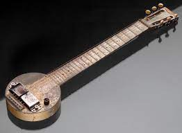

# Siglo XX

## 1900. Zeppelin

El dirigible rígido Zeppelin fue uno de los primeros dirigibles grandes en entrar en servicio, construido por el ingeniero alemán Ferdinand von Zeppelin. Esta innovadora nave llevó a cabo el primer vuelo de pasajeros comercial exitoso, estableciendo un precedente para la navegación aérea moderna.

1900 El tractor fue una innovación importante en la agricultura, permitiendo a los agricultores trabajar grandes extensiones de tierra y aumentar la productividad. Esto representó una revolución en la agricultura, ya que hasta entonces los agricultores dependían de bueyes y caballos para la preparación de la tierra.

1901 Mecano fue uno de los primeros juegos de construcción creados para entretener a los niños. Esto permitió a los niños jugar con piezas metálicas, como tuercas y tornillos, para construir máquinas, edificios y otras estructuras.

1901 Marconi emitió un mensaje de radio a través del Océano Atlántico, estableciendo las bases para el desarrollo de la tecnología de radio moderna. Esta innovadora tecnología permitió a los operadores de radio enviar y recibir señales de radio a distancias mucho más largas de lo que era posible anteriormente.

1902 Los frenos de disco fueron inventados para mejorar la seguridad de los vehículos, permitiendo a los conductores detener su vehículo de manera más rápida y efectiva. Esta tecnología se ha convertido en una característica común en la mayoría de los vehículos modernos, proporcionando una mayor seguridad para los pasajeros.

1903 Hoja de seguridad
1903 Máquina de hacer botellas
1903 Electrocardiograma
1903 Cinturón de seguridad
1903 Osito de peluche

## 1904 Se abre el canal de panamá

El 15 de agosto de 1904 se abrió el Canal de Panamá después de 10 años de construcción. El canal, que une el Océano Atlántico con el Océano Pacífico, fue hecho para permitir que los barcos naveguen más directamente entre los dos océanos. El canal fue construido por la Compañía del Canal de Panamá, una empresa estadounidense, y fue comprado por los Estados Unidos en el año de 1914. Desde entonces, el Canal de Panamá ha sido administrado por el gobierno de los Estados Unidos. El canal ha sido una importante vía navegable en el comercio internacional desde su apertura.

1906 Luz termoiónico

1907 Lavadora

1910 Modelo nuclear del átomo

1911 Acero inoxidable

1913 Cadena de montaje

1913 Heladera eléctrica

## 1913 Cremallera

La primera patente de un dispositivo de cremallera fue presentada en 1913 por Gideon Sundback, un ingeniero sueco. Se le atribuye el haber creado la cremallera moderna, un dispositivo fácil de usar con una combinación de dientes de metal y una solapa. Sundback también inventó el cierre de plástico, que se utilizó para la primera vez en 1933

## 1914 Primera guerra mundial

## 1914 Semáforos Luminosos

Los primeros semáforos luminosos fueron instalados en 1914 en Cleveland, Ohio. Estaban diseñados para ayudar a controlar el tráfico en las principales intersecciones de la ciudad. Estos semáforos usaban luces rojas y verdes para indicar a los conductores cuándo parar y cuándo seguir.

## 1914 Limpiaparabrisas

Los primeros limpiaparabrisas fueron inventados en 1914 por Mary Anderson. Su invento consistía en una palanca que se manejaba desde el interior de un vehículo para activar un brazo con una goma, que se movía de un lado a otro para limpiar el parabrisas.

## 1915 Teoría de la relatividad

En 1915, ``Albert Einstein`` desarrolló y enunció su teoría de la Relatividad, la cual revolucionó la física moderna. Esta teoría explica la relación entre la gravitación y la energía, y cómo el universo se comporta en diferentes situaciones.

1920 Secador de pelo: El primer secador de pelo fue inventado en 1920 por Alexander Godefroy. Utilizaba un ventilador para hacer circular aire caliente, lo que ayudaba a secar el cabello de forma más eficiente.

## 1915. Tanque

http://infografias.elmercurio.com/20160910-CAB-historiatanque/

## 1921 Autopistas

En 1921, el ingeniero Edward de Bono diseñó la primera autopista del mundo, la Autopista del Sol, en Nueva York. Esta autopista fue diseñada para permitir una mayor velocidad y seguridad al conducir, así como un mejor flujo de tráfico.

## 1922 Contador Geiger

El Contador Geiger fue inventado en 1922 por Hans Geiger y Ernest Marsden. Esta herramienta fue diseñada para detectar y contar los rayos cósmicos, y se considera uno de los primeros instrumentos de medición de radiación.

## 1925 Televisor:

El televisor fue inventado en 1925 por John Logie Baird. Se trataba de un dispositivo que podía transmitir imágenes en movimiento a través de ondas electromagnéticas, lo que permitió la transmisión de programas de televisión en vivo.

## 1926 Tostadora:

La tostadora fue inventada en 1926 por Charles Strite. Esta herramienta utiliza una resistencia eléctrica para tostar el pan de manera uniforme, lo que hace que sea más fácil preparar el desayuno.

1927 Caucho sintético: El caucho sintético fue inventado en 1927 por el químico aleman Fritz Hofmann. Esta sustancia, que se fabrica a partir de petróleo, es más resistente y duradera que el caucho natural, lo que lo hace ideal para la fabricación de neumáticos y otros productos.

## 1927 Antibióticos

Los ``antibióticos`` fueron inventados en 1927 por el bioquímico ``Alexander Fleming``. Estos medicamentos son utilizados para tratar infecciones bacterianas, impidiendo el crecimiento y reproducción de las bacterias dañinas.

La ``amoxicilina`` es un antibiótico semisintético derivado de la ``penicilina``. Se emplea a menudo como primer fármaco en infecciones de diferente gravedad, tanto en medicina humana como también en veterinaria.

## 1926 Plancha de vapor

Fue en 1926 cuando la empresa Elder Co. puso a la venta la primera plancha de vapor de uso doméstico, esto en la ciudad de Nueva York.

## 1928 Ciclotrón

 El ciclotrón fue una invención creada en 1928 por Ernest Lawrence, un físico de la Universidad de California. Esta invención fue una de las primeras máquinas de aceleración de partículas, la cual permitió a los científicos explorar los átomos y sus partículas elementales que los componen.

 

 Un ciclotrón es un tipo de ``acelerador de partículas``, de trayectoria circular, capaz de imprimir un movimiento en espiral cada vez más veloz a partículas subatómicas cargadas como, por ejemplo, los protones. Las partículas, que se mueven en el vacío siguiendo una trayectoria curva gracias al efecto de un campo magnético uniforme, son aceleradas paulatinamente a partir de las oscilaciones de alta frecuencia que generan un campo eléctrico oscilante.

## 1930 Motor a reacción

El motor a reacción fue inventado en 1930 por Frank Whittle, un científico británico. Esta invención permitió a los aviones volar con más rapidez, mayor alcance y menor consumo de combustible. Esta innovación revolucionó la ingeniería aeronáutica y la tecnología de los aviones.

## 1932 Guitarra eléctrica

La primera guitarra eléctrica fue inventada en 1932 por George Beauchamp y Adolph Rickenbacker. Esta invención permitió a los músicos amplificar su sonido sin tener que mover los brazos para tocar.

## 1933 Grabaciones estéreo

Las primeras grabaciones estéreo fueron inventadas en 1933 por Alan Blumlein. Esta innovación permitió a los músicos grabar una grabación en dos canales, lo que resultó en un sonido mucho más vivo y realista. Esta innovación permitió a los artistas tener un mayor control sobre la producción de sus grabaciones.

## 1933 Polietileno

El polietileno fue inventado en 1933 por Eric Fawcett y Reginald Gibson. Esta invención fue uno de los primeros materiales sintéticos y fue ampliamente utilizado como material de embalaje y para la fabricación de productos plásticos.

## 1934 Nylon

El nylon fue inventado en 1934 por Wallace Carothers. Esta invención revolucionó la industria textil, ya que fue el primer material sintético utilizado para hacer telas. El nylon fue ampliamente utilizado para la fabricación de ropa, zapatos y otros productos textiles.

## 1935 Radar

El radar fue inventado en 1935 por Robert Watson-Watt. Esta innovación fue uno de los primeros sistemas de detección a distancia, lo que permitió a los militares detectar grandes objetos a largas distancias. Esta invención revolucionó la industria de la defensa y fue una de las principales innovaciones de la Segunda Guerra Mundial.

## 1936 Guerra Civil Española

## 1938 Café instantáneo

## 1938 Fotocopiadora

La primera fotocopiadora fue inventada en 1938 por el químico suizo, Albert Gyorgy. Utilizaba una lámpara de arco para concentrar la luz en un papel fotográfico sensibilizado y un cristal fotoconductivo para hacer una copia de la imagen original. Esta primera máquina fue llamada Copiadora Österreich

## 1938 Bolígrafo

La invención del bolígrafo se atribuye a John J. Loud, un fabricante de calzado de Massachusetts. En 1888, diseñó un lápiz con una punta de metal recubierta de un material resistente al aceite, lo que permitía que el lápiz escribiera sobre casi cualquier superficie, desde papel hasta metal. Loud patentó su invento en octubre de ese año. El nombre de "bolígrafo" fue acuñado en 1938 por László Bíró, un inventor húngaro que mejoró el diseño de Loud.

## 1939 Comienza la Segunda Guerra Mundial

## 1941 Aerosoles

La invención de aerosoles se atribuye a Eric Rotheim, un inventor noruego, quien patentó el primer aerosol en 1927. Originalmente se llamaba "Aerosolv", y funcionaba con un gas licuado como propelente. El primer aerosol fue creado para la aplicación de insecticidas.

En 1941, el químico estadounidense Lloyd Nelson inventó un aerosol basado en el uso de un compuesto orgánico como propelente. Esta fue la primera vez que se usó un compuesto orgánico como propelente. El aerosol se popularizó durante la década de 1950, cuando se comenzó a usar como aerosoles para la aplicación de pintura, en aerosoles para el cabello y en aerosoles para la limpieza.

## 1942 Napalm

Durante la Segunda Guerra Mundial, los Aliados y la Alemania nazi utilizaron la gasolina como arma en lanzallamas, ya que solamente la gasolina era un rápido y eficaz dispositivo incendiario. Una sustancia adicional era necesaria para producir una combustión de gran alcance y persistencia pero que no se consumiera velozmente.

Aunque los investigadores habían encontrado maneras de hacer gasolina convertida en gelatina, muchas de ellas requirieron de caucho como componente principal, que durante tiempos de guerra era una materia escasa. En 1942, investigadores de la Universidad de Harvard (conducida por Louis Fieser) y el cuerpo químico del Ejército de los Estados Unidos encontró la solución: el napalm.

## 1942 Reactor nuclear

## 1942 Equipo de inmersión

## 1943 Turbina de reacción para aviones

Los motores a reacción hicieron posible que los aviones volaran a mayores altitudes y velocidades de crucero, lo que significa que los vuelos se pueden realizar con mayor rapidez, economía y seguridad. Los motores a reacción también son más fiables que los motores de hélice, lo que significa que los aviones pueden volar por más tiempo sin necesidad de un mantenimiento frecuente.

## 1945 La Bomba atómica destruye Hiroshima y Nagasaki

## 1946 Horno de microondas

## 1946 Calculadora electrònica

## 1946 Ordenador

## 1947 Transistor

## 1948 Long Play - Disc de llarga durada; neumáticos radiales

## 1958. Primer radar de velocidad

El holandés Maurice Gatsonides (1911-1998), quien para mejorar sus tiempos decidió que más que conocer a qué velocidad máxima llegaba al final de las rectas, necesitaba saber a qué velocidad pasaba por las curvas, para mejorar su técnica en el paso por curva.

Así que comenzó a idear un artilugio basado en la tecnología del radar que, como sabéis, es un dispositivo emisor y receptor de ondas que se aprovecha del efecto Doppler.

## 1950 Tarjeta de crédito

En el año 1949 Frank McNamara pensó en una tarjeta que permitiera pagar en cualquier establecimiento.  Esto se le ocurrió en una cena con otros 2 comensales. A McNamara se le olvidó la cartera y tuvo que telefonear a su mujer para que se la trajera. Junto a los otros dos decidieron crear un método para poder pagar con una sola tarjeta en diferentes establecimientos de forma personal y segura. De aquí surgió la Diners’ Club, la primera tarjeta de crédito.

## 1953 Hillary y Tenzing ascienden el everest

En 1953, el alpinista Edmund Hillary y el sherpa Tenzing Norgay hicieron historia cuando ascendieron la cumbre del Monte Everest, convirtiéndose en los primeros humanos en alcanzar la cima más alta de la Tierra. La expedición británica, dirigida por el almirante John Hunt, partió de Katmandú, Nepal, el 10 de marzo de 1953. Después de meses de preparación, la expedición de alpinistas inició su ascenso a la cumbre del Monte Everest el 26 de mayo. Luego de muchos intentos infructuosos, Hillary y Tenzing finalmente lograron el éxito el 29 de mayo de 1953.

## 1954 Central nuclear

La primera central nuclear en el mundo fue la Central Nuclear de Obninsk, cerca de Moscú, Rusia, que comenzó a operar el 27 de junio de 1954. Esta central nuclear fue el primer reactor nuclear de agua ligera del mundo. Fue diseñado para producir energía eléctrica para uso civil, y su potencia fue de 5 megavatios.

## 1954 Radio a transistores

Apareció en el año 1954 y fue un cambio drástico en los sistemas de radio. Esto se debe a que los transistores eran más pequeños, más baratos y también más fiables que los tubos de vacío que se usaban antes. Esto significaba que los radios a transistores podían ser más pequeños y portátiles. También eran más eficientes energéticamente, lo que significaba que eran más baratos de fabricar.

## 1956 Velcro

Velcro fue inventado en 1956 por el ingeniero suizo George de Mestral, quien se dio cuenta de que los granos de la hierba se adhirían a su perro y a su ropa. Inspirado por esta naturaleza, inventó una tela con un cierre de gancho y bucle que se conoce como Velcro. El nombre "Velcro" surgió de la combinación de las palabras francesas "velours" (terciopelo) y "crochet" (ganchos).

## 1956 Videocámara

## 1957 Satélite espacial

El primer satélite artificial en orbitar la Tierra. Fue lanzado por la Unión Soviética el 4 de octubre de 1957 y se conoció como Sputnik 1. Estaba equipado con un emisor de radio y su señal fue recibida por estaciones de radio en todo el mundo. El satélite era una esfera de metal de 58 cm de diámetro, con cuatro antenas y una batería para alimentar el emisor de radio. El peso total del satélite era de 83.6 kg.

El lanzamiento de Sputnik 1 fue un hito importante en la historia de la humanidad. La carrera espacial entre la Unión Soviética y los Estados Unidos comenzó con el lanzamiento del satélite

## 1958 Aerodeslizador

El Aerodeslizador de 1958 fue un vehículo de transporte inventado por el ingeniero William Blanchard. Estaba diseñado para ser una alternativa a los helicópteros, ya que era más barato y fácilinvencion de construir. Estaba compuesto por una serie de alas y una hélice para proporcionar propulsión al vehículo. El Aerodeslizador de 1958 fue uno de los primeros vehículos de transporte aéreo no tripulados y fue diseñado para ser una alternativa a los aviones comerciales. Estaba equipado con una hélice en la parte superior para proporcionar el impulso y una serie de alas que permitían al vehículo volar en línea recta. El Aerodeslizador era capaz de alcanzar velocidades de hasta 160 km/h.

## 1959 Chip de silicio

## 1959 Lycra

Lycra fue una innovadora fibra sintética desarrollada por DuPont que se utilizó por primera vez para fabricar ropa deportiva y prendas de baño. Esta fibra era extremadamente resistente y elástica, lo que permitió a los diseñadores cambiar el diseño de la ropa para que se ajustara mejor al cuerpo. Además, Lycra también permitió que la ropa fuera mucho más cómoda de usar y durara más tiempo.

## 1960 Teflón

Teflón fue una sustancia química desarrollada por DuPont que se usó por primera vez para revestir utensilios domésticos. Esta sustancia era extremadamente resistente al calor y los alimentos no se adherían a la superficie, lo que hacía que la limpieza fuera mucho más fácil. También fue una innovación en la industria de la cocina, ya que los alimentos no se quemaban ni se adherían a los utensilios.

1962 Robot industrial
1962 Satélite de comunicaciones
1963 Videocasetera
1964 Procesador de textos
1840 Reloj eléctrico: El reloj eléctrico fue inventado en 1840 por Alexander Bain. Esta innovación tecnológica permitió a las personas medir el tiempo con precisión y exactitud. Esto ayudó a mejorar la eficiencia y la productividad en muchos campos.

## 1969 Avión Jumbo

El primer avión jumbo fue el Boeing 747, que entró en servicio el 9 de febrero de 1970. El 747 fue diseñado para transportar grandes cantidades de pasajeros y carga a largas distancias. Está equipado con cuatro motores turbofan y tiene capacidad para hasta 400 pasajeros. El 747 se ha convertido en el avión de pasajeros más vendido de la historia, con más de 1550 aviones entregados desde su lanzamiento.

## 1969 Los astronautas estadounidenses llegan a la Luna

## 1971 Rellotge digital

## 1972 Escàner

## 1972 Rayos X

Los rayos X son una forma de radiación electromagnética de alta energía con longitudes de onda más cortas que la luz visible. Esta radiación puede atravesar objetos sólidos, lo que permite ver imágenes internas de los cuerpos que no se pueden ver fácilmente de otra manera. Esta tecnología revolucionaria se ha utilizado para detectar fracturas óseas, enfermedades cardíacas y cánceres, entre muchas otras aplicaciones.

1973 Videojocs domèstics
1974 Protocol d'Internet (IP) i Protocol de Control de Transmissió (TCP)
1978 Codis de barres

## 1978 Nace el primer bebe de probeta

El primer bebé nacido de un embrión fertilizado fuera del cuerpo de su madre, conocido como bebé de probeta, nació el 25 de julio de 1978 en Oldham, en el Reino Unido. El bebé, llamado Louise Brown, fue creado mediante una técnica de fecundación in vitro. Esto significa que el óvulo de la madre fue fecundado por el espermatozoide del padre en un frasco de laboratorio, antes de ser implantado en el útero de la madre.

## 1975 Ordenador personal

El primer ordenador personal fue el Altair 8800, que fue lanzado en 1975. Fue creado por una empresa llamada Micro Instrumentation and Telemetry Systems (MITS). Estaba equipado con un microprocesador 8080 de Intel y 256 bytes de memoria RAM. El Altair 8800 fue el principio de la era de los ordenadores personales y su lanzamiento se considera el inicio de la revolución informática. El precio inicial del Altair 8800 fue de $397.

Walkman fue inventada en 1979 por Masaru Ibuka, el fundador de Sony Corporation. Fue el primer dispositivo portátil de reproducción de audio para uso personal. Estaba destinado a sustituir los radios de onda corta, al permitir a los usuarios escuchar música sin usar auriculares.

catalitzadors per a automotors

## 1980 Cubo de Rubik

El cubo de Rubik es un puzzle creado por el arquitecto húngaro Ernő Rubik. El cubo de Rubik se inventó en 1974 y se lanzó en el mercado en 1980.

## 1981 Transbordador espacial

El primer transbordador espacial fue el Columbia, que fue lanzado el 12 de abril de 1981. El Columbia fue el primer vehículo de lanzamiento de la nave espacial de la NASA. La misión de lanzamiento fue un éxito y el Columbia completó su primera misión orbital el 14 de abril de 1981, con astronautas John W. Young y Robert L. Crippen a bordo.

Los transbordadores espaciales son naves diseñadas para viajar a y desde la órbita de la Tierra. Estas naves tienen la capacidad de aterrizar y despegar y pueden transportar equipo y personas. Los transbordadores espaciales se usan generalmente para transportar astronautas, equipo científico y suministros.

1981 Papeles autoadhesivos
1982 Tarjeta inteligente

## 1982 Corazón artificial

El primer corazón artificial se implantó en 1982 en el paciente Barney Clark, un hombre de 61 años de edad. El corazón artificial era un dispositivo mecánico diseñado por el Dr. Robert Jarvik y se llamaba el Jarvik-7. La cirugía duró unas 8 horas y se llevó a cabo en el Universidad Médica de Utah. El dispositivo fue diseñado para ayudar a bombea la sangre alrededor del cuerpo, y se conectó directamente a la arteria aorta y vena cava inferior de Clark. El dispositivo funcionó durante 112 días antes de que el paciente muriera de una infección.

### 1982 Discos compactos
### 1986 Explosión del reactor nuclear de Chernobyl
### 1989 Cae el Muro de Berlín
### 1990 Invasión a Kuwait por parte de Irak
### 1990 Realitat virtual
### 1990 Fusió nuclear
### 1990 Identificador de veu
### 1995 Internet: se populariza el uso de redes con protocolos TCP/IP
