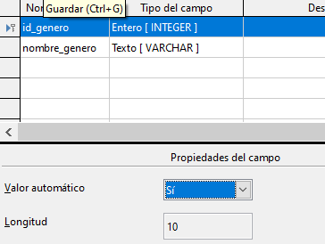
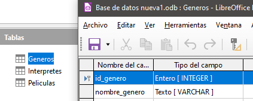
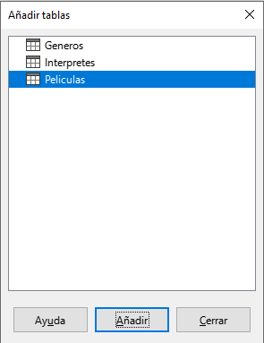
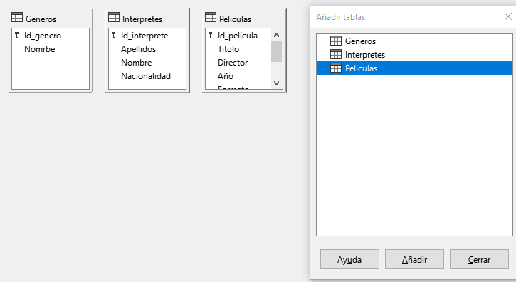
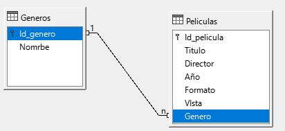
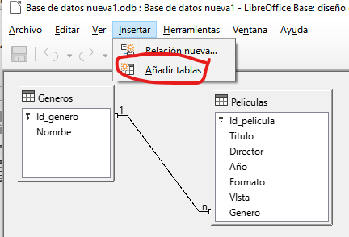
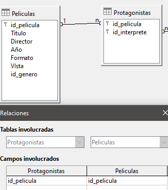
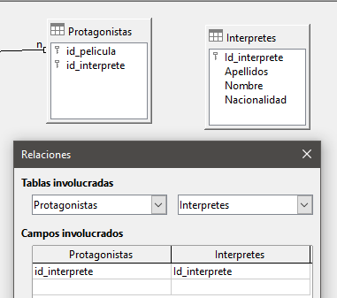

# 4. relaciones entre tablas

El problema de la información repetida

Una de las grandes ventajas de las bases de datos es que podemos tener toda la información que necesitamos almacenar en varias tablas, relacionadas entre ellas, en lugar de una única tabla enorme con toda la información. 

Se podría pensar en añadir una nueva columna (no la hagáis) a la **tabla Peliculas** que se llamara Género, de manera que por cada película almacenada también tuviera su género. 

Si nos fijamos en esta solución podemos ver que se está repitiendo el mismo valor muchas veces, por ejemplo, Ciencia-Ficción aparece en cuatro filas y Drama en otras tantas. 

¿Qué problemas podemos tener si lo hacemos así?

1. Que en algún momento nos equivoquemos al teclear, y escribamos, por ejemplo, Ciencia-Fusión.
2. Qué decidamos cambiar el nombre de un género, y por tanto tendríamos que cambiarlo en todas las filas.

**Crear tabla de géneros**

La información de géneros la vamos a crear en una nueva tabla e indicaremos de alguna forma que hay filas de la tabla PELICULAS y de la tabla GENEROS que están relacionadas.

Creamos la tabla géneros, con los campos **id_genero** y **nombre_genero**. **id_genero** hay que marcarlo como **clave principal**. 

Al marcar **valor automático** a **SI**, no tendremos que rellenar este campo.

Y la guardamos con el nombre generos.

**Repaso de tablas**

Ahora mismo deberíais tener 3 tablas:

Rellenar la tabla generos

Vamos a rellenar la tabla generos. En la primera columna no tenemos que poner nada, siempre se pondrán los valores automáticamente cuando pasemos a la siguiente fila.

🚩 Si no se autocompletan los números, revisa que id_genero sea clave principal.

Información de intérpretes

También vamos a suponer que quisiéramos almacenar información (apellidos, nombre y nacionalidad) acerca de los principales intérpretes con cada una de nuestra películas. 

A pesar de haber creado una tabla INTÉRPRETES  anteriormente, podríamos haber pensado en agregar columnas a la tabla PELICULAS donde guardar la información acerca de sus protagonistas. 

Esta solución es difícil de mantener y puede dar multitud de problemas y errores, por lo ya habíamos creado una tabla INTÉRPRETES 

## Tipos de relaciones

Para ver la forma de establecer la relación es necesario decidir, previamente, qué tipo de relación existe entre las tablas. Existen tres tipos básicos de relaciones entre tablas: 

**Uno a muchos (1:n)**

Cuando una fila de la primera tabla puede estar relacionada con muchas filas de la segunda tabla, pero una fila de la segunda sólo está relacionada con una de la primera. 

Una película puede tener un único género pero un género puede serlo de varias películas.

**Muchos a muchos (n:n)**

Esta clase de relación ocurre cuando una fila de la primera tabla puede estar relacionada con muchas filas de la segunda tabla y una fila de la segunda tabla puede estarlo con muchas filas de la primera. 

Un ejemplo de este tipo lo tenemos en la relación entre la tabla Peliculas y la tabla Interpretes

Una película en particular puede tener muchos intérpretes y viceversa.  

**Uno a uno (1:1)** 

Cuando una fila de la primera tabla sólo puede estar relacionada con una fila de la segunda y viceversa.

Por ejemplo una tabla con países y otra con jefes de gobierno, dado que, normalmente, un país sólo tiene un jefe de gobierno y un jefe de gobierno lo es sólo de un país.  

Establecer relaciones entre tablas 

En función del tipo de relación, los pasos a realizar para indicarlas son distintos. 

A continuación se explica al detalle las reglas básicas para los tipos uno a muchos y muchos a muchos. 

## Relación uno a muchos

Para este tipo de relaciones la solución siempre es crear una nueva columna en la tabla del lado del muchos, es decir, debemos crear una nueva columna en la tabla cuyas filas sólo pueden estar relacionadas con una fila de la otra tabla, de manera que el valor de ese campo me indique sin lugar a dudas con qué fila está relacionada de la otra tabla. 

En el caso de Generos y Peliculas, esto supone que tenemos que crear en Peliculas un nuevo campo que para cada película mantenga un valor que me indique sin error al género al que pertenece. 

Por tanto, la columna debe ser del mismo tipo de dato que la columna que sea clave primaria en la otra tabla y los valores que podrá contener será cualquiera de los valores que tome la clave primaria en dicha tabla. 

Crear columna género dentro de la tabla películas

Es decir, en la tabla Peliculas tendremos que crear una columna del mismo tipo que a la que llamaremos Genero. 

Los valores que pondremos en esa columna estarán comprendidos en los distintos valores que toma ese valor en la **tabla Generos**. 

Rellenar género de las películas

Como la columna que hemos creado en la tabla películas es nueva, tendremos que completarla con el número correspondiente al género al  que pertenece la película.

**Herramienta relaciones**

Falta indicarle que las dos tablas están relacionadas y que vamos a utilizar para mantener dicha relación la nueva columna id_genero que hemos creado en peliculas. 

Para realizar esta operación tenemos que abrir la herramienta QUE SOLO ENCONTRARÉIS EN LA VENTANA PRINCIPAL, llamada Relaciones. 

Veréis que se abre una ventana nueva.

Añadir las tablas que vamos a utilizar

Lo primero que nos ocurre nada más entrar en la ventana Relaciones. Seleccionamos cada tabla y le damos a añadir.

Deberemos ver esto. Las tablas que aquí vemos las podremos unir con flechas. Estas flechas que pondremos indicarán las relaciones que tienen entre ellas.

## Relación PELICULAS - GENEROS

A continuación ya podemos establecer la relación que queremos indicar. Para ello pinchamos en el icono que aparece a la derecha en la ventana relaciones 

Entonces, nos debe aparecer una ventana donde primero debemos indicar las tablas que queremos relacionar para, a continuación, elegir en función de qué columna vamos a establecer la relación. Debería quedar así:

En la parte inferior de esta ventana veremos que nos pide que indiquemos dos opciones: 

- Opciones de actualización 
- Opciones de eliminación

Nos ofrece cuatro posibilidades para cada una de ellas. Estas opciones sirven para indicar qué hacer si algún valor del campo de clave primaria que está siendo referenciada (en nuestro caso Id_genero) sufre alguna modificación o si esa fila es eliminada.

Para la actualización, lo normal suele ser elegir la posibilidad de actualizar en cascada, y para el borrado no existe una opción preferida sino que dependerá bastante del contexto, en nuestro caso, para esta relación, indicaremos poner a nulos. 

Le damos a aceptar

## Visualizar la relación creada

Una vez hemos terminado de indicar la relación, ésta debe aparecer indicada tal y como se muestra.

Ahora aparece una línea uniendo ambas tablas y que en el extremo de esa línea;

- En el lado de la tabla Generos aparece el valor 1
- En el extremo de la tabla Peliculas, nos aparece el valor n. 

Estos valores nos están indicando que el tipo de relación es de **uno (1) a muchos (n). **

## Relación PELICULAS - INTERPRETES

En este caso puede darse el caso de:

- 1 película que tiene N intérpretes
- 1 intérprete que participa en N películas

La relación entre películas e intérpretes es de muchos a muchos (N a N).

Cuando esto pasa, no basta con añadir una columna. Necesitamos crear una nueva tabla.

**Crear tabla protagonistas**

A esta **tabla** la llamaremos **Protagonistas** con, al menos, dos columnas:

- Identificador de película
- Identificador de intérprete
  
Cada una de ellas para apuntar a cada una de las claves primarias respectivas de las tablas que queremos relacionar

Cada fila de esta tabla va a representar las relaciones que existen entre las filas de ambas tablas. 

**Rellenar filas de la tabla**

Rellenaremos la tabla, asignando a cada id de película, un id de intérprete. La tabla es la que véis a la izquierda. Si os fijáis:

- La película 1 es blade runner, protagonizada por Harrison ford (intérprete número 1)
- La película 2 es la guerra de las galaxias, protagonizada también por él (intérprete 1)
- Etc.

Como véis la tabla protagonistas enlaza las películas con sus intérpretes, y viceversa.

# Relación entre PELICULAS - INTERPRETES (protagonistas)

Una vez que tenemos creada esta tabla nos falta indicar las relaciones existentes, siguiendo la misma mecánica que hemos visto en el anterior apartado. 

Así, una vez que nos hemos situado de nuevo en la ventana Relaciones y hemos añadido las tablas que queremos relacionar a dicha ventana. 

Agregamos la tabla protagonistas

Aquí véis las dos tablas que hemos añadido, pero que no están conectadas con nada más. Ahora vamos a enlazar estas 3 tablas entre sí:

Relación películas y protagonistas

Relación Protagonistas e Interpretes

Del mismo modo relacionamos estas dos tablas, a través del campo id_interprete que aparece en ambas tablas.

## Resumen de relaciones

Resumiendo, al final las relaciones que hemos creado tienen que quedar así. Si tenéis así las relaciones, podéis pasar al siguiente apartado.

