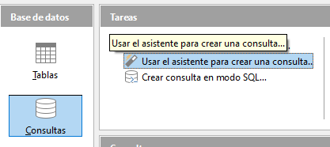
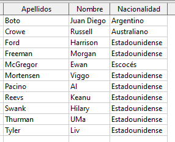
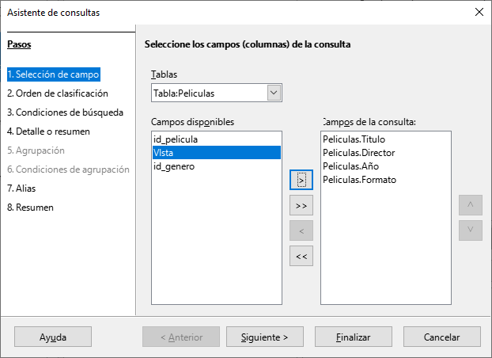
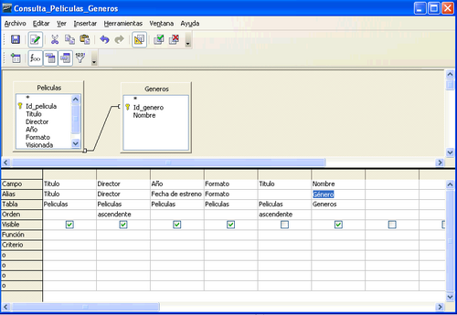

# 5. Consultas simples 

Las consultas nos permiten visualizar parte de la información contenida en nuestras bases de datos desde una perspectiva más detallada 

Se pueden realizar sobre una o varias tablas relacionadas

El resultado que devuelven se muestran también en forma de tabla.

Las consultas son muy útiles a la hora de construir formularios y, sobre todo, informes, como ya veremos más adelante.

## 5.1. Creación de consultas sobre una tabla utilizando el asistente 

Vamos a comenzar realizando una consulta que nos devuelva de la tabla Interpretes , el nombre, los apellidos y la nacionalidad de los que no son españoles.

Para ello, teniendo seleccionada la sección “Consultas”, nos situamos sobre el apartado de tareas y elegimos “Usar el asistente para crear consulta…”. 

Nos aparece entonces la primera ventana del asistente donde debemos elegir qué campos queremos que se muestren, y seleccionamos entonces los campos Nombre, Apellidos,y Nacionalidad de la tabla Interpretes.

Tiene que quedar así:

A continuación, podemos elegir si queremos que se muestren ordenados en función de los valores de uno o varios campos. Nosotros vamos a seleccionar que se ordenen alfabéticamente por los apellidos del intérprete.

En el siguiente paso podemos elegir si queremos indicar uno o varios criterios de búsqueda; es decir, si queremos que las filas que se muestran cumplan alguna condición en particular. 

Como en nuestro caso el objetivo es mostrar sólo los intérpretes no españoles, debemos indicar que para el campo Nacionalidad no deseamos aquellos que contengan el valor “Español” (ver Figura 5.5). 

A continuación, podemos elegir con qué nombre (**alias**), se mostrarán las cabeceras de las columnas de los campos que hemos elegido al mostrar el resultado de la consulta. En este caso, como los nombres de los campos son bastante claros simplemente les quitamos el nombre de la tabla que figura delante del nombre.

A continuación podemos cambiar el nombre de la consulta si queremos:

Como resultado veremos el listado ordenado por apellido en orden ascendente, y evitando los intérpretes españoles.

Siempre que queramos hacer esta consulta, simplemente hacemos doble clic sobre su nombre:

## 5.2. Creación de consultas sobre varias tablas combinando el asistente con el modo Diseño 

Ahora vamos a realizar una consulta que nos muestre las películas junto con el nombre del género al que pertenecen. 

Para realizar esta consulta primero vamos a utilizar el asistente para conseguir un primer “borrador” de la consulta que queremos realizar para, finalmente, acabar de concretar en modo Diseño. 

Por tanto, empezamos de nuevo yendo a la sección tareas del tipo de objeto consulta y elegimos “Usar el asistente para crear consulta…”. 

Ahora, en la ventana inicial del asistente, elegimos los campos Titulo, Director, Año y Formato de la **tabla Peliculas**

En la siguiente ventana (Figura 5.10) vamos a indicar que queremos que el resultado se ordene, en primer lugar, en función del campo Director, y, en caso de coincidir el director entre distintas películas, en función del campo Titulo. 

En esta consulta no vamos a poner ninguna condición por la que filtrar los datos, por lo que nos vamos directamente a la ventana “Alias”, donde vamos a aprovechar para “maquillar” que el campo Título no tuviera tilde al crear dicho campo y ahora sí se la incluimos. Además, para que el campo Año quede más concreto lo vamos a presentar como Fecha de estreno. 

Antes de finalizar con el asistente, en la ventana “Información general” del mismo, debemos incluir el nombre de la consulta, que en este caso va a ser  **Consulta_Peliculas_Generos**, 

Vamos a indicar también que no queremos que se muestre el resultado de la consulta, sino que queremos seguir trabajando con ella en modo Diseño.

Para esto último debemos activar la casilla **Modificar consulta** en dicha ventana

**Modo diseño**

Nos debe aparecer entonces una ventana que permite crear consultas en modo Diseño. 

En primer lugar, podemos ver que la ventana aparece dividida en dos partes bien diferenciadas: 

Una que contiene la tablas que estamos utilizando en la consulta 

Otra con los campos que ya habíamos seleccionado en el asistente junto con una serie de opciones que podemos indicar para cada uno de ellos. 

Así, podemos ver que aparecen los campos Titulo, Director, Año y Formato junto con los alias que indicamos en el asistente y la opción de que se ordene la consulta en función del campo Director. 

Algo que seguro nos ha llamado la atención es por qué aparece el campo Titulo dos veces. La respuesta es que, debido a que en el orden en que queremos que se muestren los campos es: primero el campo Titulo, y luego el Director, y en el asistente hemos indicado que primero queremos la ordenación en función del nombre del director, y, en caso de repetirse dicho nombre, ordenar por el título de la película. 

La única forma de indicar esto es poniendo de nuevo el campo Titulo detrás de los otros cuatro, indicando que se ordene de manera ascendente pero desmarcando la casilla “Visible” para que no aparezca dos veces este campo en el resultado de la consulta. 

Ya hemos visto entonces que en el modo Diseño nos aparecen los campos de Peliculas que deseamos pero aún no hemos hecho nada para ver el nombre del género de la película. 

Como el nombre del género es un campo de la **tabla Generos** lo primero que tenemos que hacer es indicar que queremos incluir dicha tabla en la consulta. Para ello, debemos seleccionar el icono “Añadir tablas” (ver Figura 5.14), que es el primero por la izquierda de los iconos de la fila inferior y elegir la tabla Generos. 

Podemos observar que automáticamente detecta que estas dos tablas están relacionadas. 

Pues lo mismo que si hubiéramos intentado elegir los campos de ambas tablas directamente en el asistente, que la respuesta a la consulta hubiera sido que cada fila de la primera tabla aparecería unida a cada una de las filas de la otra tabla sin ningún criterio, es decir, en nuestro caso tendríamos 90 filas (resultado del producto cartesiano de 10 filas de Peliculas por 9 que tenemos en Generos) de las cuales 80 no significan nada. 

Pero al haber indicado que existe la relación y detectarse en el modo Diseño conseguimos, sin necesidad de indicarlo explícitamente, que a la hora de mostrar todas las filas de Peliculas y Géneros, sólo nos muestre aquellas donde el valor para el campo por el que están relacionadas (Genero e Id_genero respectivamente) sea el mismo, es decir, que sólo nos muestre juntas las filas de ambas tablas que realmente están relacionadas. 

Una vez hemos añadido la **tabla Generos**, elegimos qué campos queremos mostrar de ella. En este caso, nos basta con el campo Nombre.

Una vez que hemos elegido el campo, no debemos olvidar comprobar que la opción “Visible” está marcada para que se muestre este campo en el resultado de la consulta.

**Alias**

En la opción **“Alias”** del campo nombre_genero de la **TABLA GENEROS** vamos a mostrar la palabra “Género” para que cualquier usuario entienda mejor lo que mostrará esta columna.

Dentro del modo Diseño podemos comprobar si la consulta devuelve lo que queremos sin necesidad de cerrar esta ventana y lanzar la consulta desde el menú principal. 

Para ello, basta con seleccionar el icono de ejecución de la consulta que se encuentra situado el segundo por la derecha en la fila de iconos superiores. Así, nos aparece entonces en la parte superior de la ventana el resultado de la consulta.

Veremos que se nos muestran los resultados:

Si estamos conformes con el resultado, guardamos la consulta y podemos ver en la ventana principal que las dos consultas de esta unidad aparecen ya almacenadas.
