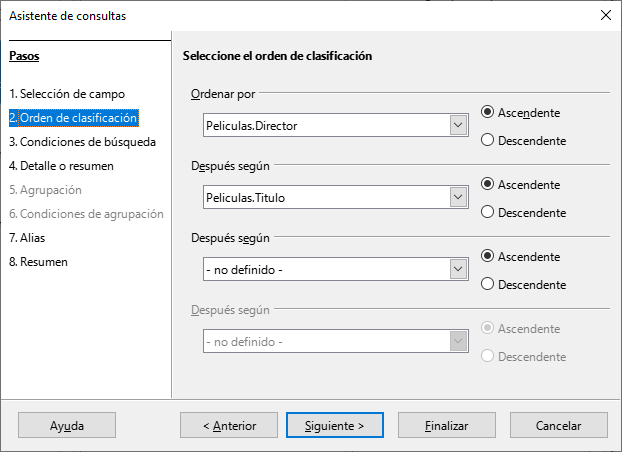
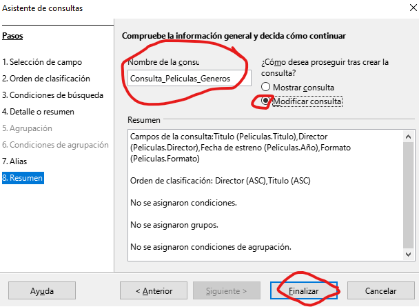
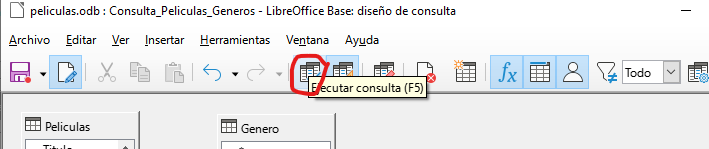
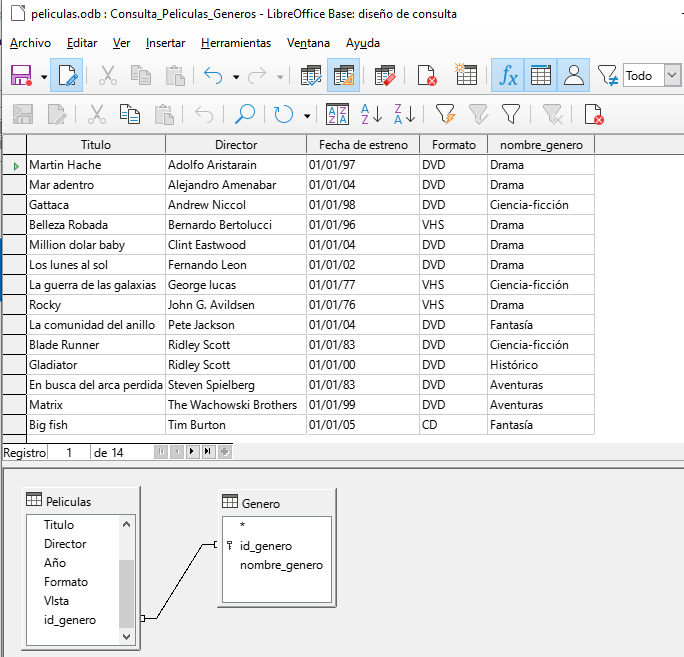

# 5.3. Consultas sobre varias tablas

## Consulta lista de películas y género correspondiente

Ahora vamos a realizar una consulta que nos muestre las películas junto con el nombre del género al que pertenecen. 

Para realizar esta consulta primero vamos a utilizar el asistente para conseguir un primer “borrador” de la consulta que queremos realizar para, finalmente, acabar de concretar en modo Diseño. 

## Asistente de consultas

Por tanto, empezamos de nuevo yendo a la sección tareas del tipo de objeto consulta y elegimos “Usar el asistente para crear consulta…”. 

## Selección de campos

Ahora, en la ventana inicial del asistente, elegimos los campos Titulo, Director, Año y Formato de la **tabla Peliculas**

## Orden de clasificación

En la siguiente ventana vamos a indicar que queremos que el resultado se ordene, en primer lugar, en función del campo Director, y, en caso de coincidir el director entre distintas películas, en función del campo Titulo. 

## Condiciones de búsqueda

En esta consulta no vamos a poner ninguna condición por la que filtrar los datos

## Alias

En el paso “Alias”, donde vamos a aprovechar para “maquillar” algunos campos:

- El campo **Título** no tenía tilde al crear dicho campo y ahora sí se la incluimos. 
- Para que el campo Año quede más concreto lo vamos a presentar como **Fecha de estreno.** 

## Resumen y guardado

Antes de finalizar con el asistente, en la ventana “Información general” del mismo, debemos incluir el nombre de la consulta, que en este caso va a ser  **Consulta_Peliculas_Generos**, 

Vamos a indicar también que no queremos que se muestre el resultado de la consulta, sino que queremos seguir trabajando con ella en modo Diseño.

## Modificar la consulta creada

Para esto último debemos activar la casilla **Modificar consulta** en dicha ventana

## Modo diseño

Nos debe aparecer entonces una ventana que permite crear consultas en modo Diseño. 

En primer lugar, podemos ver que la ventana aparece dividida en dos partes bien diferenciadas: 

- Una que contiene la tablas que estamos utilizando en la consulta 
- Otra con los campos que ya habíamos seleccionado en el asistente junto con una serie de opciones que podemos indicar para cada uno de ellos. 

Así, podemos ver que aparecen los campos Titulo, Director, Año y Formato junto con los alias que indicamos en el asistente y la opción de que se ordene la consulta en función del campo Director. 

## Aclaraciones

Algo que seguro nos ha llamado la atención es por qué aparece el campo Titulo dos veces. La respuesta es que, debido a que en el orden en que queremos que se muestren los campos es: primero el campo Titulo, y luego el Director, y en el asistente hemos indicado que primero queremos la ordenación en función del nombre del director, y, en caso de repetirse dicho nombre, ordenar por el título de la película. 

La única forma de indicar esto es poniendo de nuevo el campo Titulo detrás de los otros cuatro, indicando que se ordene de manera ascendente pero desmarcando la casilla **Visible** para que no aparezca dos veces este campo en el resultado de la consulta. 

## Agregar el género

Ya hemos visto entonces que en el **modo diseño** nos aparecen los campos de  que deseamos pero aún no hemos hecho nada para ver el nombre del género de la película. 

Como el nombre del género es un campo de la **tabla Generos** lo primero que tenemos que hacer es indicar que queremos incluir dicha tabla en la consulta. 

Para ello, debemos seleccionar el icono **añadir tablas** , que es el primero por la izquierda de los iconos de la fila inferior y elegir la **tabla Generos**. 

Podemos observar que automáticamente detecta que estas dos tablas están relacionadas. 

Pues lo mismo que si hubiéramos intentado elegir los campos de ambas tablas directamente en el asistente, que la respuesta a la consulta hubiera sido que cada fila de la primera tabla aparecería unida a cada una de las filas de la otra tabla sin ningún criterio, es decir, en nuestro caso tendríamos 90 filas (resultado del producto cartesiano de 10 filas de Peliculas por 9 que tenemos en Generos) de las cuales 80 no significan nada. 

Pero al haber indicado que existe la relación y detectarse en el modo Diseño conseguimos, sin necesidad de indicarlo explícitamente, que a la hora de mostrar todas las filas de Peliculas y Géneros, sólo nos muestre aquellas donde el valor para el campo por el que están relacionadas (Genero e Id_genero respectivamente) sea el mismo, es decir, que sólo nos muestre juntas las filas de ambas tablas que realmente están relacionadas. 

Una vez hemos añadido la **tabla Generos**, elegimos qué campos queremos mostrar de ella. En este caso, nos basta con el campo Nombre.

Una vez que hemos elegido el campo, no debemos olvidar comprobar que la opción “Visible” está marcada para que se muestre este campo en el resultado de la consulta.

**Alias**

En la opción **“Alias”** del campo nombre_genero de la **TABLA GENEROS** vamos a mostrar la palabra “Género” para que cualquier usuario entienda mejor lo que mostrará esta columna.

## Ejecutar consulta

Dentro del **modo diseño** podemos comprobar si la consulta devuelve lo que queremos sin necesidad de cerrar esta ventana y lanzar la consulta desde el menú principal. 

Para ello, basta con hacer una de estas dos acciones:

- Seleccionar el icono de **ejecutar consulta**. 
- Pulsar F5.

Así, nos aparece entonces en la parte superior de la ventana el resultado de la consulta.

## Comprobación de los resultados

Veremos que se nos muestran los resultados:

Si estamos conformes con el resultado, guardamos la consulta y podemos ver en la ventana principal que las dos consultas de esta unidad aparecen ya almacenadas.
